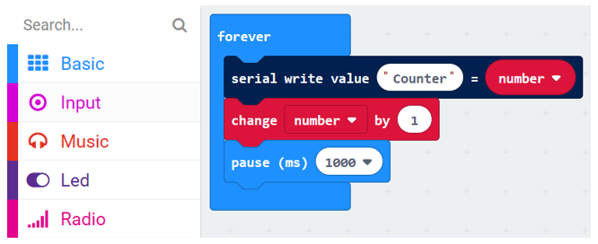
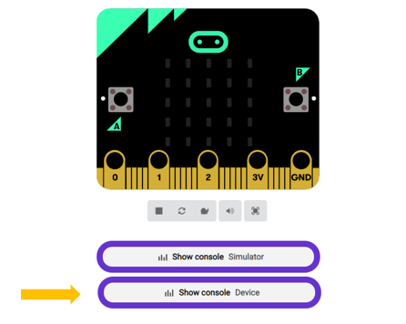
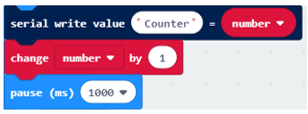
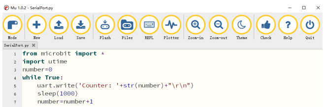
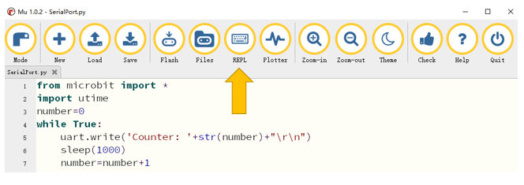
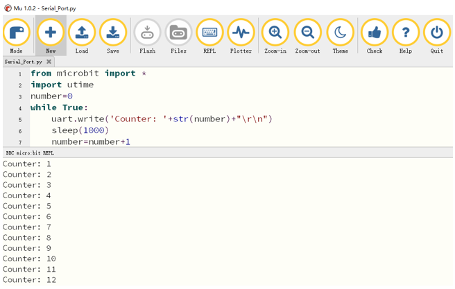

.. _Serial:

##############################################################################
Chapter Serial Communication
##############################################################################

In this chapter, we will learn how to use serial port.

Project Display the Data
******************************************

This project uses serial ports to transmit data and display data.

Component list
==========================

.. list-table:: 
   :width: 100%
   :align: center

   * -  Microbit x1
     -  USB cable x1
   * -  |Chapter03_00|
     -  |Chapter03_03|

.. |Chapter03_00| image:: ../_static/imgs/3_LED/Chapter03_00.png
.. |Chapter03_03| image:: ../_static/imgs/3_LED/Chapter03_03.png

Circuit
====================

Connect micro:bit and PC via a micro USB cable.

Hardware connection

.. image:: ../_static/imgs/10_Serial_Communication/Chapter10_00.png
    :align: center

Block code 

Open MakeCode first. Import the .hex file. The path is as below:

( :ref:`How to import project <import_project>` )

+-----------+---------------------------------------+----------------+
| File type | Path                                  | File name      |
+-----------+---------------------------------------+----------------+
| HEX file  | ../Projects/BlockCode/10.1_SerialPort | SerialPort.hex |
+-----------+---------------------------------------+----------------+

After importing successfully, the code is shown as below: 

Check the connection of the circuit and verify it correct download the code into the micro:bit, and then open the serial controller, as shown below:

On the serial console, you can see the data sent by the microbit.

Every 1 second, the value of the variable number is incremented by 1, and the new value will be sent to the serial port.

Reference
---------------------------

.. list-table:: 
   :width: 100%
   :align: center

   * -  Block
     -  Function 
   
   * -  |Chapter10_05|
     -  Write a name:value pair and a newline character (\r\n) to the serial port.

   * -  |Chapter10_06|
     -  The change blocks increase the value in the variable by the amount you want.
      
        This is also known as an addition assignment operation.

Python code
===============================

Open the .py file with Mu. Code, the path is as below:

+-------------+----------------------------------------+---------------+
| File type   | Path                                   | File name     |
+-------------+----------------------------------------+---------------+
| Python file | ../Projects/PythonCode/10.1_SerialPort | SerialPort.py |
+-------------+----------------------------------------+---------------+

After loading successfully, the code is shown as below:

Check the connection of the circuit and verify it correct and then download the code into the micro:bit. 

After the program is downloaded, click on REPL as shown below.

Then press the reset button (the button on the back) of the Micro:bit and we will see the change of value.

The following is the program code:

.. literalinclude:: ../../../freenove_Kit/Projects/PythonCode/10.1_SerialPort/SerialPort.py
    :linenos: 
    :language: python
    :lines: 1-7
    :dedent:

Every 1 second, the value of the variable number is incremented by 1, and the new value will be sent to the serial port, where "\r\n" is the meaning of the newline.

.. literalinclude:: ../../../freenove_Kit/Projects/PythonCode/10.1_SerialPort/SerialPort.py
    :linenos: 
    :language: python
    :lines: 5-7
    :dedent:

Reference
--------------------------------

.. py:function:: uart.write(x)	
    
    Write the buffer to the bus, it can be a bytes object or a string:
    
    uart.write('hello world')
    
    uart.write(b'hello world')
    
    uart.write(bytes([1, 2, 3]))
    
    For more information, please refer to:
    
    https://microbit-micropython.readthedocs.io/en/latest/uart.html