##############################################################################
Chapter Magnetometer
##############################################################################

In this chapter, we will learn the micro:bit built-in magnetometer chip.

Project Display Magnetometer Data
************************************************

This project will print the data obtained from the magnetometer chip on the serial console.

Component list
==============================

.. list-table:: 
   :width: 100%
   :align: center

   * -  Microbit x1
     -  USB cable x1
   * -  |Chapter03_00|
     -  |Chapter03_03|

.. |Chapter03_00| image:: ../_static/imgs/3_LED/Chapter03_00.png
.. |Chapter03_03| image:: ../_static/imgs/3_LED/Chapter03_03.png

Circuit
===========================

Connect micro:bit and PC via micro USB cable.

Hardware connection

.. image:: ../_static/imgs/10_Serial_Communication/Chapter10_00.png
    :align: center

Block code
=========================

Open MakeCode first. Import the .hex file. The path is as below:

( :ref:`How to import project <import_project>` )

+-----------+----------------------------------------------------+-----------------------------+
| File type | Path                                               | File name                   |
+-----------+----------------------------------------------------+-----------------------------+
| HEX file  | ../Projects/BlockCode/11.1_DisplayMagnetometerData | DisplayMagnetometerData.hex |
+-----------+----------------------------------------------------+-----------------------------+

After importing successfully, the code is shown as below:

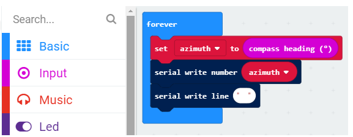

Check the connection of the circuit and verify it correct, and then download the code into the micro:bit. After completing downloading, the magnetometer needs to be calibrated (calibration must be performed using the magnetometer program). Calibrating the magnetometer will cause the program to pause until the calibration is completed. Start the calibration process, a prompt will scroll on the LED matrix, which indicates that you need to rotate the micro:bit until all LEDs on the LED screen are illuminated, and then a smile is displayed which means the calibration is completed, as shown below:

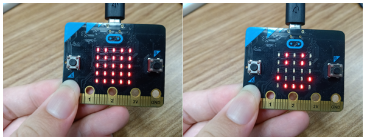

Then open the serial console ( :ref:`Open the Serial Port <Serial>`), place the micro:bit horizontally on the desktop, and rotate the micro:bit (clockwise or counterclockwise) to see the angular offset read from the magnetometer chip. As shown below:

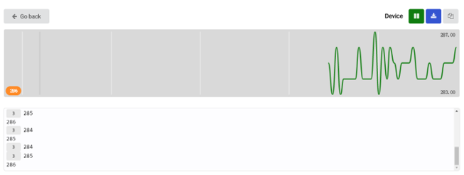

3 indicates the number of times of consecutive readings of the same value.

The angular offset is the angle between the directions of the micro:bit and the geographic North Pole, as shown in the following figure.

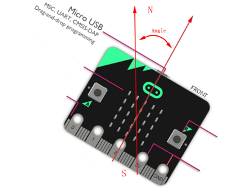

The angular offset read from the magnetometer chip is stored in the variable azimuth.

Then the value of the variable azimuth is printed on the serial port interface.

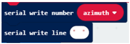

Reference
-----------------------------

.. list-table:: 
   :width: 100%
   :align: center

   * -  Block
     -  Function 
   
   * -  |Chapter11_06|
     -  Set the number of data pins and LEDs, as well as the type of LED.

   * -  |Chapter11_07|
     -  Set LED color

   * -  |Chapter11_08|
     -  Turn on LED

Python code
============================

Open the .py file with Mu. Code, the path is as below:

+-------------+-----------------------------------------------------+----------------------------+
| File type   | Path                                                | File name                  |
+-------------+-----------------------------------------------------+----------------------------+
| Python file | ../Projects/PythonCode/11.1_DisplayMagnetometerData | DisplayMagnetometerData.py |
+-------------+-----------------------------------------------------+----------------------------+

After loading successfully, the code is shown as below:

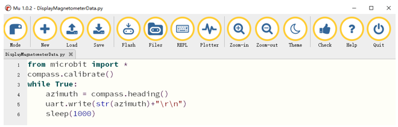

After checking the connection of the circuit and verify it correct, download the code into micro:bit. 

After downloading the program, click REPL, as shown below.

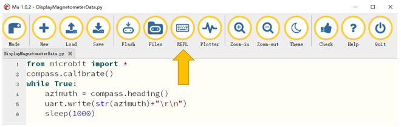

Then press the reset button of the Micro:bit, you need to calibrate the magnetometer (the calibration must be performed when downloading using the magnetometer program).

Calibrating the magnetometer will cause the program to pause until the calibration is complete. Start the calibration process, a prompt will scroll on the LED matrix, which indicates that you need to rotate the micro:bit until all LEDs on the LED screen are illuminated, and then a smile is displayed which means the calibration is completed, as shown below:

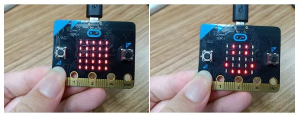

Place the micro:bit horizontally on the desktop, and rotate the micro:bit (clockwise or counterclockwise) to see the angular offset read from the magnetometer chip. As shown below:

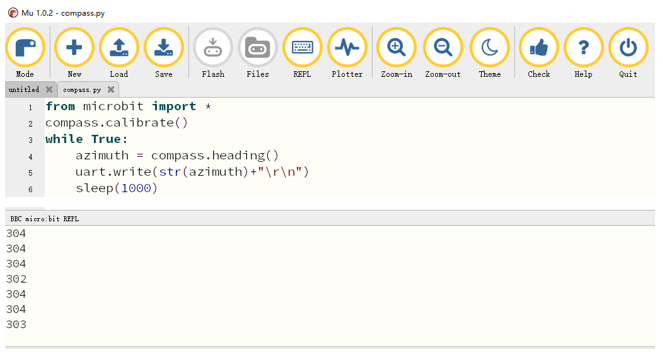

The angular offset is the angle between the direction of the micro:bit and the geographic north pole, as shown in the following figure.

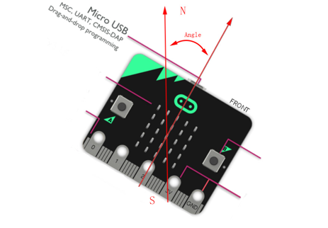

The following is the program code:

.. literalinclude:: ../../../freenove_Kit/Projects/PythonCode/11.1_DisplayMagnetometerData/DisplayMagnetometerData.py
    :linenos: 
    :language: python
    :lines: 1-6
    :dedent:

Magnetometer calibration.

.. literalinclude:: ../../../freenove_Kit/Projects/PythonCode/11.1_DisplayMagnetometerData/DisplayMagnetometerData.py
    :linenos: 
    :language: python
    :lines: 2-2
    :dedent:

The angular offset read from the magnetometer chip is stored in the variable azimuth and then printed out every 1s through a serial port.

.. literalinclude:: ../../../freenove_Kit/Projects/PythonCode/11.1_DisplayMagnetometerData/DisplayMagnetometerData.py
    :linenos: 
    :language: python
    :lines: 4-6
    :dedent:

Reference
--------------------------

.. py:function:: compass.calibrate()	
    
    Starts the calibration process. An instructive message will scroll on the LED matrix, which indicates that you need to rotate the micro:bit until all LEDs are illuminated.

.. py:function:: compass.heading()	
    
    Gives the compass heading, calculated from the above readings, as an integer in the range from 0 to 360, representing the angle in degrees, clockwise, with north as 0.

Project Electronic Compass
******************************************

In this project, we will use micro:bit to make an electronic compass, displaying an arrow on the micro:bit, and the arrow always points to the geographic north pole.

Component list
===========================

.. list-table:: 
   :width: 100%
   :align: center

   * -  Microbit x1
     -  USB cable x1
   * -  |Chapter03_00|
     -  |Chapter03_03|

Circuit
==========================

Connect micro:bit and PC via micro USB cable.

Hardware connection

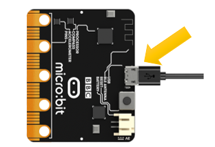

Block code
============================

Open MakeCode first. Import the .hex file. The path is as below:

( :ref:`How to import project <import_project>` )

+-----------+----------------------------------------------+-----------------------+
| File type | Path                                         | File name             |
+-----------+----------------------------------------------+-----------------------+
| HEX file  | ../Projects/BlockCode/11.2_ElectronicCompass | ElectronicCompass.hex |
+-----------+----------------------------------------------+-----------------------+

After importing successfully, the code is shown as below:

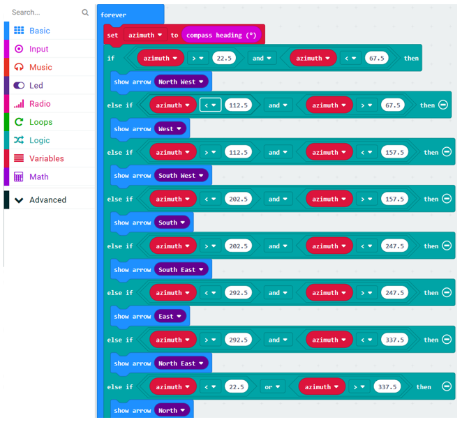

Check the connection of the circuit and verify it correct, and then download the code into the micro:bit. Calibrate the electronic compass. After the calibration is successful, place the micro:bit horizontally and turn the micro:bit to see that the arrow points to the geography Arctic.

The arrow will point to eight directions: northwest, west, southwest, south, southeast, east, northeast, north, each direction is 45 degrees apart. Assuming that the direction of the micro:bit is rotated 45 degrees from the north to the northeast of the geography, the arrow shown should be reversed, that is, it rotates 

-45 degrees, pointing to the northwest of the micro:bit, which is the geographic north pole. Therefore, we can adjust the direction of the arrow according to its angular offset from the geographic North Pole.

When the variable azimuth is less than 22.5 or greater than 337.5, the arrow points to the due north of the micro:bit.

When the variable azimuth is greater than 22.5 or less than 67.5, the arrow points to the northwest of the micro:bit.

And so on in the same fashion, in every 45 degrees, the arrow points to a particular direction indicating the geographic north, as shown in the following illustration:

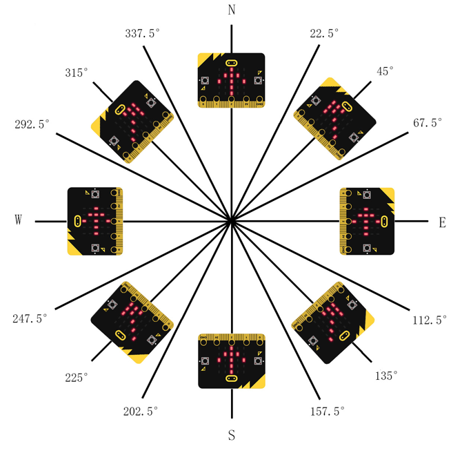

The angular offset read from the magnetometer chip is stored in the variable azimuth

Determine the value of the variable azimuth to change the direction of the arrow.

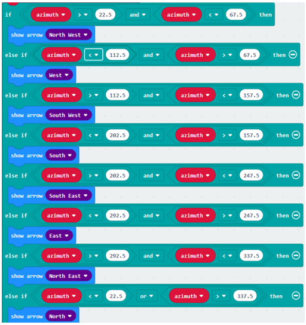

Reference
--------------------------------

.. list-table:: 
   :width: 100%
   :align: center

   * -  Block
     -  Function 
   
   * -  |Chapter11_18|
     -  Run code depending on whether a Boolean condition is true or false.

   * -  |Chapter11_19|
     -  Shows the selected arrow on the LED screen

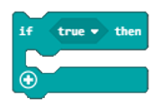

Python code
================================

Open the .py file with Mu. Code, the path is as below:

+-------------+-----------------------------------------------+----------------------+
| File type   | Path                                          | File name            |
+-------------+-----------------------------------------------+----------------------+
| Python file | ../Projects/PythonCode/11.2_ElectronicCompass | ElectronicCompass.py |
+-------------+-----------------------------------------------+----------------------+

After loading successfully, the code is shown as below:

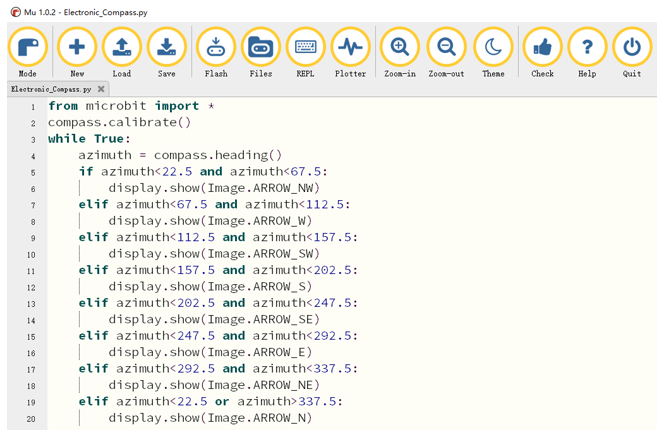

Check the connection of the circuit and verify it correct,, download the code into the micro:bit and calibrate the electronic compass. After the calibration is successful, place the micro:bit horizontally and rotate the micro:bit to see that the arrow points to the geography Arctic.

The arrow will point to eight directions:: northwest, west, southwest, south, southeast, east, northeast, north, each direction is 45 degrees apart. Assuming that the direction of the micro:bit is rotated 45 degrees from the north to the northeast of the geography, the arrow shown should be reversed, that is, rotated -45 degrees, pointing to the northwest of the micro:bit, which is the geographic north pole. Therefore, the direction of the arrow is adjusted according to the angular offset from the geographic North Pole.

When the variable azimuth is less than 22.5 or greater than 337.5, the arrow points to the true north of the micro:bit.

When the variable azimuth is greater than 22.5 and less than 67.5, the arrow points to the northwest of the micro:bit.

And so on in the same fashion, in every 45 degrees, the arrow points to a particular direction indicating the geographic north, as shown in the following figure:

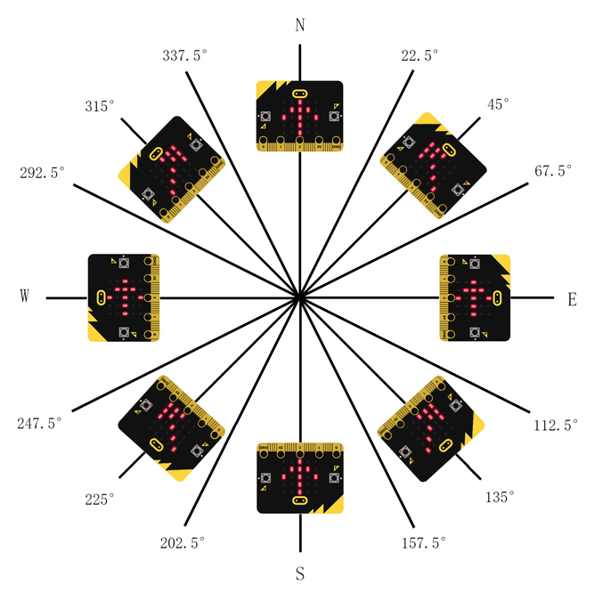

The following is the program code:

.. literalinclude:: ../../../freenove_Kit/Projects/PythonCode/11.2_ElectronicCompass/ElectronicCompass.py
    :linenos: 
    :language: python
    :lines: 1-20
    :dedent:

Calibrate the electronic compass first and store the data on the variable azimuth.

.. code-block:: python

    compass.calibrate()
    azimuth = compass.heading()

Determine the value of the variable azimuth and change the direction of the arrow.

.. literalinclude:: ../../../freenove_Kit/Projects/PythonCode/11.2_ElectronicCompass/ElectronicCompass.py
    :linenos: 
    :language: python
    :lines: 5-20
    :dedent: