##############################################################################
Chapter Accelerometer
##############################################################################

In this chapter, we will learn about the built-in accelerometer sensor of micro:bit.

Project Display Accelerometer Data
**************************************************

In this project, we will obtain data from the accelerometer sensor and print it on the serial console.

Component list
==============================

.. list-table:: 
   :width: 100%
   :align: center

   * -  Microbit x1
     -  USB cable x1
   * -  |Chapter03_00|
     -  |Chapter03_03|

.. |Chapter03_00| image:: ../_static/imgs/3_LED/Chapter03_00.png
.. |Chapter03_03| image:: ../_static/imgs/3_LED/Chapter03_03.png

Circuit
================================

Connect micro:bit and PC via a micro USB cable.

Hardware connection

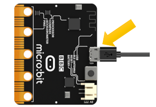

Block code
===============================

Open MakeCode first.

Import the .hex file. The path is as below:

( :ref:`How to import project <import_project>` )

+-----------+-----------------------------------------------------+------------------------------+
| File type | Path                                                | File name                    |
+-----------+-----------------------------------------------------+------------------------------+
| HEX file  | ../Projects/BlockCode/12.1_DisplayAccelerometerData | DisplayAccelerometerData.hex |
+-----------+-----------------------------------------------------+------------------------------+

After importing successfully, the code is shown as below:

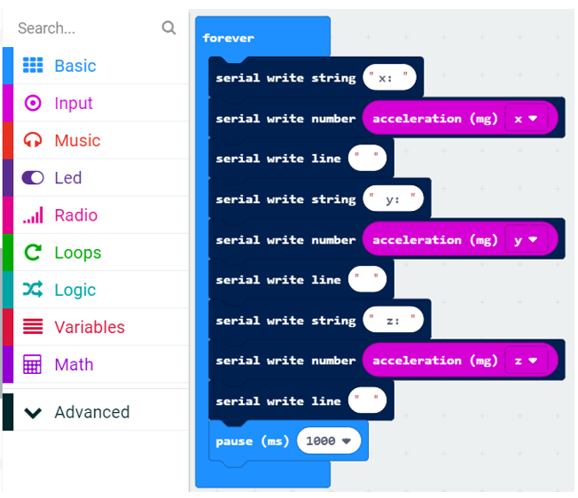

Check the connection of the circuit and verify it correct, download the code into the micro:bit, and then open the serial console, you can see the data of the accelerometer, as shown below:

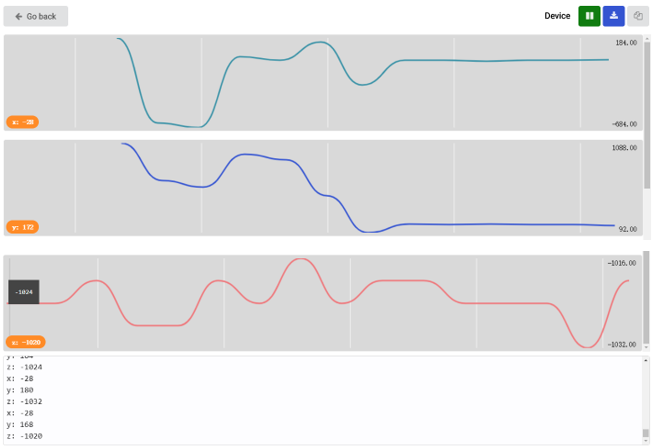

Read the value of the accelerometer in three directions and print it out through the serial port every second.

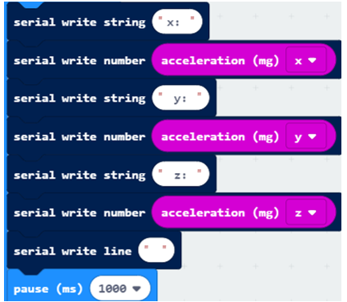

Reference
--------------------------

.. list-table:: 
   :width: 100%
   :align: center

   * -  Block
     -  Function 
   
   * -  |Chapter12_03|
     -  Get the acceleration value in one of three dimensions, 
        
        or the combined value in all directions (x, y, and z).

Python code 
===========================

Open the .py file with Mu. Code, the path is as below:

+-------------+---------------------------------------------+-----------------------------+
| File type   | Path                                        | File name                   |
+-------------+---------------------------------------------+-----------------------------+
| Python file | ../PythonCode/12.1_DisplayAccelerometerData | DisplayAccelerometerData.py |
+-------------+---------------------------------------------+-----------------------------+

After loading successfully, the code is shown as below:

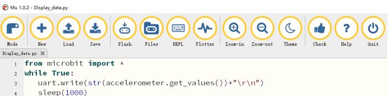

Check the connection of the circuit and verify it correct, and then download the code into the micro:bit. 

After the program is downloaded, open the plotter (Plotter), click on the REPL, you can see the x-axis, y-axis, z-axis data collected by the accelerometer, as shown below:

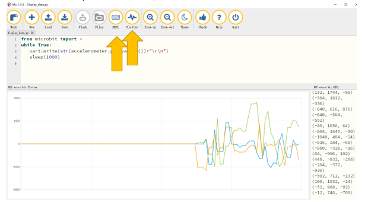

The following is the program code:

.. literalinclude:: ../../../freenove_Kit/Projects/PythonCode/12.1_DisplayAccelerometerData/DisplayAccelerometerData.py
    :linenos: 
    :language: python
    :lines: 1-4
    :dedent:

Every 1 second, the accelerometer data will be obtained and printed through the serial port.

.. literalinclude:: ../../../freenove_Kit/Projects/PythonCode/12.1_DisplayAccelerometerData/DisplayAccelerometerData.py
    :linenos: 
    :language: python
    :lines: 3-4
    :dedent:

Reference
-----------------------

.. py:function:: accelerometer.get_values()	

    Get the acceleration measurements in all axes at once, as a three-element tuple of integers ordered as X, Y, Z. By default the accelerometer is configured with a range of +/- 2g, so X, Y, and Z will be within the range of +/-2000mg.

Project 12.2 Gradiometer
*****************************************

In this project, we will use the accelerometer to make a level instrument.

Component list
==================================

.. list-table:: 
   :width: 100%
   :align: center

   * -  Microbit x1
     -  USB cable x1
   * -  |Chapter03_00|
     -  |Chapter03_03|

Circuit
=================================

Connect micro:bit and PC via a micro USB cable.

Hardware connection

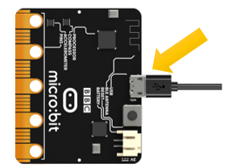

Block code
================================

Open MakeCode first.

Import the .hex file. The path is as below:

( :ref:`How to import project <import_project>` )

+-----------+---------------------------------------+----------------+
| File type | Path                                  | File name      |
+-----------+---------------------------------------+----------------+
| HEX file  | ../Projects/BlockCode/12.2_Gradienter | Gradienter.hex |
+-----------+---------------------------------------+----------------+

After importing successfully, the code is shown as below:

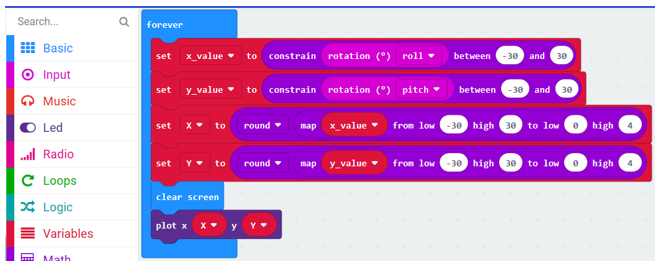

Check the connection of the circuit and verify it correct and download the code into micro:bit, you will observe that the LED dot matrix will change with the tilt of micro:bit.

Detect the flip angle of the microbit in the x-axis and the y-axis. The return value ranges from -180 to 180 degrees. This project does not require such a wide range of flip angles, so we just set it within -30 to 30 degrees. 

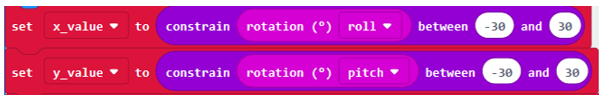

Since the LED screen is 5x5, map the range of -30-30 to the range of 0-4, and assign it to the X, Y variable.

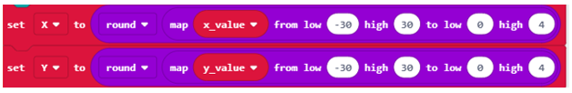

Turn OFF all the LED first, then turn ON the corresponding LED according to the value of the X, Y variables.

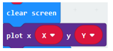

Reference
-----------------------------

.. list-table:: 
   :width: 100%
   :align: center

   * -  Block
     -  Function 
   
   * -  |Chapter12_11|
     -  Find how much the micro:bit is tilted in different directions.

   * -  |Chapter12_12|
     -  Turn ON the LED you set on the LED screen.

   * -  |Chapter12_13|
     -  If a number has a fractional part, you can change the number 
      
        to the nearest integer value.

   * -  |Chapter12_14|
     -  A map is a conversion of one span of numbers to another.

   * -  |Chapter12_15|
     -  Turn OFF all the LED lights on the LED screen.

   * -  |Chapter12_16|
     -  Make sure that the value of the number you give is within the range.

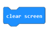

Python code 
============================

Open the .py file with Mu. Code, the path is as below:

+-------------+----------------------------------------+---------------+
| File type   | Path                                   | File name     |
+-------------+----------------------------------------+---------------+
| Python file | ../Projects/PythonCode/12.2_Gradienter | Gradienter.py |
+-------------+----------------------------------------+---------------+

After loading successfully, the code is shown as below:

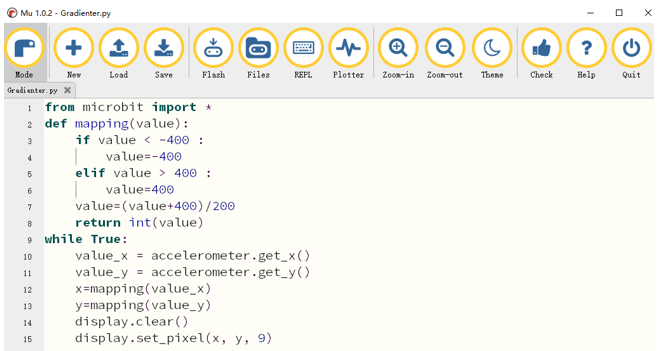

Check the connection of the circuit and verify it correct, download the code into micro:bit, you will observe that the LED dot matrix will change with the tilt of micro:bit.

The following is the program code:

.. literalinclude:: ../../../freenove_Kit/Projects/PythonCode/12.2_Gradienter/Gradienter.py
    :linenos: 
    :language: python
    :lines: 1-15
    :dedent:

A custom mapping() function limits the input value to a range of -400 to 400 and maps to a range of 0-4.

.. literalinclude:: ../../../freenove_Kit/Projects/PythonCode/12.2_Gradienter/Gradienter.py
    :linenos: 
    :language: python
    :lines: 2-8
    :dedent:

Read the value of the accelerometer X, Y-axis direction. The return value range is -2000-2000. This project does not require such a wide range, So we set it to the range of -400to 400. Call the mapping() function to return the value ranging from 0-4 , lighting the LED corresponding to the x row and the y column.

.. literalinclude:: ../../../freenove_Kit/Projects/PythonCode/12.2_Gradienter/Gradienter.py
    :linenos: 
    :language: python
    :lines: 9-15
    :dedent:

Reference
------------------------------

.. py:function:: display.clear()	

    Set the brightness of all LEDs to 0 (off).

.. py:function:: display.set_pixel(x,y,9)	

    Set the brightness value of the LED at column x and row y, which has to be an integer between 0 and 9.

.. py:function:: accelerometer.get_x()	

    Get the acceleration measurement in the x axis, as a positive or negative integer, depending on the direction. The measurement is given in milli-g. By default the accelerometer is configured with a range of +/- 2g, and so this method will return a value within the range of +/- 2000mg

.. py:function:: accelerometer.get_y()	

    Get the acceleration measurement in the y axis, as a positive or negative integer, depending on the direction. The measurement is given in milli-g. By default the accelerometer is configured with a range of +/- 2g, and so this method will return a value within the range of +/- 2000mg.