##############################################################################
Chapter Potentiometer
##############################################################################

In this chapter, we will learn a new component: potentiometer

Project Potentiometer
*************************************

This project enables a rotatary potentiometer to output different voltages.

Component list
================================

+----------------------------+-----------------------------+
| Microbit x1                | Expansion board x1          |
|                            |                             |
| |Chapter03_00|             | |Chapter03_01|              |
+----------------------------+-----------------------------+
| Breakboard x1              | USB cable x1                |
|                            |                             |
| |Chapter03_02|             | |Chapter03_03|              |
+----------------------------+-----------------------------+
| Potentiometer x1           | F/M x3                      |
|                            |                             |
| |Chapter13_00|             | |Chapter13_01|              |
+----------------------------+-----------------------------+

.. |Chapter13_00| image:: ../_static/imgs/13_Potentiometer/Chapter13_00.png
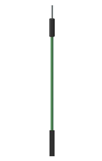
.. |Chapter03_00| image:: ../_static/imgs/3_LED/Chapter03_00.png
.. |Chapter03_01| image:: ../_static/imgs/3_LED/Chapter03_01.png
.. |Chapter03_02| image:: ../_static/imgs/3_LED/Chapter03_02.png
.. |Chapter03_03| image:: ../_static/imgs/3_LED/Chapter03_03.png

Component knowledge
=========================

ADC
---------------------------

An ADC is an electronic integrated circuit used to convert analog signals such as voltages to digital or binary form consisting of 1s and 0s. The range of our ADC module is 10 bits, that means the resolution is 2^10=1024, so that its range (at 3.3V) will be divided equally to 1024 parts. 

Any analog value can be mapped to one digital value using the resolution of the converter. So the more bits the ADC has, the denser the partition of analog will be and the greater the precision of the resulting conversion.

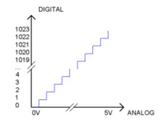

Subsection 1: the analog in rang of 0V-3.3/1024V corresponds to digital 0;

Subsection 2: the analog in rang of 3.3 /1024V-2*3.3/1024V corresponds to digital 1;

...

The resultant analog signal will be divided accordingly.

Potentiometer
-----------------------------

Potentiometer is a resistive element with three Terminal parts. Unlike the resistors that we have used thus far in our project which have a fixed resistance value, the resistance value of a potentiometer can be adjusted. A potentiometer is often made up by a resistive substance (a wire or carbon element) and movable contact brush. When the brush moves along the resistor element, there will be a change in the resistance of the potentiometer’s output side (3) (or change in the voltage of the circuit that is a part). The illustration below represents a linear sliding potentiometer and its electronic symbol on the right.

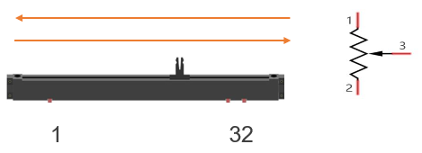

Between potentiometer pin 1 and pin 2 is the resistive element (a resistance wire or carbon) and pin 3 is connected to the brush that makes contact with the resistive element. In our illustration, when the brush moves from pin 1 to pin 2, the resistance value between pin 1 and pin 3 will increase linearly (until it reaches the highest value of the resistive element) and at the same time the resistance between pin 2 and pin 3 will decrease linearly and conversely down to zero. At the midpoint of the slider the measured resistance values between pin 1 and 3 and between pin 2 and 3 will be the same.

In a circuit, both sides of resistive element are often connected to the positive and negative electrodes of power. When you slide the brush "pin 3", you can get variable voltage within the range of the power supply.

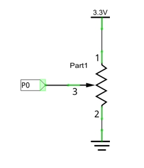

Rotary potentiometer
-------------------------------

Rotary potentiometers and linear potentiometers have the same function; the only difference being the physical action being a rotational rather than a sliding movement.

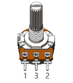

Circuit
================================

.. list-table:: 
   :width: 100%
   :align: center

   * -  Schematic diagram
   * -  |Chapter13_06|
   * -  Hardware connection
   * -  |Chapter13_07|

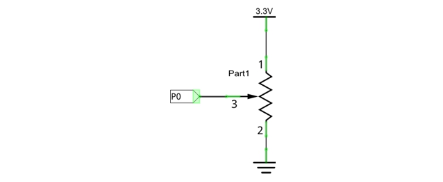
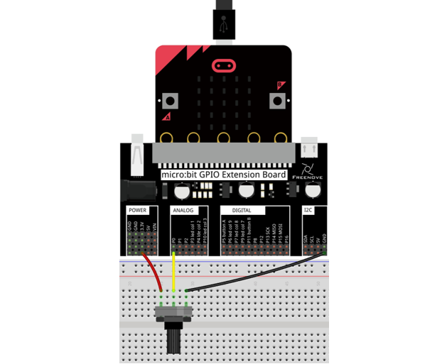

Block code 
=====================================

Open MakeCode first. Import the .hex file. The path is as below:

( :ref:`How to import project <import_project>` )

+-----------+------------------------------------------+-------------------+
| File type | Path                                     | File name         |
+-----------+------------------------------------------+-------------------+
| HEX file  | ../Projects/BlockCode/13.1_Potentiometer | Potentiometer.hex |
+-----------+------------------------------------------+-------------------+

After importing successfully, the code is shown as below:

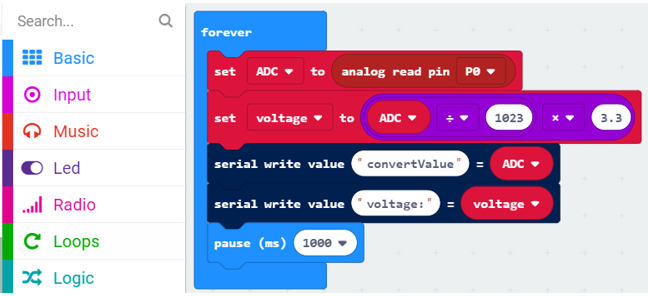

Check the connection of the circuit and verify it correct and then download the code into micro:bit.

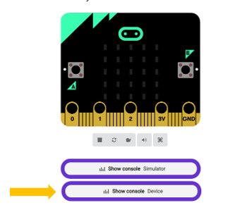

Click on the console device, rotate the potentiometer, you will see the output ADC value and voltage value.

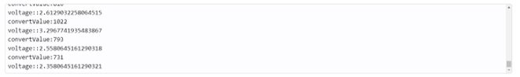

Read the analog voltage value of the P0 pin, the range is 0-1023, and then convert the analog voltage value into a digital voltage value.

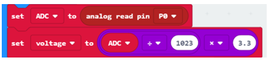

Print the analog voltage and digital voltage of P0 pin every 1 second.

Reference
--------------------------

.. list-table:: 
   :width: 100%
   :align: center

   * -  Block
     -  Function 
   
   * -  |Chapter13_13|
     -  Read an analog signal (0 to 1023) from the pin you set.

Python code
==========================

Open the .py file with Mu. Code, the path is as below:

+-------------+-------------------------------------------+------------------+
| File type   | Path                                      | File name        |
+-------------+-------------------------------------------+------------------+
| Python file | ../Projects/PythonCode/13.1_Potentiometer | Potentiometer.py |
+-------------+-------------------------------------------+------------------+

After loading successfully, the code is shown as below:

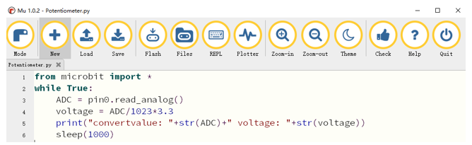

Check the connection of the circuit and confirm that the circuit is connected correctly. Download the code into the micro:bit. ( :ref:`How to download? <download>` )

Click on the REPL, press the micro:bit reset button, and then rotate the potentiometer. You can see the change in the value on the software Mu, as shown below.

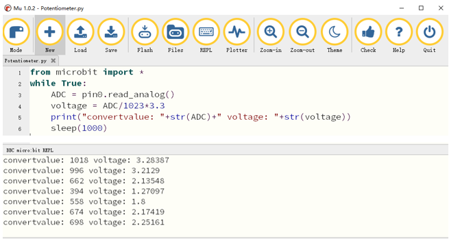

The following is the program code:

.. literalinclude:: ../../../freenove_Kit/Projects/PythonCode/13.1_Potentiometer/Potentiometer.py
    :linenos: 
    :language: python
    :lines: 1-6
    :dedent:

Read the analog voltage value of the P0 pin, the range is 0-1023, and then convert the analog voltage value into a digital voltage value.

.. literalinclude:: ../../../freenove_Kit/Projects/PythonCode/13.1_Potentiometer/Potentiometer.py
    :linenos: 
    :language: python
    :lines: 3-4
    :dedent:

Print the analog voltage and digital voltage of P0 pin every 1 second.

.. literalinclude:: ../../../freenove_Kit/Projects/PythonCode/13.1_Potentiometer/Potentiometer.py
    :linenos: 
    :language: python
    :lines: 5-6
    :dedent:

Reference
----------------------------

.. py:function:: read_analog()	
    
    Read an analog signal (0 to 1023) from the pin you set.
    
.. py:function:: print()	
    
    print() is a Python built-in function for printing.