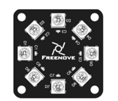
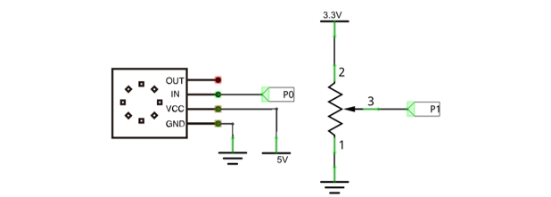
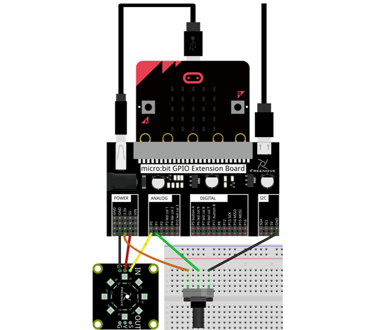
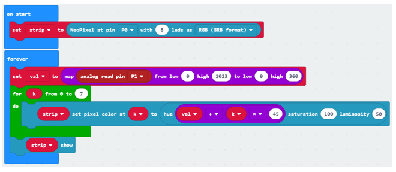
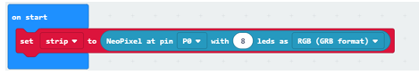
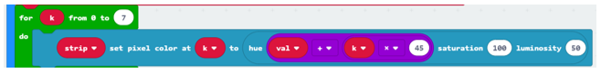
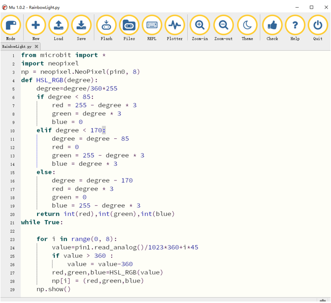

Project Rainbow Light
***************************************

In this project, we use a potentiometer to control the RGB LED module.

Component list
=============================

+----------------------------+-----------------------------+
| Microbit x1                | Expansion board x1          |
|                            |                             |
| |Chapter03_00|             | |Chapter03_01|              |
+----------------------------+-----------------------------+
| Breakboard x1              | USB cable x1                |
|                            |                             |
| |Chapter03_02|             | |Chapter03_03|              |
+----------------------------+-----------------------------+
| Potentiometer x1           | F/M x3  M/M x1              |
|                            |                             |
| |Chapter13_00|             | |Chapter14_00|              |
+----------------------------+-----------------------------+
| Freenove 8 RGB LED Module x1                             |
|                                                          |
|  |Chapter14_18|                                          |
+----------------------------------------------------------+

.. |Chapter13_00| image:: ../_static/imgs/13_Potentiometer/Chapter13_00.png
.. |Chapter14_00| image:: ../_static/imgs/14_Potentiometer_and_LED/Chapter14_00.png
.. |Chapter03_00| image:: ../_static/imgs/3_LED/Chapter03_00.png
.. |Chapter03_01| image:: ../_static/imgs/3_LED/Chapter03_01.png
.. |Chapter03_02| image:: ../_static/imgs/3_LED/Chapter03_02.png
.. |Chapter03_03| image:: ../_static/imgs/3_LED/Chapter03_03.png

Circuit
==========================

.. list-table:: 
   :width: 100%
   :align: center

   * -  Schematic diagram
   * -  |Chapter14_19|
   * -  Hardware connection
   * -  |Chapter14_20|

:red:`RGBLED's long pin (anode) is connected to 3.3V power supply.`

Block code 
============================

Open MakeCode first. Import the .hex file. The path is as below:

( :ref:`How to import project <import_project>` )

+-----------+-----------------------------------------+------------------+
| File type | Path                                    | File name        |
+-----------+-----------------------------------------+------------------+
| HEX file  | ../Projects/BlockCode/14.3_RainbowLight | RainbowLight.hex |
+-----------+-----------------------------------------+------------------+

After importing successfully, the code is shown as below:

Check the connection of the circuit, verify it correct, download the code into the micro:bit, rotate the potentiometer, and the color ring of the RGB LED module also rotates.

Set the number of pins and LEDs for the RGB LED module, as well as the type of LED.

Read the voltage of the potentiometer and map the analog value of 0-1023 to an angle of 0-360.

In the for loop, the hue difference between each two LEDs is 45. When the hue changes, it ensures that the LED succeeds the hue of the previous LED. Then it converts the HSL color system to the RGB color system, and returns the RGB value corresponding to the angle, to make the LED to achieve the effect of the rainbow.

Python code 
=========================

Open the .py file with Mu. Code, the path is as below:

+-------------+------------------------------------------+-----------------+
| File type   | Path                                     | File name       |
+-------------+------------------------------------------+-----------------+
| Python file | ../Projects/PythonCode/14.3_RainbowLight | RainbowLight.py |
+-------------+------------------------------------------+-----------------+

After loading successfully, the code is shown as below:

Check the connection of the circuit, verify it correct, and download the code into the micro:bit. Rotate the potentiometer, and then the color ring of the RGB LED module also rotates.

The following is the program code:

.. literalinclude:: ../../../freenove_Kit/Projects/PythonCode/14.3_RainbowLight/RainbowLight.py
    :linenos: 
    :language: python
    :lines: 1-29
    :dedent:

Set the number of pins and LED to control the RGB LED module.

.. literalinclude:: ../../../freenove_Kit/Projects/PythonCode/14.3_RainbowLight/RainbowLight.py
    :linenos: 
    :language: python
    :lines: 3-3
    :dedent:

Custom HSL_RGB() function is used to convert HSL color to RGB color, returning the RGB value corresponding to the current hue angle.

.. literalinclude:: ../../../freenove_Kit/Projects/PythonCode/14.3_RainbowLight/RainbowLight.py
    :linenos: 
    :language: python
    :lines: 4-20
    :dedent:

In the for loop, the analog voltage of the potentiometer is read and converted to the corresponding hue angle. The hue difference between each two led is 45. The HSL_RGB() function is called to convert the HSL color system to the RGB color system, return the RGB value corresponding to the current hue angle to make the LED achieve the effect of rainbow.

.. literalinclude:: ../../../freenove_Kit/Projects/PythonCode/14.3_RainbowLight/RainbowLight.py
    :linenos: 
    :language: python
    :lines: 21-29
    :dedent: