##############################################################################
Chapter Potentiometer and LED 
##############################################################################

This chapter is a comprehensive application of potentiometer and LED.

Project Soft Light
******************************

In this project, we will make an LED with adjustable brightness.

Component list
================================

+----------------------------+-----------------------------+
| Microbit x1                | Expansion board x1          |
|                            |                             |
| |Chapter03_00|             | |Chapter03_01|              |
+----------------------------+-----------------------------+
| Breakboard x1              | USB cable x1                |
|                            |                             |
| |Chapter03_02|             | |Chapter03_03|              |
+----------------------------+-----------------------------+
| Potentiometer x1           | F/M x3  M/M x1              |
|                            |                             |
| |Chapter13_00|             | |Chapter14_00|              |
+----------------------------+-----------------------------+
| LED x1                     | Resistor 220Ω x1            |
|                            |                             |
| |Chapter14_01|             | |Chapter14_02|              |
+----------------------------+-----------------------------+

.. |Chapter13_00| image:: ../_static/imgs/13_Potentiometer/Chapter13_00.png
.. |Chapter14_00| image:: ../_static/imgs/14_Potentiometer_and_LED/Chapter14_00.png
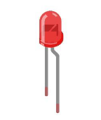
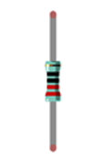
.. |Chapter03_00| image:: ../_static/imgs/3_LED/Chapter03_00.png
.. |Chapter03_01| image:: ../_static/imgs/3_LED/Chapter03_01.png
.. |Chapter03_02| image:: ../_static/imgs/3_LED/Chapter03_02.png
.. |Chapter03_03| image:: ../_static/imgs/3_LED/Chapter03_03.png

Circuit
============================

In this circuit, the port 1 and 2 of the potentiometer are respectively connected to the two ends of the power supply, and the port3 is connected to the P0 pin of the micro:bit. 

.. list-table:: 
   :width: 100%
   :align: center

   * -  Schematic diagram
   * -  |Chapter14_03|
   * -  Hardware connection
   * -  |Chapter14_04|

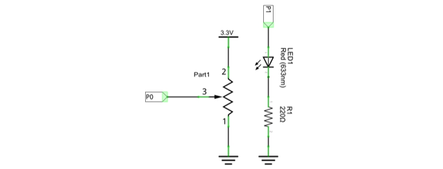
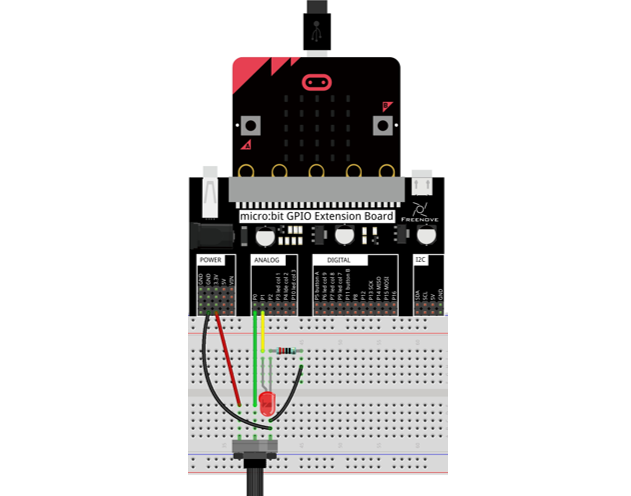

:red:`P1 pin is connected to LED's long pin (positive), and its short pin (negative) is connected to resistor.`

Block code
==========================
Open MakeCode first. Import the .hex file. The path is as below:

(How to import project)

+-----------+--------------------------------------+---------------+
| File type | Path                                 | File name     |
+-----------+--------------------------------------+---------------+
| HEX file  | ../Projects/BlockCode/14.1_SoftLight | SoftLight.hex |
+-----------+--------------------------------------+---------------+

After importing successfully, the code is shown as below:

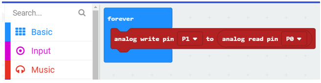

Check the connection of the circuit, verify it correct,, download the code into the micro:bit, and rotate the potentiometer to see the change of the brightness.

Read the analog voltage value of the P0 pin, then the P1 pin outputs the same analog voltage value.

Python code
=========================

Open the .py file with Mu. Code, the path is as below:

+-------------+---------------------------------------+--------------+
| File type   | Path                                  | File name    |
+-------------+---------------------------------------+--------------+
| Python file | ../Projects/PythonCode/14.1_SoftLight | SoftLight.py |
+-------------+---------------------------------------+--------------+

After load successfully, the code is shown as below:

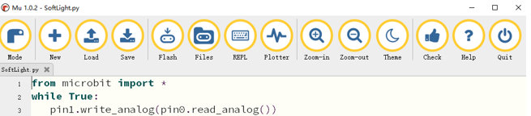

Check the connection of the circuit, verify it correct, download the code into the micro:bit, and rotate the potentiometer to see the change of the brightness of the LED.

The following is the program code:

.. literalinclude:: ../../../freenove_Kit/Projects/PythonCode/14.1_SoftLight/SoftLight.py
    :linenos: 
    :language: python
    :lines: 1-3
    :dedent:

Read the analog voltage value of the P0 pin, then the P1 pin outputs the same analog voltage value.

.. literalinclude:: ../../../freenove_Kit/Projects/PythonCode/14.1_SoftLight/SoftLight.py
    :linenos: 
    :language: python
    :lines: 3-3
    :dedent:

Project Multicolored Soft Light
**************************************************

In this project, we control the color of the RGBLED with a potentiometer. 

Component list
===============================

+----------------------------+-----------------------------+
| Microbit x1                | Expansion board x1          |
|                            |                             |
| |Chapter03_00|             | |Chapter03_01|              |
+----------------------------+-----------------------------+
| Breakboard x1              | USB cable x1                |
|                            |                             |
| |Chapter03_02|             | |Chapter03_03|              |
+----------------------------+-----------------------------+
| Potentiometer x1           | F/M x6  M/M x1              |
|                            |                             |
| |Chapter13_00|             | |Chapter14_00|              |
+----------------------------+-----------------------------+
| RGB_LED x1                 | Resistor 220Ω x3            |
|                            |                             |
| |Chapter14_08|             | |Chapter14_00|              |
+----------------------------+-----------------------------+

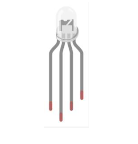

Circuit
================================

.. list-table:: 
   :width: 100%
   :align: center

   * -  Schematic diagram
   * -  |Chapter14_09|
   * -  Hardware connection
   * -  |Chapter14_10|

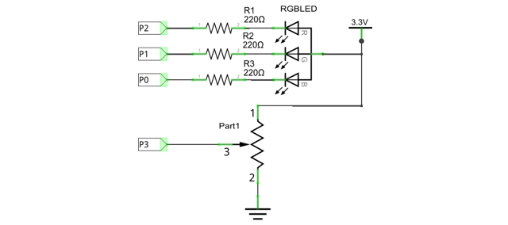
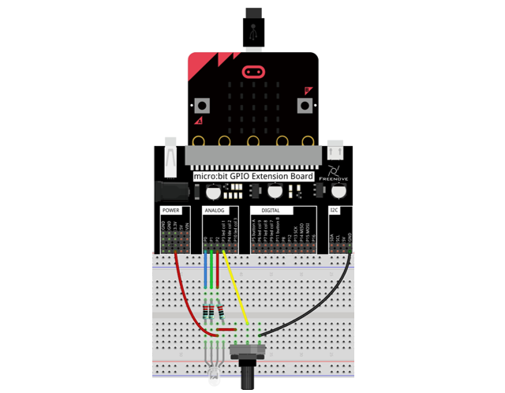

:red:`RGBLED's long pin (anode) is connected to 3.3V power supply.`

Block code 
=================================

Open MakeCode first. Import the .hex file. The path is as below:

(How to import project)

+-----------+----------------------------------------------+-----------------------+
| File type | Path                                         | File name             |
+-----------+----------------------------------------------+-----------------------+
| HEX file  | ../Projects/BlockCode/14.2_ColorfulSoftLight | ColorfulSoftLight.hex |
+-----------+----------------------------------------------+-----------------------+

After importing successfully, the code is shown as below:

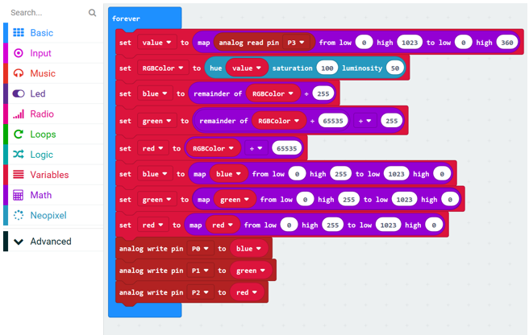

Download the code into micro:bit, rotate the potentiometer, you can see that the color of the RGBLED is changing.

Read the potentiometer's analog voltage and map the potentiometer's analog voltage ranging 0-1023 to the hue angle ranging 0-360.

Convert the HSL color system to the RGB color system, return the RGB value corresponding to the current hue angle, and store the value in the variable RGBColor.

The value of the lower eight-bit blue channel of the variable RGBColor is assigned to the variable blue, the value of the middle eight-bit green channel is assigned to the variable green, and the value of the upper eight-bit red channel is assigned to the variable red.

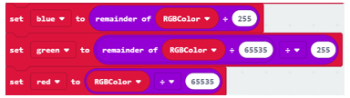

RGBLED is a common anode, so the pins are set to low to turn on the RGBLED. The values of the variables 'red', 'green', and 'blue' are converted from 0-255 to analog signal values in the range of 1023-0, and then reassigned to 'red', 'green', 'blue 'variable. In this kit, three LEDs of RGB LED share a common anode(+) and their negative pins need to be set to LOW level to turn ON the RGB LED work. And the value of variables ‘red’, ‘green’, and ‘blue’ need to be converted from the value ranging from 0-255 to analog signal values ranging from 1023-0, and then reassigned to them.

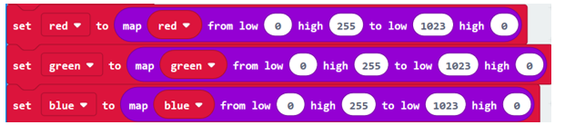

Write the analog voltage value of the red, green, and blue variables to the corresponding P0, P1, and P2 pins to change the LED color.

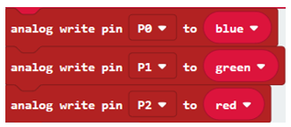

Python code
========================

Open the py file with Mu. Code, the path is as below:

+-------------+-----------------------------------------------+----------------------+
| File type   | Path                                          | File name            |
+-------------+-----------------------------------------------+----------------------+
| Python file | ../Projects/PythonCode/14.2_ColorfulSoftLight | ColorfulSoftLight.py |
+-------------+-----------------------------------------------+----------------------+

After loading successfully, the code is shown as below:

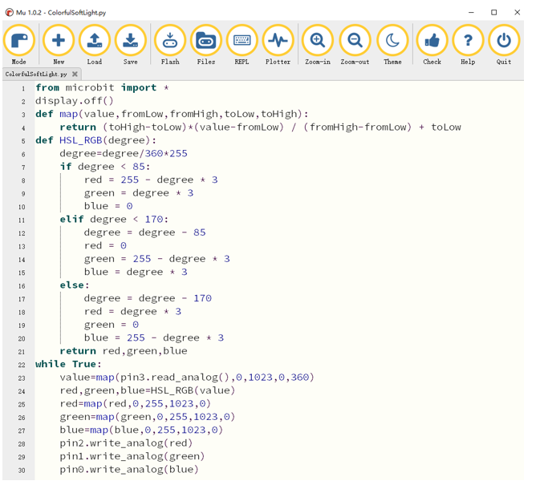

After checking the connection of the circuit, verify it correct, download the code into micro:bit. By rotating the potentiometer, you can see that the color of RGB LED is changing.

The following is the program code:

.. literalinclude:: ../../../freenove_Kit/Projects/PythonCode/14.2_ColorfulSoftLight/ColorfulSoftLight.py
    :linenos: 
    :language: python
    :lines: 1-30
    :dedent:

Turn OFF the LED screen to use the P3 pin. A custom map() function converts values in one range of numbers to values in another range of numbers.

.. literalinclude:: ../../../freenove_Kit/Projects/PythonCode/14.2_ColorfulSoftLight/ColorfulSoftLight.py
    :linenos: 
    :language: python
    :lines: 2-4
    :dedent:

The custom function HSL_RGB()is used to convert the HSL color system to the RGB color system and return the RGB value corresponding to the current hue angle.

.. literalinclude:: ../../../freenove_Kit/Projects/PythonCode/14.2_ColorfulSoftLight/ColorfulSoftLight.py
    :linenos: 
    :language: python
    :lines: 5-21
    :dedent:

Read the analog voltage value of the P3 pin and convert it to the corresponding hue angle. Call the HSL_RGB() function to return the RGB value corresponding to the current hue angle, and then write the corresponding RGB values to the P0, P1, and P2 pins to change the LED color.

.. literalinclude:: ../../../freenove_Kit/Projects/PythonCode/14.2_ColorfulSoftLight/ColorfulSoftLight.py
    :linenos: 
    :language: python
    :lines: 22-30
    :dedent:

.. include:: 14_2_Potentiometer_and_LED.rst