##############################################################################
Chapter Light Sensor
##############################################################################

In this chapter, we will learn the micro:bit built-in light sensor and photoresistor.

Project 15.1 Built-in Light Sensor
********************************************

In this project, we use the micro:bit built-in light sensor to measure the brightness of light.

Component list
==============================

.. list-table:: 
   :width: 100%
   :align: center

   * -  Microbit x1
     -  USB cable x1
   * -  |Chapter03_00|
     -  |Chapter03_03|

.. |Chapter03_00| image:: ../_static/imgs/3_LED/Chapter03_00.png
.. |Chapter03_03| image:: ../_static/imgs/3_LED/Chapter03_03.png

Component knowledge
===============================

Light sensor
---------------------------------

Micro:bit detects the ambient light intensity through the LED matrix. In forward bias mode, the LED screen works as a display. In reverse bias mode, the LED screen works as a basic light sensor that can be used to detect ambient light.

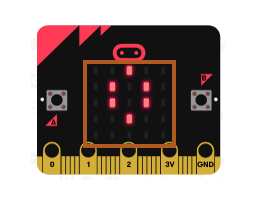

Circuit
=============================

Connect micro:bit and PC via a micro USB cable.

Hardware connection

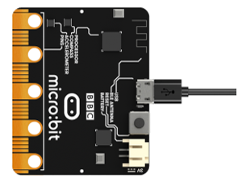

Block code 
===============================

Open MakeCode first. Import the .hex file. The path is as below:

( :ref:`How to import project <import_project>` )

+-----------+------------------------------------------------+-------------------------+
| File type | Path                                           | File name               |
+-----------+------------------------------------------------+-------------------------+
| HEX file  | ../Projects/BlockCode/15.1_LightIntensityMeter | LightIntensityMeter.hex |
+-----------+------------------------------------------------+-------------------------+

After importing successfully, the code is shown as below:

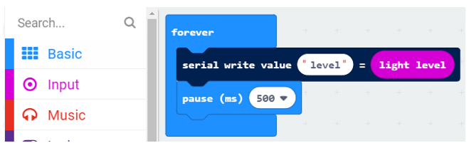

Check the connection of the circuit, verify it correct and download the code into the micro:bit. Open the serial port console, then you can see the reading light intensity. Cover the LED screen with your hand or increase the light shining on it, you can see the change in value, the range of values is 0-255, 0 is dark, 255 is the brightest, as shown below.

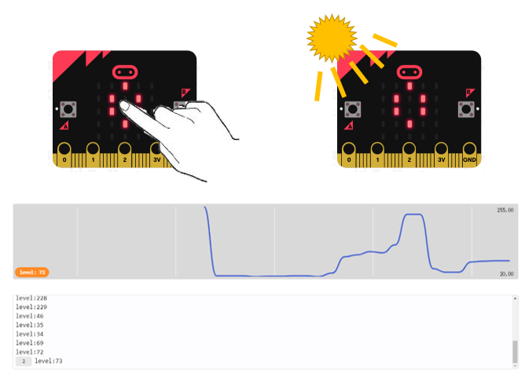

Reference
------------------------------

.. list-table:: 
   :width: 100%
   :align: center

   * -  Block
     -  Function 
   
   * -  |Chapter15_04|
     -  Detect the light level (how bright or dark it is) of the environment where you are. The light level 0 means darkness and 255 means bright light.

Python code
==============================

Open the .py file with Mu. Code, the path is as below:

+-------------+-------------------------------------------------+------------------------+
| File type   | Path                                            | File name              |
+-------------+-------------------------------------------------+------------------------+
| Python file | ../Projects/PythonCode/15.1_LightIntensityMeter | LightIntensityMeter.py |
+-------------+-------------------------------------------------+------------------------+

After loading successfully, the code is shown as below:

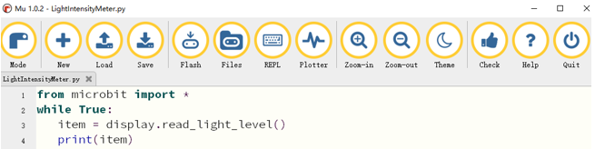

Check the connection of the circuit, verify it correct, download the code into the micro:bit. Open the serial port console, then you can see the reading light intensity. Cover the LED screen with your hand or increase the light shining on it, you can see the change in value, the range of values is 0-255, 0 is dark, 255 is the brightest, as shown below.】

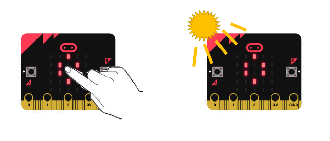

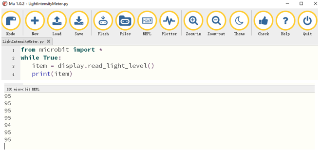

The following is the program code:

.. literalinclude:: ../../../freenove_Kit/Projects/PythonCode/15.1_LightIntensityMeter/LightIntensityMeter.py
    :linenos: 
    :language: python
    :lines: 1-4
    :dedent:

Reference
-----------------------

.. py:function:: display.read_light_level()	

    Use the display's LEDs in reverse-bias mode to sense the amount of light falling on the display, return an integer between 0 and 255 representing the light level. The larger the value, the brighter the light..

Project Night Light
*************************************

In this project, we will make a night light.

Component list
================================

+----------------------------+-----------------------------+
| Microbit x1                | Expansion board x1          |
|                            |                             |
| |Chapter03_00|             | |Chapter03_01|              |
+----------------------------+-----------------------------+
| Breakboard x1              | USB cable x1                |
|                            |                             |
| |Chapter03_02|             | |Chapter03_03|              |
+----------------------------+-----------------------------+
| Photoresistance x1         | F/M x4  M/M x1              |
|                            |                             |
| |Chapter13_00|             | |Chapter15_08|              |
+----------------+-----------+--------+--------------------+
| LED x1         |   Resistor 10kΩ x1 | Resistor 220Ω x1   |
|                |                    |                    |
| |Chapter13_00| |  |Chapter15_09|    |   |Chapter15_10|   |
+----------------+--------------------+--------------------+

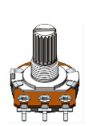
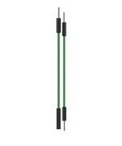
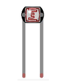

.. |Chapter03_01| image:: ../_static/imgs/3_LED/Chapter03_01.png
.. |Chapter03_02| image:: ../_static/imgs/3_LED/Chapter03_02.png

Component knowledge
===============================

Photoresistor
--------------------------------

A Photoresistor is simply a light sensitive resistor. It is an active component that decreases resistance with respect to receiving luminosity (light) on the component's light sensitive surface. A Photoresistor’s resistance value will change in proportion to the ambient light detected. With this characteristic, we can use a Photoresistor to detect light intensity. The Photoresistor and its electronic symbol are as follows.

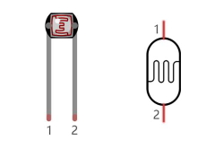

The circuit below is often used to detect the change of a photoresistor's resistance value:

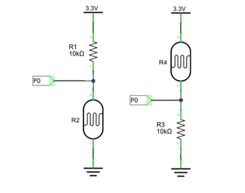

In the above circuit, when a Photoresistor's resistance vale changes due to a change in light intensity, the voltage between the Photoresistor and Resistor R1 will also change. Therefore, the intensity of the light can be obtained by measuring this voltage.

Circuit
================================

.. list-table:: 
   :width: 100%
   :align: center

   * -  Schematic diagram
   * -  |Chapter15_13|
   * -  Hardware connection
   * -  |Chapter15_14|

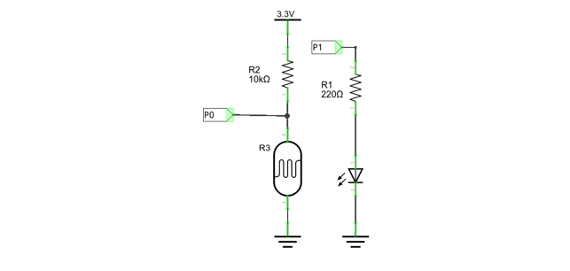
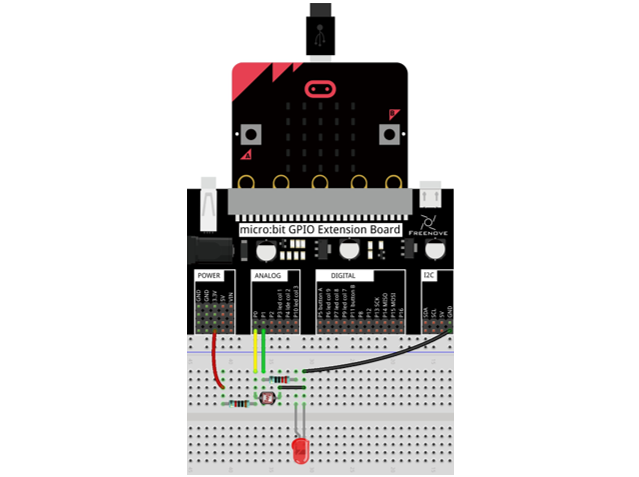

Block code
===================================

Open MakeCode first. Import the .hex file. The path is as below:

(How to import project)

+-----------+---------------------------------------+----------------+
| File type | Path                                  | File name      |
+-----------+---------------------------------------+----------------+
| HEX file  | ../Projects/BlockCode/15.2_NightLight | NightLight.hex |
+-----------+---------------------------------------+----------------+

After importing successfully, the code is shown as below:

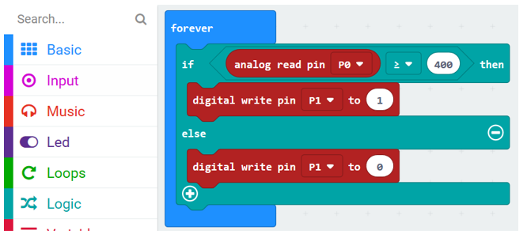

Check the connection of the circuit, verify it correct, and download the code into the micro:bit. Cover the photoresistor with your hand, the LED is turned ON. Move the hand away, the LED is turned OFF.

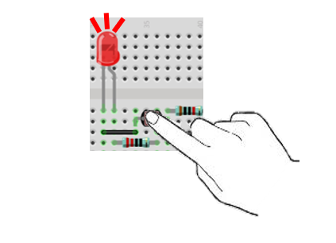

Read the analog voltage value of the P0 pin.

If the analog voltage read is greater than or equal to 400, it is considered to be occluded, and the LED is turned ON. Or the LED is turned OFF. 

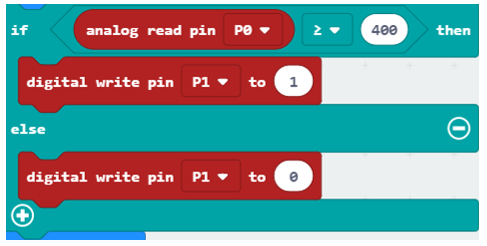

Python code
===========================

Open the .py file with Mu. Code, the path is as below:

+-------------+----------------------------------------+---------------+
| File type   | Path                                   | File name     |
+-------------+----------------------------------------+---------------+
| Python file | ../Projects/PythonCode/15.2_NightLight | NightLight.py |
+-------------+----------------------------------------+---------------+

After loading successfully, the code is shown as below:

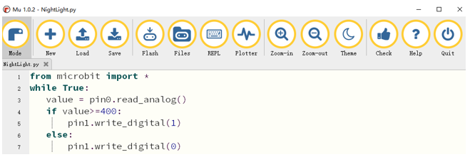

Check the connection of the circuit, verify it correct, and download the code into the micro:bit. Cover the photoresistor with your hand, then the LED is turned ON. Move the hand away, then the LED is turned OFF.

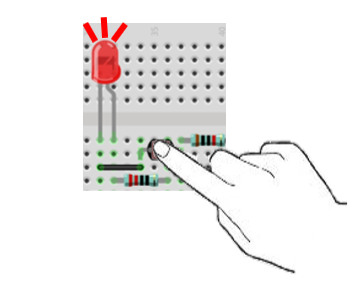

The following is the program code:

.. literalinclude:: ../../../freenove_Kit/Projects/PythonCode/15.2_NightLight/NightLight.py
    :linenos: 
    :language: python
    :lines: 1-7
    :dedent:

Read the analog voltage value of the P0 pin.

.. literalinclude:: ../../../freenove_Kit/Projects/PythonCode/15.2_NightLight/NightLight.py
    :linenos: 
    :language: python
    :lines: 3-3
    :dedent:

If the analog voltage read is greater than or equal to 400, it is considered to be occluded, and the LED is turned ON. Otherwise the LED is turned OFF.

.. literalinclude:: ../../../freenove_Kit/Projects/PythonCode/15.2_NightLight/NightLight.py
    :linenos: 
    :language: python
    :lines: 4-7
    :dedent: