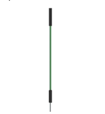
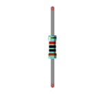
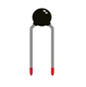
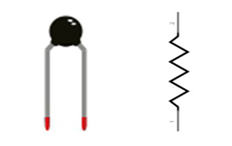
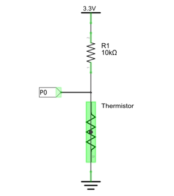
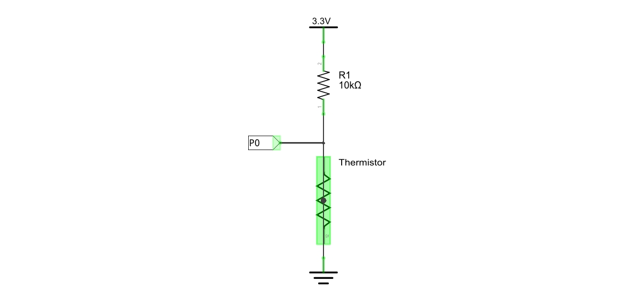
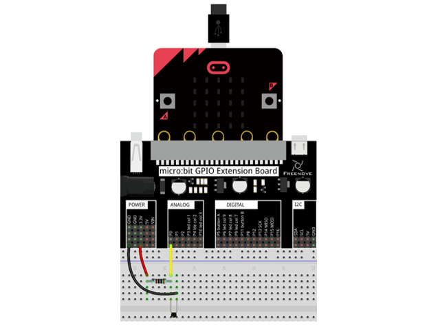
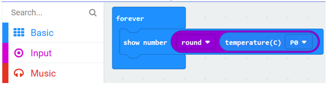
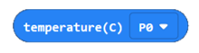
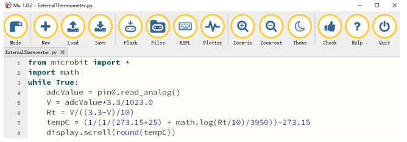

Project Thermistor
************************************

In this project, we will use a thermistor to detect the ambient temperature.

Component list
=============================

+----------------+-------------------------------------+
| Microbit x1    | Expansion board x1                  |
|                |                                     |
| |Chapter03_00| | |Chapter03_01|                      |
+----------------+-------------------------------------+
| Breakboard x1  | USB cable x2                        |
|                |                                     |
| |Chapter03_02| | |Chapter03_03|                      |
+----------------+-------------------------------------+
| Jumper F/M x3  | Resistor 10kΩ x1                    |
|                |                                     |
| |Chapter16_03| | |Chapter16_04|                      |
+----------------+-------------------------------------+
| Thermistor x1                                        |
|                                                      |
|  |Chapter16_05|                                      |
+------------------------------------------------------+

.. |Chapter03_01| image:: ../_static/imgs/3_LED/Chapter03_01.png
.. |Chapter03_02| image:: ../_static/imgs/3_LED/Chapter03_02.png

Component knowledge
==========================

Thermistor
--------------------------

Thermistor is a temperature sensitive resistor. When it senses a change in temperature, the resistance of the Thermistor will change. We can take advantage of this characteristic by using a Thermistor to detect temperature intensity. A Thermistor and its electronic symbol are shown below. 

The relationship between resistance value and temperature of a thermistor is:

Rt=R*EXP[B*(1/T2-1/T1)]

Where:

Rt is the thermistor resistance under T2 temperature;

R is in the nominal resistance of thermistor under T1 temperature; EXP[n] is nth power of e;

B is for thermal index;

T1, T2 is Kelvin temperature (absolute temperature). Kelvin temperature=273.15+celsius temperature.

For the parameters of the Thermistor, we use: B=3950, R=10k, T1=25.

The circuit connection method of the Thermistor is similar to photoresistor, as the following:

We can use the value measured by the analog pin of micro:bit to obtain resistance value of thermistor, and then we can use the formula to obtain the temperature value.

Therefore, the temperature formula can be derived as:

T2 = 1/(1/T1 + ln(Rt/R)/B)

Circuit
============================

.. list-table:: 
   :width: 100%
   :align: center

   * -  Schematic diagram
   * -  |Chapter16_08|
   * -  Hardware connection
   * -  |Chapter16_09|

Block code 
=================================

Open MakeCode first. Import the .hex file. The path is as below:

( :ref:`How to import project <import_project>` )

+-----------+------------------------------------------------+-------------------------+
| File type | Path                                           | File name               |
+-----------+------------------------------------------------+-------------------------+
| HEX file  | ../Projects/BlockCode/16.2_ExternalThermometer | ExternalThermometer.hex |
+-----------+------------------------------------------------+-------------------------+

After importing successfully, the code is shown as below:

Check the connection of the circuit, verify it correct, download the code into the micro:bit, and the LED dot matrix will display the detected temperature.

The temperature measured by the thermistor and the temperature measured by the micro:bit's built-in temperature sensor may have slight difference. This is because the hardware used is different, and there are certain differences in the manufacturing of the components. It is within a reasonable range and can be ignored.

Obtain the temperature data measured by the thermistor, and then round up and display on the LED display.

Reference
--------------------------

.. list-table:: 
   :width: 100%
   :align: center

   * -  Block
     -  Function 
   
   * -  |Chapter16_12|
     -  Belongs to the Freenove extension block. Get the temperature data measured by the thermistor.

Extensions
---------------------------

If you want to import Freenove extensions in a new project, follow the steps below to add them.

Python code 
=============================

Open the .py file with Mu. Code, the path is as below:

+-------------+-------------------------------------------------+------------------------+
| File type   | Path                                            | File name              |
+-------------+-------------------------------------------------+------------------------+
| Python file | ../Projects/PythonCode/16.2_ExternalThermometer | ExternalThermometer.py |
+-------------+-------------------------------------------------+------------------------+

After loading successfully, the code is shown as below:

Check the connection of the circuit, verify it correct, download the code into the micro:bit, and the LED dot matrix will display the detected temperature.

The following is the program code:

.. literalinclude:: ../../../freenove_Kit/Projects/PythonCode/16.2_ExternalThermometer/ExternalThermometer.py
    :linenos: 
    :language: python
    :lines: 1-7
    :dedent:

Read the analog voltage of the thermistor and calculate the resistance of the thermistor.

.. literalinclude:: ../../../freenove_Kit/Projects/PythonCode/16.2_ExternalThermometer/ExternalThermometer.py
    :linenos: 
    :language: python
    :lines: 4-6
    :dedent:

Calculate the current temperature according to the resistance value of the thermistor and then display it on the LED dot matrix screen. For the formula, please refer to the component knowledge.,.

.. literalinclude:: ../../../freenove_Kit/Projects/PythonCode/16.2_ExternalThermometer/ExternalThermometer.py
    :linenos: 
    :language: python
    :lines: 7-8
    :dedent: