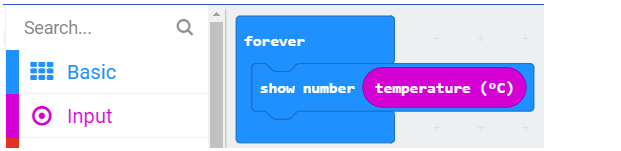
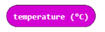
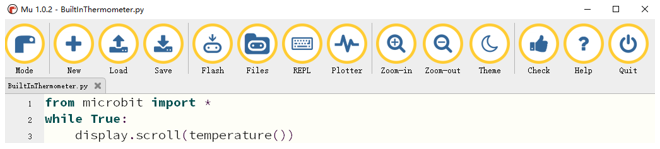

##############################################################################
Chapter Temperature Sensor
##############################################################################

In this chapter, we will learn the micro:bit built-in temperature sensor and thermistor.

Project Built-in Temperature Sensor
****************************************************

In this project, we measure the temperature with the micro:bit's built-in temperature sensor.

Component list
================================

.. list-table:: 
   :width: 100%
   :align: center

   * -  Microbit x1
     -  USB cable x1
   * -  |Chapter03_00|
     -  |Chapter03_03|

.. |Chapter03_00| image:: ../_static/imgs/3_LED/Chapter03_00.png
.. |Chapter03_03| image:: ../_static/imgs/3_LED/Chapter03_03.png

Circuit
=============================

Connect micro:bit and PC via a micro USB cable.

Hardware connection

.. image:: ../_static/imgs/15_Light_Sensor/Chapter15_01.png
    :align: center

Block code 
============================

Open MakeCode first. Import the .hex file. The path is as below:

( :ref:`How to import project <import_project>` )

+-----------+-----------------------------------------------+------------------------+
| File type | Path                                          | File name              |
+-----------+-----------------------------------------------+------------------------+
| HEX file  | ../Projects/BlockCode/16.1_BuiltInThermometer | BuiltInThermometer.hex |
+-----------+-----------------------------------------------+------------------------+

After importing successfully, the code is shown as below:

Check the connection of the circuit, verify it correct, and download the code into micro:bit, and then LED dot matrix screen will display the current detected temperature.

Reference
-----------------------

.. list-table:: 
   :width: 100%
   :align: center

   * -  Block
     -  Function
   * -  |Chapter16_01|
     -  Detect the temperature of the environment where you are. The temperature is measured in Celsius (metric).

Python code 
===========================

Open the .py file with Mu. Code, the path is as below:

+-------------+------------------------------------------------+-----------------------+
| File type   | Path                                           | File name             |
+-------------+------------------------------------------------+-----------------------+
| Python file | ../Projects/PythonCode/16.1_BuiltInThermometer | BuiltInThermometer.py |
+-------------+------------------------------------------------+-----------------------+

After loading successfully, the code is shown as below:

Check the connection of the circuit, verify it correct, and download the code into micro:bit, and then LED dot matrix screen will display the current detected temperature.

The following is the program code:

.. literalinclude:: ../../../freenove_Kit/Projects/PythonCode/16.1_BuiltInThermometer/BuiltInThermometer.py
    :linenos: 
    :language: python
    :lines: 1-3
    :dedent:

Display the detected temperature on the LED dot matrix.

.. literalinclude:: ../../../freenove_Kit/Projects/PythonCode/16.1_BuiltInThermometer/BuiltInThermometer.py
    :linenos: 
    :language: python
    :lines: 3-3
    :dedent:

Reference
----------------------

.. py:function:: temperature()	

    Return the temperature of the micro:bit in Celcius.

.. py:function:: display.scroll()	

    scrolls a string across the display

.. include:: 16.2_Temperature_Sensor.rst