##############################################################################
Chapter Joystick
##############################################################################

In an earlier chapter, we learned how to use Rotary Potentiometer. We will now learn about joysticks, which are electronic modules that work on the same principle as the Rotary Potentiometer.

Project Displaying Joystick Data
************************************************

In this project, we will read the output data of a joystick and display it.

Component list
================================

+----------------------------+-----------------------------+
| Microbit x1                | Expansion board x1          |
|                            |                             |
| |Chapter03_00|             | |Chapter03_01|              |
+----------------------------+-----------------------------+
| Joystick x1                | USB cable x2                |
|                            |                             |
| |Chapter17_00|             | |Chapter03_03|              |
+----------------------------+-----------------------------+
| Resistor 10kΩ x1           | F/F x4  F/M x3              |
|                            |                             |
| |Chapter17_02|             | |Chapter17_01|              |
+----------------------------+-----------------------------+

.. |Chapter03_00| image:: ../_static/imgs/3_LED/Chapter03_00.png
.. |Chapter03_01| image:: ../_static/imgs/3_LED/Chapter03_01.png
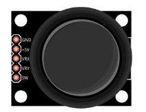
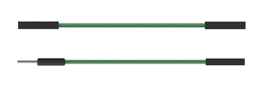

.. |Chapter03_03| image:: ../_static/imgs/3_LED/Chapter03_03.png

Component knowledge
==========================

Joystick
----------------------------

A Joystick is a kind of input sensor used with your fingers. You should be familiar with this concept already as they are widely used in gamepads and remote controls. It can receive input on two axes (Y and or X) at the same time (usually used to control direction on a two dimensional plane). And it also has a third direction capability by pressing down (Z axis/direction).

Component knowledge
===========================

Joystick
----------------------------

A Joystick is a kind of input sensor used with your fingers. You should be familiar with this concept already as they are widely used in gamepads and remote controls. It can receive input on two axes (Y and or X) at the same time (usually used to control direction on a two dimensional plane). And it also has a third direction capability by pressing down (Z axis/direction).

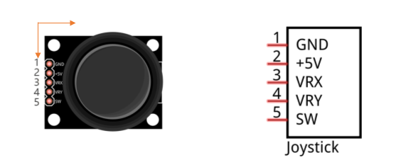

This is accomplished by incorporating two rotary potentiometers inside the Joystick Module at 90 degrees of each other, placed in such a manner as to detect shifts in direction in two directions simultaneously and with a Push Button Switch in the "vertical" axis, which can detect when a User presses on the Joystick.

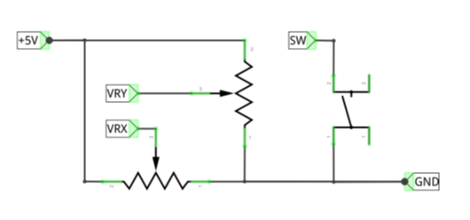

Circuit
==========================

.. list-table:: 
   :width: 100%
   :align: center

   * -  Schematic diagram
   * -  |Chapter17_05|
   * -  Hardware connection
   * -  |Chapter17_06|

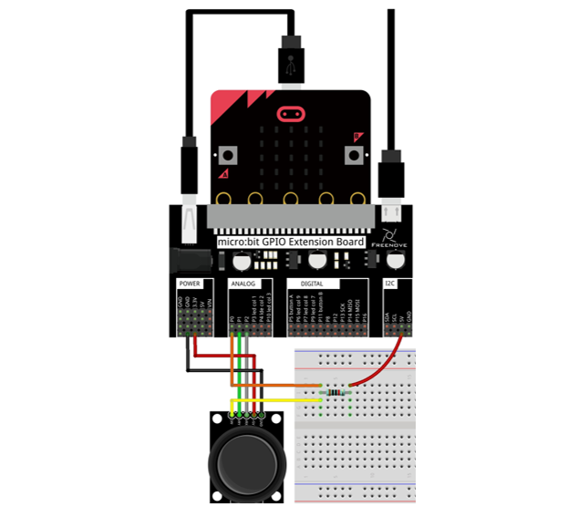

Block code 
=====================

Open MakeCode first. Import the .hex file. The path is as below:

( :ref:`How to import project <import_project>` )

+-----------+------------------------------------------------+-------------------------+
| File type | Path                                           | File name               |
+-----------+------------------------------------------------+-------------------------+
| HEX file  | ../Projects/BlockCode/17.1_DisplayJoystickData | DisplayJoystickData.hex |
+-----------+------------------------------------------------+-------------------------+

After importing successfully, the code is shown as below:

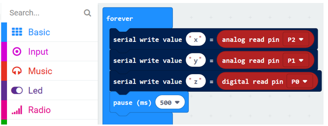

Check the connection of the circuit, verify it correct, and download the code into the micro:bit. Open the serial console, then you can see the Joystick data, as shown below.

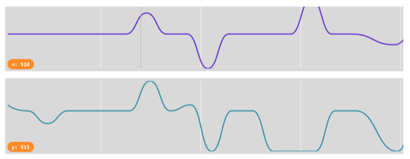

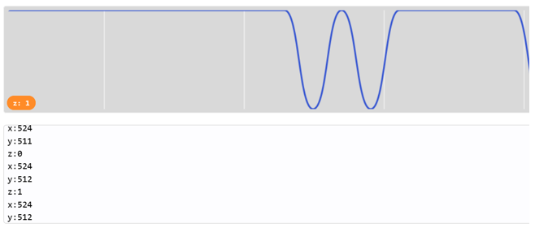

Read the analog voltage value of P1 and P2 pins and the digital voltage value of P0 pin, and print the values every 500ms.

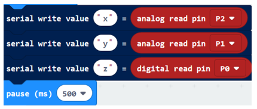

Python code
===========================

Open the .py file with Mu. Code, the path is as below:

+-------------+-------------------------------------------------+------------------------+
| File type   | Path                                            | File name              |
+-------------+-------------------------------------------------+------------------------+
| Python file | ../Projects/PythonCode/17.1_DisplayJoystickData | DisplayJoystickData.py |
+-------------+-------------------------------------------------+------------------------+

After loading successfully, the code is shown as below:

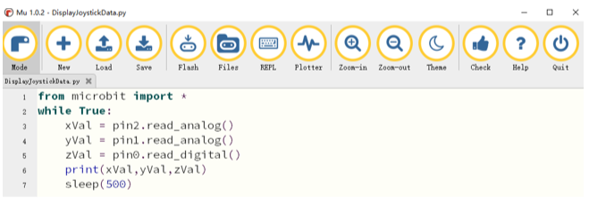

Check the connection of the circuit, verify it correct, and download the code into the micro:bit. Click on the REPL, and then press the micro:bit reset button to see the Joystick data.

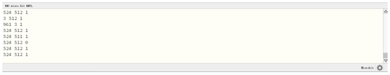

The following is the program code:

.. literalinclude:: ../../../freenove_Kit/Projects/PythonCode/17.1_DisplayJoystickData/DisplayJoystickData.py
    :linenos: 
    :language: python
    :lines: 1-7
    :dedent:

Read the analog voltage value of P0, P1, P2 pins.

.. literalinclude:: ../../../freenove_Kit/Projects/PythonCode/17.1_DisplayJoystickData/DisplayJoystickData.py
    :linenos: 
    :language: python
    :lines: 3-5
    :dedent:

Print data every 500ms.

.. literalinclude:: ../../../freenove_Kit/Projects/PythonCode/17.1_DisplayJoystickData/DisplayJoystickData.py
    :linenos: 
    :language: python
    :lines: 6-7
    :dedent:

Project Showing Direction
******************************************

This project shows the direction of the Joystick with arrows on the dot matrix.

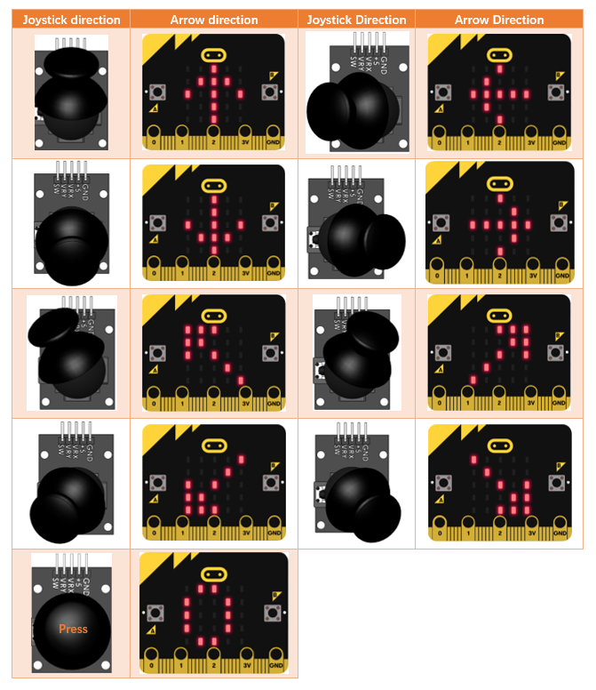

Component list
===============================

It is same as the previous project.

Circuit
=============================

It is same as the previous project.

Block code 
==============================

Open MakeCode first. Import the .hex file. The path is as below:

( :ref:`How to import project <import_project>` )

+-----------+-------------------------------------+--------------+
| File type | Path                                | File name    |
+-----------+-------------------------------------+--------------+
| HEX file  | ../Projects/BlockCode/17.2_Joystick | Joystick.hex |
+-----------+-------------------------------------+--------------+

After importing successfully, the code is shown as below:

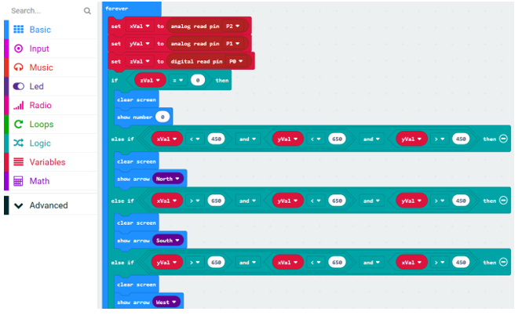

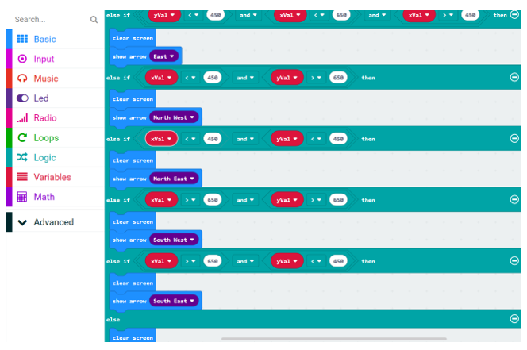

Check the connection of the circuit and verify it correct. Download the code into the micro:bit, and then the direction of the Joystick will be displayed on the dot matrix.

Get the values in the X, Y, and Z directions.

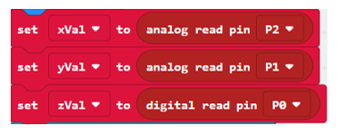

Display the corresponding arrow image according to the values of the X, Y, and Z directions.

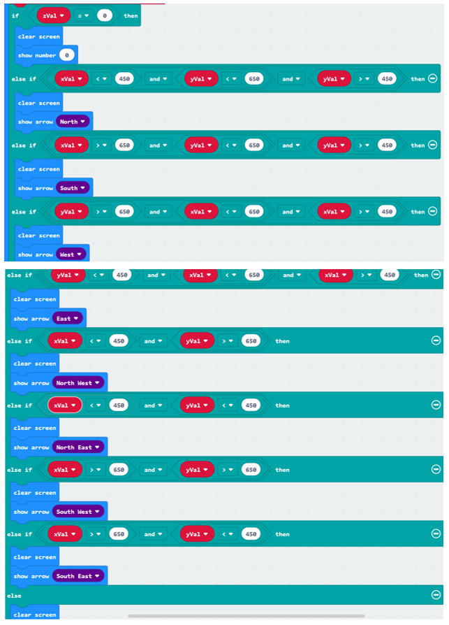

Python code 
=========================

Open the .py file with Mu. Code, the path is as below:

+-------------+--------------------------------------+-------------+
| File type   | Path                                 | File name   |
+-------------+--------------------------------------+-------------+
| Python file | ../Projects/PythonCode/17.2_Joystick | Joystick.py |
+-------------+--------------------------------------+-------------+

After loading successfully, the code is shown as below:

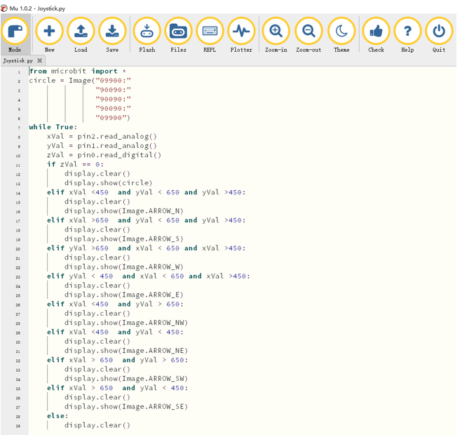

Check the connection of the circuit and verify it correct. Download the code into the micro:bit and then the direction of the Joystick will be displayed on the dot matrix.

The following is the program code:

.. literalinclude:: ../../../freenove_Kit/Projects/PythonCode/17.2_Joystick/Joystick.py
    :linenos: 
    :language: python
    :lines: 1-39
    :dedent:

Custom image number "0" will be displayed when pressing the Joystick.

.. literalinclude:: ../../../freenove_Kit/Projects/PythonCode/17.2_Joystick/Joystick.py
    :linenos: 
    :language: python
    :lines: 2-6
    :dedent:

Get the values in the X, Y, and Z directions.

.. literalinclude:: ../../../freenove_Kit/Projects/PythonCode/17.2_Joystick/Joystick.py
    :linenos: 
    :language: python
    :lines: 8-10
    :dedent:

Display the corresponding arrow image according to the value of X, Y, Z in three directions

.. literalinclude:: ../../../freenove_Kit/Projects/PythonCode/17.2_Joystick/Joystick.py
    :linenos: 
    :language: python
    :lines: 11-39
    :dedent: