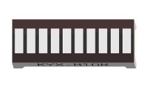
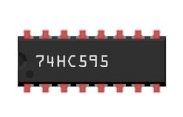
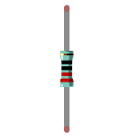
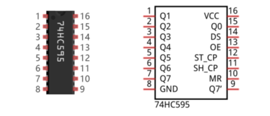
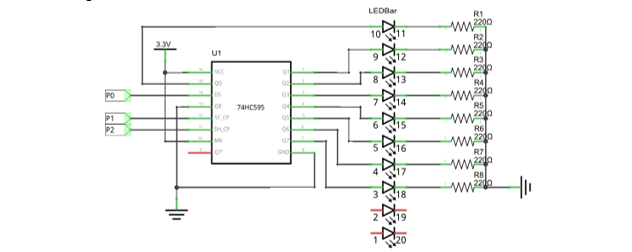
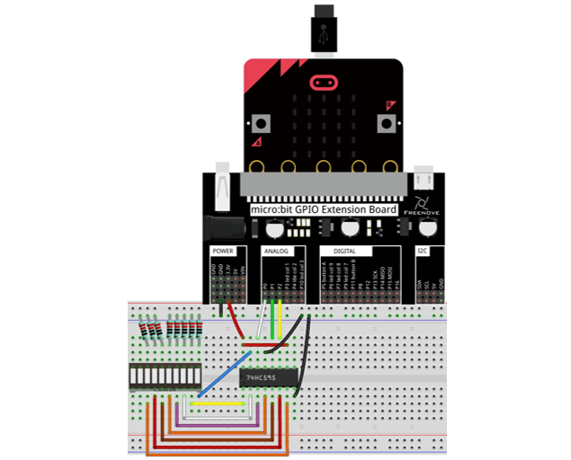
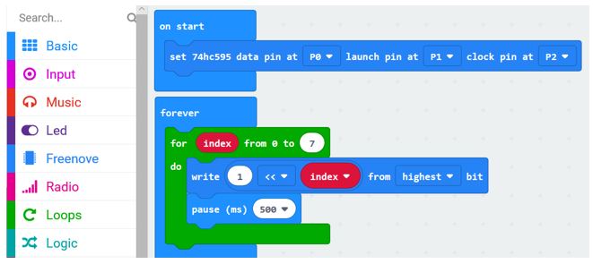
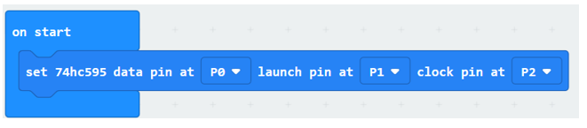
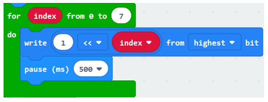
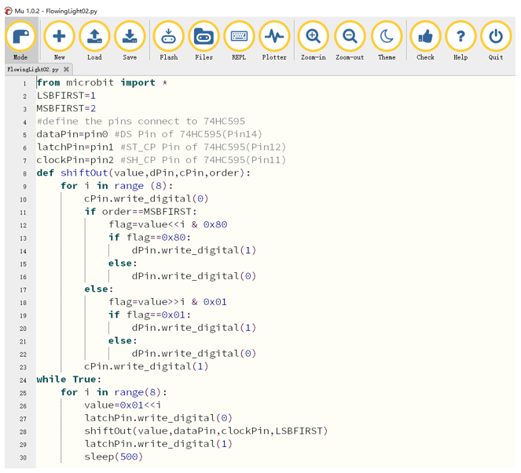

##############################################################################
Chapter 74HC595 and LED Bar Graph
##############################################################################

In this chapter, we will learn a new component: 74HC595

Project Flowing Water Light
***************************************

In this project, we will use a 74HC595 chip and LED Bar Graph to make a flowing water light.

Component list
================================

+----------------------------+-----------------------------+
| Microbit x1                | Expansion board x1          |
|                            |                             |
| |Chapter03_00|             | |Chapter03_01|              |
+----------------------------+-----------------------------+
| Breakboard x1              | USB cable x1                |
|                            |                             |
| |Chapter03_02|             | |Chapter03_03|              |
+----------------------------+-----------------------------+
| LED Bar Graph x1           | F/M x5  M/M x11             |
|                            |                             |
| |Chapter18_00|             | |Chapter14_00|              |
+----------------------------+-----------------------------+
| 74HC595 x1                 | Resistor 220Ω x8            |
|                            |                             |
| |Chapter18_01|             | |Chapter18_02|              |
+----------------------------+-----------------------------+

.. |Chapter14_00| image:: ../_static/imgs/14_Potentiometer_and_LED/Chapter14_00.png

.. |Chapter03_00| image:: ../_static/imgs/3_LED/Chapter03_00.png
.. |Chapter03_01| image:: ../_static/imgs/3_LED/Chapter03_01.png
.. |Chapter03_02| image:: ../_static/imgs/3_LED/Chapter03_02.png
.. |Chapter03_03| image:: ../_static/imgs/3_LED/Chapter03_03.png

Component knowledge
==========================

74HC595
-----------------------

A 74HC595 chip is used to convert serial data into parallel data. A 74HC595 chip can convert the serial data of one byte into 8 bits, and send its corresponding level to each of the 8 ports correspondingly. With this characteristic, the 74HC595 chip can be used to expand the IO ports of a Raspberry Pi. At least 3 ports on the RPI board are required to control the 8 ports of the 74HC595 chip.

The ports of 74HC595 are described as follows:

+----------+------------+---------------------------------------------------------------------------------+
| Pin name | Pin number | Description                                                                     |
+----------+------------+---------------------------------------------------------------------------------+
| Q0-Q7    | 15, 1-7    | Parallel data output                                                            |
+----------+------------+---------------------------------------------------------------------------------+
| VCC      | 16         | The positive electrode of power supply, the voltage is 2~6V                     |
+----------+------------+---------------------------------------------------------------------------------+
| GND      | 8          | The negative electrode of power supply                                          |
+----------+------------+---------------------------------------------------------------------------------+
| DS       | 14         | Serial data Input                                                               |
+----------+------------+---------------------------------------------------------------------------------+
|          |            | Enable output,                                                                  |
|          |            |                                                                                 |
| OE       | 13         | When this pin is in high level, Q0-Q7 is in high resistance state               |
|          |            |                                                                                 |
|          |            | When this pin is in low level, Q0-Q7 is in output mode                          |
+----------+------------+---------------------------------------------------------------------------------+
|          |            | Parallel update output: when its electrical level is rising, it will update the |
| ST_CP    | 12         |                                                                                 |
|          |            | parallel data output.                                                           |
+----------+------------+---------------------------------------------------------------------------------+
|          |            | Serial shift clock: when its electrical level is rising, serial data input      |
| SH_CP    | 11         |                                                                                 |
|          |            | register will do a shift.                                                       |
+----------+------------+---------------------------------------------------------------------------------+
|          |            | Remove shift register: When this pin is in low level, the content in shift      |
| MR       | 10         |                                                                                 |
|          |            | register will be cleared.                                                       |
+----------+------------+---------------------------------------------------------------------------------+
| Q7'      | 9          | Serial data output: it can be connected to more 74HC595 in series.              |
+----------+------------+---------------------------------------------------------------------------------+

For more detail, please refer to the datasheet.

Circuit
==========================

.. list-table:: 
   :width: 100%
   :align: center

   * -  Schematic diagram
   * -  |Chapter18_04|
   * -  Hardware connection
   * -  |Chapter18_05|

:red:`If LED bar doesn't work, try rotating the LED bar 180°.`

Block code 
==========================

Open MakeCode first. Import the .hex file. The path is as below:

( :ref:`How to import project <import_project>` )

+-----------+-------------------------------------------+--------------------+
| File type | Path                                      | File name          |
+-----------+-------------------------------------------+--------------------+
| HEX file  | ../Projects/BlockCode/18.1_FlowingLight02 | FlowingLight02.hex |
+-----------+-------------------------------------------+--------------------+

After importing successfully, the code is shown as below:

After checking the connection of the circuit and verify it correct, download the code into micro:bit, and you can see that the LED flow from left to right in turn circularly.

Set 74HC595's data pin as P0, launch pin as P1, and clock pin as P2.

In the for loop, the number '1' moves index bit to the left, writes the shifted value to 74HC595 serially, and then turn ON the LED through parallel output of Q0-Q7 to realize flowing water light.

Reference
----------------------

.. list-table:: 
   :width: 100%
   :align: center

   * -  Block
     -  Function 
   
   * -  |Chapter18_09|
     -  It belongs to Freenove Extension Block. 
      
        It is used to set data pin, launch pin, clock pin for 74HC595.
   
   * -  |Chapter18_10|
     -  It belongs to Freenove Extension Block.
     
        The data of 0-255 is serially written to 74HC595, 
        
        and then output in parallel through Q0-Q7. 
      
        The order of data writing is either from the highest bit or from the least bit.

   * -  |Chapter18_11|
     -  It belongs to Freenove Extension Block. 
      
        Move data to the left (x) bit or to the right (x) bit.

python code 
==========================

Open the .py file with Mu. Code, the path is as below:

+-------------+--------------------------------------------+-------------------+
| File type   | Path                                       | File name         |
+-------------+--------------------------------------------+-------------------+
| Python file | ../Projects/PythonCode/18.1_FlowingLight02 | FlowingLight02.py |
+-------------+--------------------------------------------+-------------------+

After loading successfully, the code is shown as below:

After checking the connection of the circuit and verify it correct, download the code into micro:bit, and you can see that the LED flow from left to right in turn circularly.

The following is the program code:

.. literalinclude:: ../../../freenove_Kit/Projects/PythonCode/18.1_FlowingLight02/FlowingLight02.py
    :linenos: 
    :language: python
    :lines: 1-30
    :dedent:

Define pins P0, P1, P2 for 74HC595.

.. literalinclude:: ../../../freenove_Kit/Projects/PythonCode/18.1_FlowingLight02/FlowingLight02.py
    :linenos: 
    :language: python
    :lines: 1-30
    :dedent:

Custom shiftOut() function is used to write data to 74HC595 serially.

.. literalinclude:: ../../../freenove_Kit/Projects/PythonCode/18.1_FlowingLight02/FlowingLight02.py
    :linenos: 
    :language: python
    :lines: 8-23
    :dedent:

In the for loop, the value of the variable value shifts to the left i-bit, then the value of the variable value is written to 74HC595, and then turn ON the LED one by one through parallel output of Q0-Q7 to realize flowing water light. 

.. literalinclude:: ../../../freenove_Kit/Projects/PythonCode/18.1_FlowingLight02/FlowingLight02.py
    :linenos: 
    :language: python
    :lines: 24-30
    :dedent:

Reference
----------------------------

.. py:function:: shiftOut(value,dPin,cPin,order)	
    
    This function is used to serially write 8 bits of data to 74HC595. Value represents data to be written to 74HC595 registers, dPin represents data pins, cPin represents clock pins, and order represents priority bit flags (high or low). About order, LSBFIRST starts writing from low data, MSBFIRST starts writing from high data.
    
.. py:function:: << operator	
    
    "<<" is a left shift operator that moves all bits of byte data to the left (high) direction by a few bits and add 0 on the right (low). For example, shift binary 0001 1110 to the left by 1 bit to get 0011 1100. If you shift 1 bit to the right, it is 0000 1111.
    
    ">>" is the right shift operator, as opposed to the left shift operator, which moves all bits of byte data to the right (low) direction by a few bits and add 0 on the left(high).
    
.. py:function:: & operator	
    
    & is a bitwise AND operation, which performs an AND operation on binary bit. Operation rules:
    
    0&0=0;   
    
    0&1=0;    
    
    1&0=0;     
    
    1&1=1
    
    For example:
    
        A=0011 1100
        
        B=0000 1101
    
    \-\-\-\-\-\-\-\-\-\-\-\-\-\-\-\-\-\-\-\-\-\-\-\-\-\-\-\-\-\-
    
    A&B=0000 1100