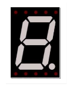
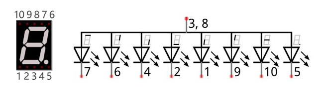
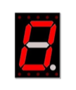
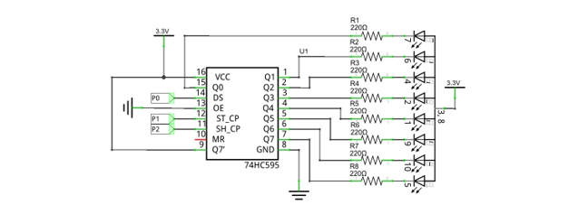
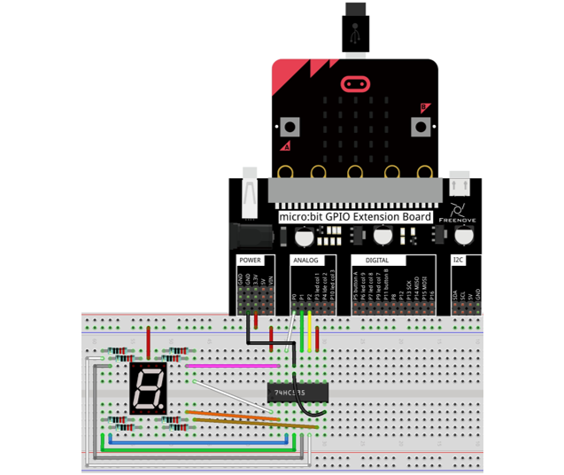
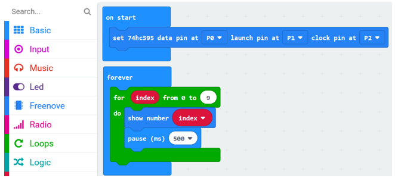
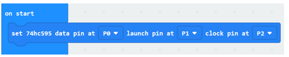
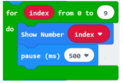
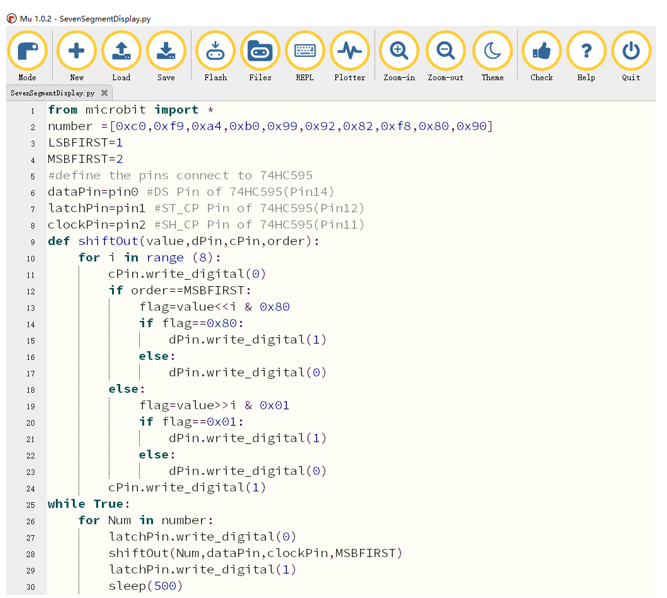

##############################################################################
Chapter 74HC595 and 7-segment display
##############################################################################

In this chapter, we will learn a new component: 7-segment display.

Project 7-segment display 
*************************************

In this project, we will use the 74HC595 chip and a 7-segment digital tube display to display the numbers 0 to 9.

Component list
=================================

+----------------------------+-----------------------------+
| Microbit x1                | Expansion board x1          |
|                            |                             |
| |Chapter03_00|             | |Chapter03_01|              |
+----------------------------+-----------------------------+
| Breakboard x1              | USB cable x1                |
|                            |                             |
| |Chapter03_02|             | |Chapter03_03|              |
+----------------------------+-----------------------------+
|1-digit 7-segment-display x1| F/M x5  M/M x12             |
|                            |                             |
| |Chapter19_00|             | |Chapter14_00|              |
+----------------------------+-----------------------------+
| 74HC595 x1                 | Resistor 220Ω x8            |
|                            |                             |
| |Chapter18_01|             | |Chapter18_02|              |
+----------------------------+-----------------------------+

.. |Chapter14_00| image:: ../_static/imgs/14_Potentiometer_and_LED/Chapter14_00.png

.. |Chapter18_01| image:: ../_static/imgs/18_74HC595_and_LED_Bar_Graph/Chapter18_01.png
.. |Chapter18_02| image:: ../_static/imgs/18_74HC595_and_LED_Bar_Graph/Chapter18_02.png
.. |Chapter03_00| image:: ../_static/imgs/3_LED/Chapter03_00.png
.. |Chapter03_01| image:: ../_static/imgs/3_LED/Chapter03_01.png
.. |Chapter03_02| image:: ../_static/imgs/3_LED/Chapter03_02.png
.. |Chapter03_03| image:: ../_static/imgs/3_LED/Chapter03_03.png

Component knowledge
================================

1-digit 7-segment display
---------------------------------

A 7-Segment Display is a digital electronic display device. There is a figure "8" and a decimal point represented, which consists of 8 LEDs. There are two kinds of 1-digit 7-segment display: Common Anode and Common Cathode. The one we use is that have a Common Anode(+) and individual Cathodes. Its internal structure and pin designation diagram is shown below:

As we can see in the above circuit diagram, we can control the state of each LED separately. Also, by combining LEDs with different states of ON and OFF, we can display different characters (Numbers and Letters). For example, to display a "0": we need to turn ON LED segments 7,6,4,2,1 and 9, and turn OFF LED segments 10 and 5.

If we use a byte to show the state of the LEDs that connected to pin 5, 10, 9, 1, 2, 4, 6, 7, we can use 0 to represent the state of on and 1 for off. Then the number 0 can be expressed as a binary number 11000000, namely hex 0xc0.

The numbers and letters that can be display are shown below:

+---------------+---------------+--------------------+----------------+
| Number/Letter | Binary number | Hexadecimal number | Decimal number |
+---------------+---------------+--------------------+----------------+
| 0             | 11000000      | 0xc0               | 192            |
+---------------+---------------+--------------------+----------------+
| 1             | 11111001      | 0xf9               | 249            |
+---------------+---------------+--------------------+----------------+
| 2             | 10100100      | 0xa4               | 164            |
+---------------+---------------+--------------------+----------------+
| 3             | 10110000      | 0xb0               | 176            |
+---------------+---------------+--------------------+----------------+
| 4             | 10011001      | 0x99               | 153            |
+---------------+---------------+--------------------+----------------+
| 5             | 10010010      | 0x92               | 146            |
+---------------+---------------+--------------------+----------------+
| 6             | 10000010      | 0x82               | 130            |
+---------------+---------------+--------------------+----------------+
| 7             | 11111000      | 0xf8               | 248            |
+---------------+---------------+--------------------+----------------+
| 8             | 10000000      | 0x80               | 128            |
+---------------+---------------+--------------------+----------------+
| 9             | 10010000      | 0x90               | 144            |
+---------------+---------------+--------------------+----------------+
| A             | 10001000      | 0x88               | 136            |
+---------------+---------------+--------------------+----------------+
| b             | 10000011      | 0x83               | 131            |
+---------------+---------------+--------------------+----------------+
| C             | 11000110      | 0xc6               | 198            |
+---------------+---------------+--------------------+----------------+
| d             | 10100001      | 0xa1               | 161            |
+---------------+---------------+--------------------+----------------+
| E             | 10000110      | 0x86               | 134            |
+---------------+---------------+--------------------+----------------+
| F             | 10001110      | 0x8e               | 142            |
+---------------+---------------+--------------------+----------------+

Circuit
============================

.. list-table:: 
   :width: 100%
   :align: center

   * -  Schematic diagram
   * -  |Chapter19_03|
   * -  Hardware connection
   * -  |Chapter19_04|

Block code
=======================

Open MakeCode first. Import the .hex file. The path is as below:

( :ref:`How to import project <import_project>` )

+-----------+------------------------------------------------+-------------------------+
| File type | Path                                           | File name               |
+-----------+------------------------------------------------+-------------------------+
| HEX file  | ../Projects/BlockCode/19.1_SevenSegmentDisplay | SevenSegmentDisplay.hex |
+-----------+------------------------------------------------+-------------------------+

After importing successfully, the code is shown as below:

After checking the connection of the circuit and verifying it correct, the code is downloaded into micro:bit. You can see that the 7-segment display shows 0, 1... 9 in turn.

Set 74HC595 data pin as P0, launch pin as P1, and clock pin as P2.

In the for loop, the digital tube displays the numbers 0 to 9 in turn, and change the number every 500ms.

Reference
-----------------------

.. list-table:: 
   :width: 100%
   :align: center

   * -  Block
     -  Function 
   
   * -  |Chapter19_08|
     -  It belongs to Freenove Extension Block. 
     
        It is used to control digital tube to display number and 
        
        character 0-F by using 74HC595.
    

Python code
============================

Open the .py file with Mu. Code, the path is as below:

+-------------+-------------------------------------------------+------------------------+
| File type   | Path                                            | File name              |
+-------------+-------------------------------------------------+------------------------+
| Python file | ../Projects/PythonCode/19.1_SevenSegmentDisplay | SevenSegmentDisplay.py |
+-------------+-------------------------------------------------+------------------------+

After loading successfully, the code is shown as below:

After checking the connection of the circuit and verifying it correct, the code is downloaded into micro:bit. You can see that the 7-segment display shows 0, 1... 9 in turn.

The following is the program code:

.. literalinclude:: ../../../freenove_Kit/Projects/PythonCode/19.1_SevenSegmentDisplay/SevenSegmentDisplay.py
    :linenos: 
    :language: python
    :lines: 1-30
    :dedent:

Define variable number to store numbers 0, 1, 2...9 in Hexadecimal.

Define pins P0, P1, P2 for 74HC595.

.. literalinclude:: ../../../freenove_Kit/Projects/PythonCode/19.1_SevenSegmentDisplay/SevenSegmentDisplay.py
    :linenos: 
    :language: python
    :lines: 2-8
    :dedent:

Custom shiftOut () function is used for writing data to 74HC595 serially.

.. literalinclude:: ../../../freenove_Kit/Projects/PythonCode/19.1_SevenSegmentDisplay/SevenSegmentDisplay.py
    :linenos: 
    :language: python
    :lines: 9-24
    :dedent:

Call the shiftOut() function, and write the hexadecimal number stored in the number variable to 74HC595 serially, then turn ON the LEDs through parallel output of Q0 ~ Q7.

.. literalinclude:: ../../../freenove_Kit/Projects/PythonCode/19.1_SevenSegmentDisplay/SevenSegmentDisplay.py
    :linenos: 
    :language: python
    :lines: 25-30
    :dedent: