##############################################################################
Chapter LED matrix
##############################################################################

The micro:bit integrates a 5x5 LED matrix, which is used as a display to display numbers, text, or simple images, which is useful and interesting.

Project Heartbeat
******************************

This project uses a pattern built in MakeCode to make a heartbeat animation.

Component List
=========================

.. list-table:: 
   :width: 100%
   :align: center

   * -  micro:bit x1
     -  micro USB cable x1
   
   * -  |Chapter01_00|
     -  |Chapter01_01| 

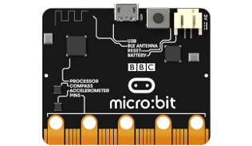
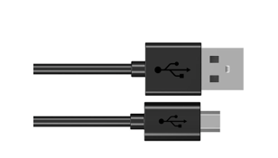

Circuit
=========================

Connect micro:bit and PC via a micro USB cable.

Hardware connection

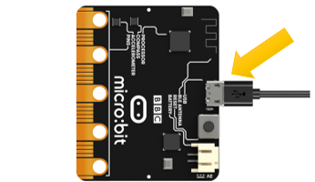

Block code
==========================

Open the MakeCode for the web version or MakeCode for the win10 version. Click on "New Project"

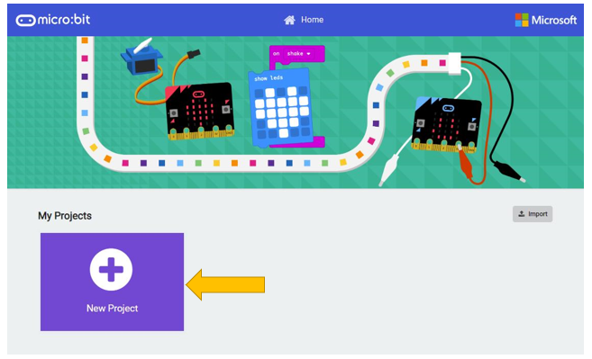

Click basic in the list on the left, select the desired code block, and drag it into the right code editing area.

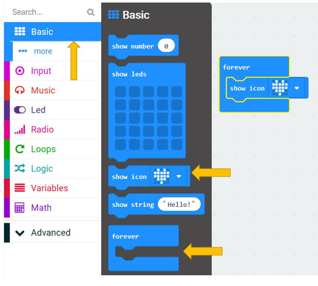

Right click the mouse and select Duplicate to duplicate the code block.

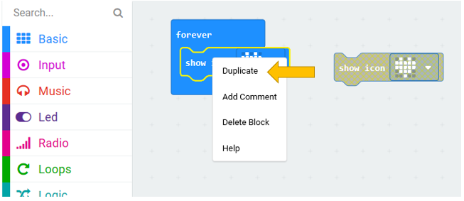

If you want to delete the block, you can right click on the block and select "Delete Block". You can also drag it to left to delete it.

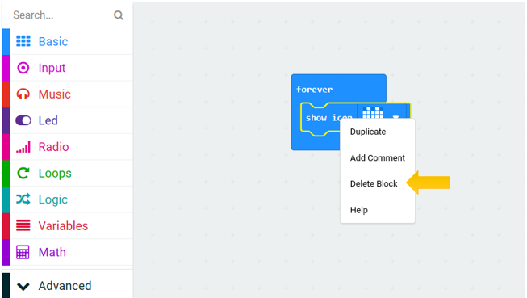

On the second block, click on the drop-down triangle next to the heart-shaped pattern on the block to display all the optional built-in patterns, select the second pattern, a small heart shape.

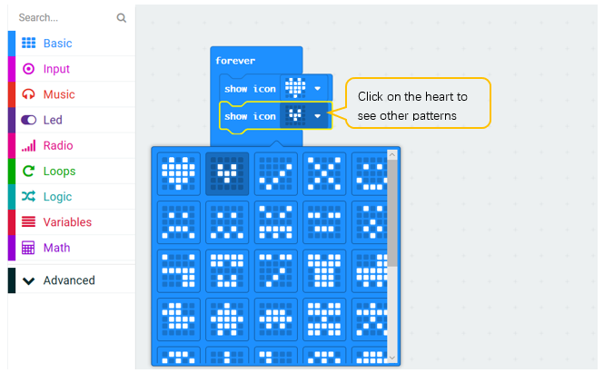

This completes the block code thie project.

Download the program to the microbit, the LED matrix on the micro:bit will continue to display a large heart-shaped pattern and a small heart-shaped pattern, just like heartbeating.

If you did not master downloading, please refer to contents ( :ref:`How to download? <download>` :ref:`How to quick download? <quick_download>` ).

Reference
---------------------------

.. list-table:: 
   :width: 100%
   :align: center

   * -  Block
     -  Function 
   
   * -  |Chapter01_08|
     -  Shows the selected icon on the LED screen

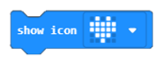

Python Code
===============================

Open the .py file with Mu. Code, the path is as below:

+-------------+---------------------------------------+--------------+
| File type   | Path                                  | File name    |
+-------------+---------------------------------------+--------------+
| Python file | ../Projects/PythonCode/01.1_Heartbeat | Heartbeat.py |
+-------------+---------------------------------------+--------------+

After loading successfully, the code is shown below:

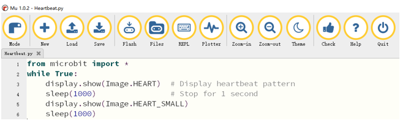

Download the program to the microbit, theLED matrix on the micro:bit will continue to display a large heart-shaped pattern and a small heart-shaped pattern, just like heartbeating.

The following is the program code:

.. literalinclude:: ../../../freenove_Kit/Projects/PythonCode/01.1_Heartbeat/Heartbeat.py
    :linenos: 
    :language: python
    :lines: 1-6
    :dedent:

Python language is an interpreted language that is executed sequentially. In the code of this project, the micro:bit module is first imported, and then in a infinite loop statement, a large heart pattern and a small heart pattern are alternately displayed.

Next, we will explain the code line by line.

.. literalinclude:: ../../../freenove_Kit/Projects/PythonCode/01.1_Heartbeat/Heartbeat.py
    :linenos: 
    :language: python
    :lines: 1-1
    :dedent:

Import everything in the microbit module, including functions, classes, variables, etc. You can also use import microbit directly. If you do this, you need to add "microbit." when you call the contents of this module in the program.

.. literalinclude:: ../../../freenove_Kit/Projects/PythonCode/01.1_Heartbeat/Heartbeat.py
    :linenos: 
    :language: python
    :lines: 2-2
    :dedent:

An infinite loop that will be executed circularly by microbit constantly.

.. literalinclude:: ../../../freenove_Kit/Projects/PythonCode/01.1_Heartbeat/Heartbeat.py
    :linenos: 
    :language: python
    :lines: 3-3
    :dedent:

Display heart pattern on LED matrix.

.. literalinclude:: ../../../freenove_Kit/Projects/PythonCode/01.1_Heartbeat/Heartbeat.py
    :linenos: 
    :language: python
    :lines: 4-4
    :dedent:

Delay for one second.

.. literalinclude:: ../../../freenove_Kit/Projects/PythonCode/01.1_Heartbeat/Heartbeat.py
    :linenos: 
    :language: python
    :lines: 3-6
    :dedent:

Display the heart pattern on the LED matrix for one second, and then display the small heart pattern for another second.

Reference
--------------------------

.. py:function:: from microbit import *
    
    Import everything in the microbit module, including functions, classes, variables, etc. You can use all the available contents in the micro:bit module in the next program.

.. py:function:: while True:	

    While is a loop statement, if the condition is true, the code in while is executed. 

    This code with True means that the code in the while is always executed circularly. 

.. py:function:: display.show(image)	

    Display the image.

    For more details about display, 

    please refer to: https://microbit-micropython.readthedocs.io/en/latest/display.html

    For more details about image,  

    Please refer to: https://microbit-micropython.readthedocs.io/en/latest/image.html

.. py:function:: sleep(t)	

    Delay for given number of milliseconds, should be positive or 0.

    For more details about sleep function, please refer to:

    https://microbit-micropython.readthedocs.io/en/latest/utime.html

Project Displaying Number
**************************************

In this project, we will use the LED matrix of the micro:bit to display numbers.

Circuit
=====================

Connect micro:bit and PC via a micro USB cable.

Hardware connection

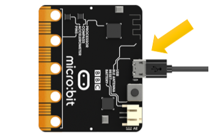

Block code
=======================

Open MakeCode first.

In this project, we will import the block code.

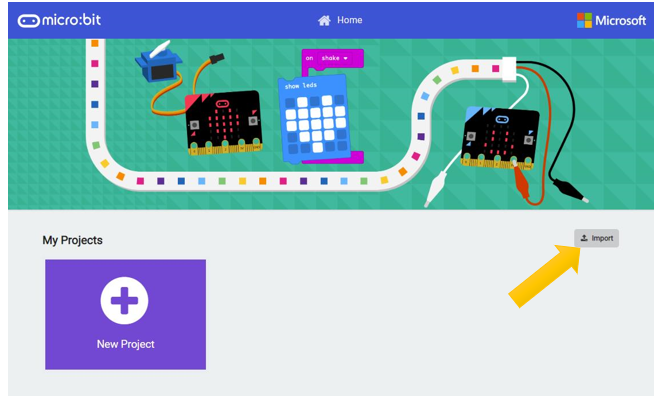

Click Import. Then click Import File.

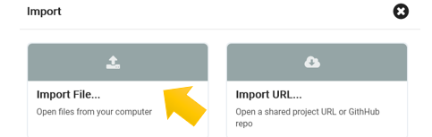

Import the .hex file. The path is as below:

+-----------+----------------------------------------+----------------+
| File type | Path                                   | File name      |
+-----------+----------------------------------------+----------------+
| HEX file  | ../ Projects/BlockCode/01.2_ShowNumber | ShowNumber.hex |
+-----------+----------------------------------------+----------------+

After load successfully, the code is shown as below:

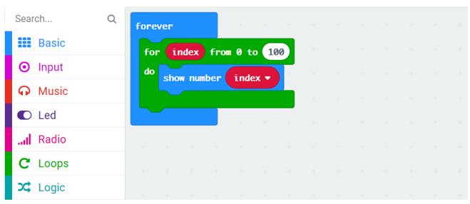

Download the code into the micro:bit. After the downloading completes, the micro:bit LED matrix will start to display the numbers 0, 1, 2, 3, 4...99. Then start again from 0 to 99, so that it will cycle permanently.

In this code, a for loop is used. Each time the loop is executed, the value of the variable index is increased by 1. When the value is greater than 99, the for loop is exited. In the body of the loop, the value of the numeric index is displayed.

Reference
-------------------------

.. list-table:: 
   :width: 100%
   :align: center

   * -  Block
     -  Function 
   
   * -  |Chapter01_14|
     -  This is a for loop, the number (4) of loops can be changed, 
      
        each time the index is incremented by 1.
        
        The loop won"t end until the index is greater than the set value. 

   * -  |Chapter01_15|
     -  Show a number on the LED screen. 
      
        It will slide left if the number is more than one digit..  

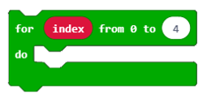

Python code 
========================

Open the .py file with Mu. Code, the path is as below:

+--------------+----------------------------------------+---------------+
| File type    | Path                                   | File name     |
+--------------+----------------------------------------+---------------+
| Python  file | ../Projects/PythonCode/01.2_ShowNumber | ShowNumber.py |
+--------------+----------------------------------------+---------------+

After loading successfully, the code is shown as below:

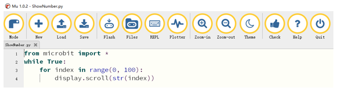

Download the code into the microbit. After the downloading completes, the micro:bit LED matrix will start to display the numbers 1, 2, 3, 4...100. Then start again from 1 to 100, so that it will repeat endlessly.

The following is the program code:

.. literalinclude:: ../../../freenove_Kit/Projects/PythonCode/01.2_ShowNumber/ShowNumber.py
    :linenos: 
    :language: python
    :lines: 1-4
    :dedent:

The code of this project, in a 0-100 for loop, scrolls through the cyclic number index, which is incremented by 1.

Reference
-----------------------

.. py:function:: display.scroll(value)	

    Scrolls value horizontally on the display. If value is an integer or float it is first converted to a string using str().

    For more information, please refer to: https://microbit-micropython.readthedocs.io/en/latest/utime.html

Project Displaying Text
***************************************

This project uses the LED matrix of micro:bit to display text (ASCII).

Circuit
============================

Connect micro:bit and PC via micro USB cable.

Hardware connection

Block code
==========================

Open MakeCode first.Import the .hex file. The path is as below:( :ref:`How to import project <import_project>` )

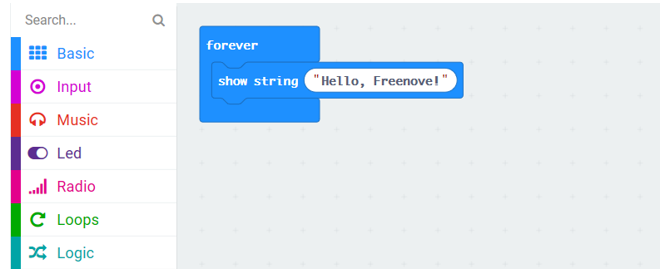

Download the code into the microbit, the micro:bit LED matrix will scroll from left to right to display "Hello, Freenove!"

Reference
-------------------------

.. list-table:: 
   :width: 100%
   :align: center

   * -  Block
     -  Function 
   
   * -  |Chapter01_18|
     -  Displays a string on the LED screen. 
      
        It will scroll to left if it's beyond the screen.

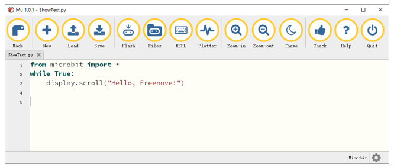

Python code 
============================

Open the .py file with Mu. Code, the path is as below:

+-------------+--------------------------------------+-------------+
| File type   | Path                                 | File name   |
+-------------+--------------------------------------+-------------+
| Python file | ../Projects/PythonCode/01.3_ShowText | ShowText.py |
+-------------+--------------------------------------+-------------+

After loading successfully, the code is shown as below:

Download the code into the microbit, the micro:bit LED matrix will scroll from left to right to display "Hello, Freenove!"

The following is the program code:

.. literalinclude:: ../../../freenove_Kit/Projects/PythonCode/01.3_ShowText/ShowText.py
    :linenos: 
    :language: python
    :lines: 1-3
    :dedent:

This code scrolls through the text "Hello, Freenove!" in a while loop.

Project Displaying Custom
**************************************

This project uses a micro:bit LED matrix to display a custom pattern.

Circuit
=================================

Connect micro:bit and PC via micro USB cable.

Hardware connection

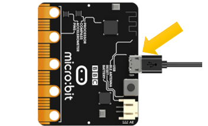

Block code
=========================

Open MakeCode first.

Import the .hex file. The path is as below:

( :ref:`How to import project <import_project>` )

+-----------+---------------------------------------+----------------+
| File type | Path                                  | File name      |
+-----------+---------------------------------------+----------------+
| HEX file  | ../Projects/BlockCode/01.4_ShowCustom | ShowCustom.hex |
+-----------+---------------------------------------+----------------+

After loading successfully, the code is shown as below:

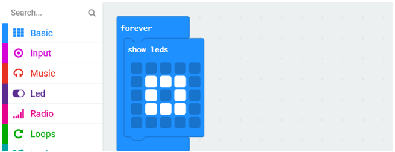

Check the connection of the circuit and verify it correct.. Then download the code into the microbit, and the square pattern shown above will appear on the LED matrix of the micro:bit.

Reference
--------------------------

.. list-table:: 
   :width: 100%
   :align: center

   * -  Block
     -  Function 
   
   * -  |Chapter01_21|
     -  Shows a picture on the LED screen.
  
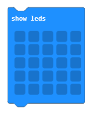

Python code 
==========================

Open the .py file with Mu. Code, the path is as below:

+-------------+----------------------------------------+---------------+
| File type   | Path                                   | File name     |
+-------------+----------------------------------------+---------------+
| Python file | ../Projects/PythonCode/01.4_ShowCustom | ShowCustom.py |
+-------------+----------------------------------------+---------------+

After loading successfully, the code is shown as below:

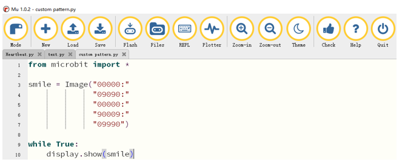

Download the code into the microbit, and a square pattern will appear on the micro:bit LED matrix.

( :ref:`How to download? <download>` )

The following is the program code:

.. literalinclude:: ../../../freenove_Kit/Projects/PythonCode/01.4_ShowCustom/ShowCustom.py
    :linenos: 
    :language: python
    :lines: 1-10
    :dedent:

Create an image in the code and define it as img, then display the defined image in a while loop. As shown in the code below, the parameters in Image consist of 5 strings. Each line of characters corresponds to a row of LEDs. Each digit represents the brightness of an LED. The value ranges from 0 to 9, the larger the number, the brighter the LED.

.. literalinclude:: ../../../freenove_Kit/Projects/PythonCode/01.4_ShowCustom/ShowCustom.py
    :linenos: 
    :language: python
    :lines: 3-7
    :dedent:

Reference
--------------------------

.. py:function:: img = Image("00000:" "09990:" "09090:" "09990:" "00000")              
                        
    Create an image of LED, and set brightness of LED.
    
    For more information, please refer to:  
    
    https://microbit-micropython.readthedocs.io/en/latest/image.html