##############################################################################
Chapter LCD1602
##############################################################################

In this chapter, we will learn the LCD1602 display.

Project I2C LCD1602
***********************************

This project realizes the display of the current ambient temperature on the LCD1602 display.

Component list
================================

+----------------------------+-----------------------------+
| Microbit x1                | Expansion board x1          |
|                            |                             |
| |Chapter03_00|             | |Chapter03_01|              |
+----------------------------+-----------------------------+
| F/F x4                     | USB cable x2                |
|                            |                             |
| |Chapter20_01|             | |Chapter03_03|              |
+----------------------------+-----------------------------+
| LCD1602                                                  |
|                                                          |
|  |Chapter20_00|                                          |
+----------------------------------------------------------+

.. |Chapter03_00| image:: ../_static/imgs/3_LED/Chapter03_00.png
.. |Chapter03_01| image:: ../_static/imgs/3_LED/Chapter03_01.png
.. |Chapter03_02| image:: ../_static/imgs/3_LED/Chapter03_02.png
.. |Chapter03_03| image:: ../_static/imgs/3_LED/Chapter03_03.png
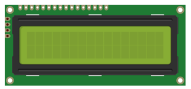

Component knowledge
============================

LCD1602
------------------------------

The LCD1602 Display Screen can display 2 lines of characters in 16 columns. It is capable of displaying numbers, letters, symbols, ASCII code and so on. As shown below is a monochrome LCD1602 Display Screen along with its circuit pin diagram

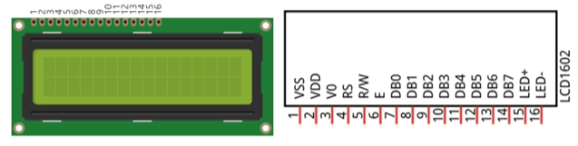

I2C LCD1602 Display Screen integrates a I2C interface, which connects the serial-input & parallel-output module to the LCD1602 Display Screen. This allows us to only use 4 lines to the operate the LCD1602.

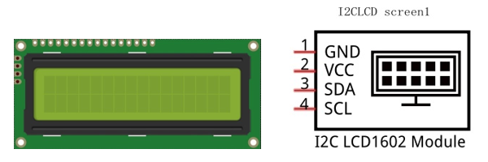

The serial-to-parallel IC chip used in this module is PCF8574T (PCF8574AT), and its default I2C address is 0x27(0x3F). 

PCF8574 pin diagram:

.. list-table:: 
   :width: 100%
   :align: center

   * -  PCF8574 chip pin diagram:
     -  PCF8574 module pin diagram
   * -  |Chapter20_04|
     -  |Chapter20_05|

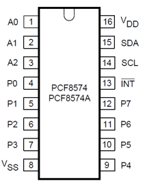
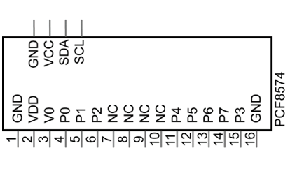

PCF8574 module pin and LCD1602 pin are corresponding to each other and connected with each other:s

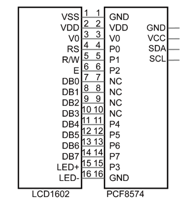

Because of this, as stated earlier, we only need 4 pins to control the 16 pins of the LCD1602 Display Screen through the I2C interface.

In this project, we will use I2CLCD1602 to display some static characters and dynamic variables.

Circuit
===========================

.. list-table:: 
   :width: 100%
   :align: center

   * -  Schematic diagram
   * -  |Chapter20_07|
   * -  Hardware connection
   * -  |Chapter20_08|

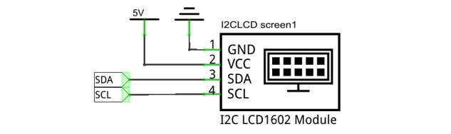
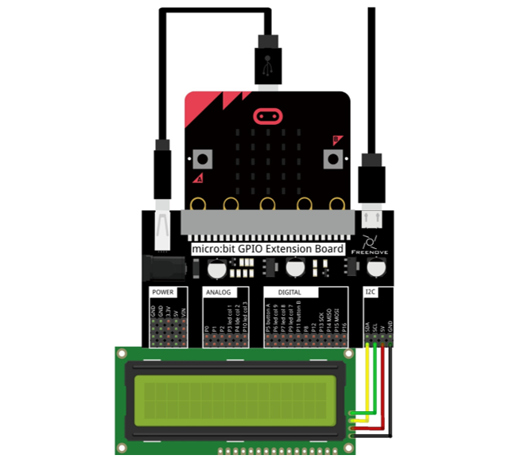

Block code
===========================

Open MakeCode first. Import the .hex file. The path is as below:

( :ref:`How to import project <import_project>` )

+-----------+------------------------------------+-------------+
| File type | Path                               | File name   |
+-----------+------------------------------------+-------------+
| HEX file  | ../Projects/BlockCode/20.1_LCD1602 | LCD1602.hex |
+-----------+------------------------------------+-------------+

After importing successfully, the code is shown as below:

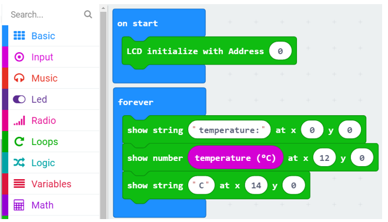

Check the connection of the circuit, verify it correct, and download the code into the micro:bit, and then the LCD screen will display the current ambient temperature.

So far, at this writing, we have two types of LCD1602 on sale. One needs to adjust the backlight, and the other does not.

The LCD1602 that does not need to adjust the backlight is shown in the figure below.

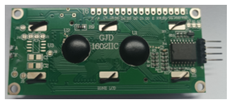

If the LCD1602 you received is the following one, and you cannot see anything on the display or the display is not clear, try rotating the white knob on back of LCD1602 slowly, which adjusts the contrast, until the screen can display clearly.

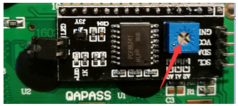

LCD initialization, we provide two kinds of LCD screen, you can write I2C address (0x27 or 0x3F) according to the LCD screen you receive. If you enter 0, it will automatically search for the correct I2C address and connect.

Display the temperature of the current environment on the LCD display.

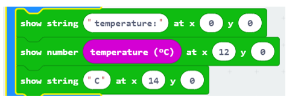

Reference
---------------------------

.. list-table:: 
   :width: 100%
   :align: center

   * -  Block
     -  Function 
   
   * -  |Chapter20_14|
     -  LCD initialization, input LCD I2C address (0x27 or 0x3F). 
      
        If you enter 0, it will automatically find the correct address and connect.

   * -  |Chapter20_15|
     -  The LCD screen displays the number in the x column, y column of the screen.

   * -  |Chapter20_16|
     -  The LCD screen displays the string in the x column, the y column of the screen

Extensions
----------------------------

If you want to import the LCD1602 expansion block in a new project, follow the steps below to add it.

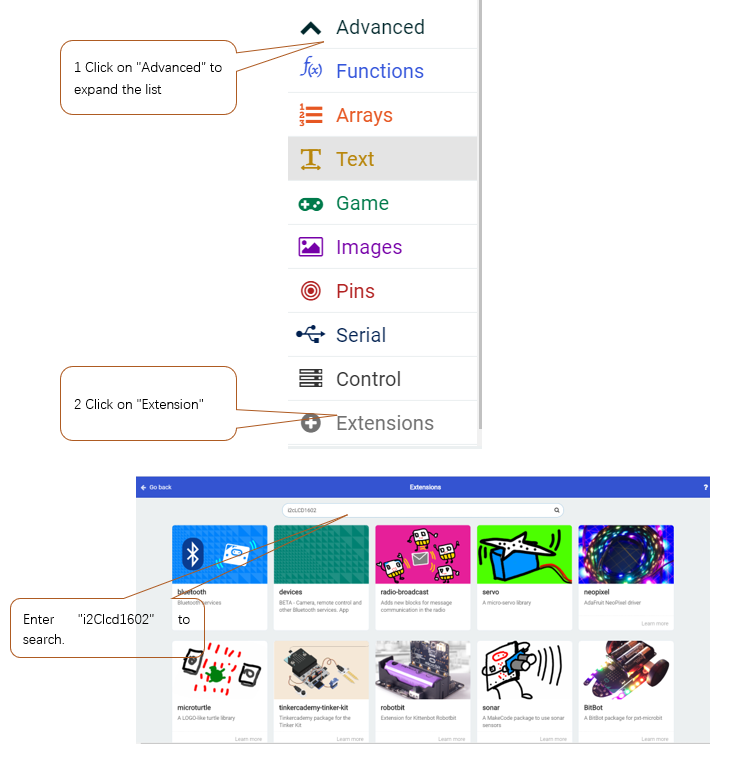

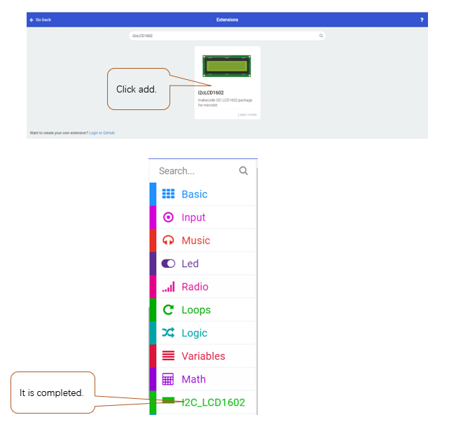

Python code
==========================

Import necessary Python file into micro:bit
-----------------------------------------------------

In the code of this tutorial, the LCD1602 module and DHT11 module are used, so it is necessary to import "I2C_LCD1602_Class.py" and "DHT11_RW.py" into the micro:bit. You can skip this section if you don’t use them. When you need, you can come back to import them.

The import method is as follows:

Search on the C drive and find the "mu_code" folder.

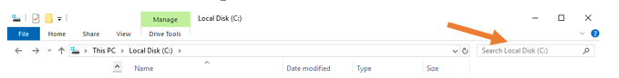

Double click on "mu_code" to enter the folder.

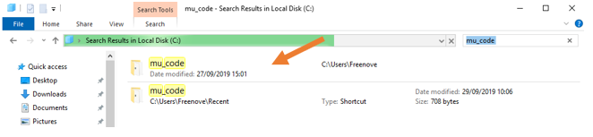

Copy "I2C_LCD1602_Class.py" and "DHT11_RW.py" from following path into "mu_code" directory.

+-------------+----------------------------+-----------------------------------+
| File type   | Path                       | File name                         |
+-------------+----------------------------+-----------------------------------+
| Python file | .. /Projects/PythonLibrary | I2C_LCD1602_Class.py  DHT11_RW.py |
+-------------+----------------------------+-----------------------------------+

After pasting successfully, you can see them as below:

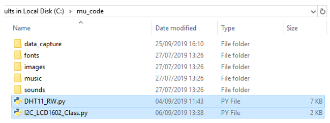

Open the Mu software, click "Files". Here we take "I2C_LCD1602_Class.py" as an example, drag "I2C_LCD1602_Class.py" into micro:bit.

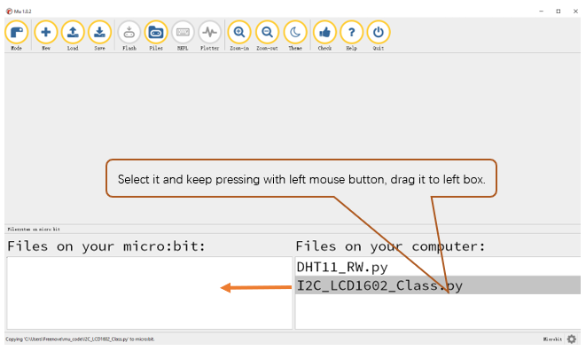

After importing successfully, you will see it on the left.

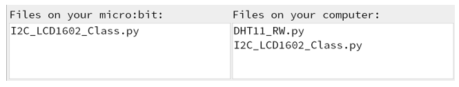

The import method of "DHT11_RW.py" is the same as described above. You just need to import the one you need to use.

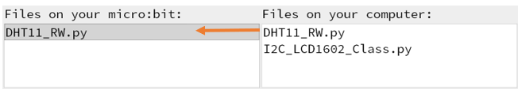

:red:`Note, after you upload other file into micro:bit, the original content will be covered. You need to import it next time you use it.`

Open the .py file with Mu. Code, the path is as below:

+-------------+-------------------------------------+------------+
| File type   | Path                                | File name  |
+-------------+-------------------------------------+------------+
| Python file | ../Projects/PythonCode/20.1_LCD1602 | LCD1602.py |
+-------------+-------------------------------------+------------+

After the code is loaded, as shown below, import the "I2C_LCD1602_Class.py" file to micro:bit before downloading the code.

( :ref:`How to import project <import_project>` )

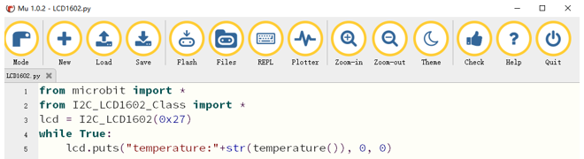

After the "I2C_LCD1602_Class.py" file is imported, check the connection of the circuit and verify it correct. Download the code into the micro:bit and the LCD screen will display the current ambient temperature.

:red:`NOTE: After the program is executed, if you cannot see anything on the display or the display is not clear, try rotating the white knob on back of LCD1602 slowly, which adjusts the contrast, until the screen can display the Temperature clearly.`

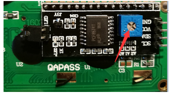

The following is the program code:

.. literalinclude:: ../../../freenove_Kit/Projects/PythonCode/20.1_LCD1602/LCD1602.py
    :linenos: 
    :language: python
    :lines: 1-5
    :dedent:

Export everything from the I2C_LCD1602_Class module, create the object lcd of the I2C_LCD1602 class, and enter the I2C address of the LCD screen. Change the I2C address according to the LCD type.

If the chip of LCD is PCF8574 T, the i2c address is 0x27.

If the chip of LCD is PCF8574A T, the i2c address is 0x3F.

.. literalinclude:: ../../../freenove_Kit/Projects/PythonCode/20.1_LCD1602/LCD1602.py
    :linenos: 
    :language: python
    :lines: 2-3
    :dedent:

Read the temperature data, and then call the puts function in the I2C_LCD1602 class to display the temperature on the LCD screen.

.. literalinclude:: ../../../freenove_Kit/Projects/PythonCode/20.1_LCD1602/LCD1602.py
    :linenos: 
    :language: python
    :lines: 5-5
    :dedent:

Reference
-------------------------------

.. py:function:: puts(String,x,y)	

    This function is defined in the I2C_LCD1602 class. The function is to display the string on the LCD screen x column, y row, x range is 0-15, y range is 0-1.