##############################################################################
Chapter Motor
##############################################################################

In this chapter, we will learn the comprehensive application of motor.

Project Relay & Motor
************************************

In this project, we will control a relay to drive a motor.

Component list
===================================

+----------------------------+-----------------------------+
| Microbit x1                | Expansion board x1          |
|                            |                             |
| |Chapter03_00|             | |Chapter03_01|              |
+----------------------------+-----------------------------+
| Breakboard x1              | USB cable x1                |
|                            |                             |
| |Chapter03_02|             | |Chapter03_03|              |
+----------------------------+-----------------------------+
|NPN(8050)transistor x 1     | Motor x1                    |
|                            |                             |
| |Chapter21_06|             | |Chapter21_07|              |
+----------------------------+-----------------------------+
| Relay x1                   | LED x1                      |
|                            |                             |
| |Chapter21_08|             | |Chapter21_09|              |
+-----------------+----------+---------+-------------------+
| Diode x1        | 1kΩ x1             | 220Ω x1           |
|                 |                    |                   |
| |Chapter21_02|  |  |Chapter21_00|    |  |Chapter21_01|   |
+-----------------+--------------------+-------------------+
| Jumper  M/M x4  | Jumper  F/M x5     | Jumper  F/F x1    |
|                 |                    |                   |
| |Chapter21_03|  |  |Chapter21_04|    |  |Chapter21_05|   |
+-----------------+--------------------+-------------------+

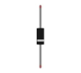

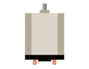
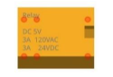
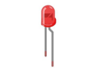
.. |Chapter03_00| image:: ../_static/imgs/3_LED/Chapter03_00.png
.. |Chapter03_01| image:: ../_static/imgs/3_LED/Chapter03_01.png
.. |Chapter03_02| image:: ../_static/imgs/3_LED/Chapter03_02.png
.. |Chapter03_03| image:: ../_static/imgs/3_LED/Chapter03_03.png

Component knowledge
===============================

DC Motor
-------------------------------

DC Motor is a device that converts electrical energy into mechanical energy. DC Motors consist of two major parts, a Stator and the Rotor. The stationary part of a DC Motor is the Stator and the part that Rotates is the Rotor. The Stator is usually part of the outer case of motor (if it is simply a pair of permanent magnets), and it has terminals to connect to the power if it is made up of electromagnet coils. Most Hobby DC Motors only use Permanent Magnets for the Stator Field. The Rotor is usually the shaft of motor with 3 or more electromagnets connected to a commutator where the brushes (via the terminals 1 & 2 below) supply electrical power, which can drive other mechanical devices. The diagram below shows a small DC Motor with two terminal pins.

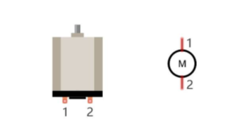

When a DC Motor is connected to a power supply, it will rotate in one direction. If you reverse the polarity of the power supply, the DC Motor will rotate in opposite direction. This is important to note.

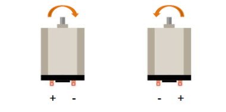

Relay
------------------------

Relays are a type of Switch that open and close circuits electromechanically or electronically. Relays control one electrical circuit by opening and closing contacts in another circuit using an electromagnet to initiate the Switch action. When the electromagnet is energized (powered), it will attract internal contacts completing a circuit, which act as a Switch. Many times Relays are used to allow a low powered circuit (and a small low amperage switch) to safely turn ON a larger more powerful circuit. They are commonly found in automobiles, especially from the ignition to the starter motor.

The following is a basic diagram of a common relay and the image and circuit symbol diagram of the 5V relay used in this project:

.. list-table:: 
   :width: 100%
   :align: center

   * -  Diagram
     -  Feature
     -  Symbol 
   
   * -  |Chapter21_12|
     -  |Chapter21_13|
     -  |Chapter21_14|

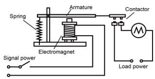
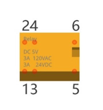
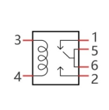

Pin 5 and pin 6 are internally connected to each other. When the coil pin3 and pin 4 are connected to a 5V power supply, pin 1 will be disconnected from pins 5 & 6 and pin 2 will be connected to pins 5 & 6. Pin 1 is called Closed End and pin 2 is called the Open End.

Inductor
---------------------

The symbol of Inductance is "L" and the unit of inductance is the "Henry" (H). Here is an example of how this can be encountered: 1H=1000mH, 1mH=1000μH.

An Inductor is a passive device that stores energy in its Magnetic Field and returns energy to the circuit whenever required. An Inductor is formed by a Cylindrical Core with many Turns of conducting wire (usually copper wire). Inductors will hinder the changing current passing through it. When the current passing through the Inductor increases, it will attempt to hinder the increasing movement of current; and when the current passing through the inductor decreases, it will attempt to hinder the decreasing movement of current. So the current passing through an Inductor is not transient.

The circuit for a Relay is as follows: The coil of Relay can be equivalent to an Inductor, when a Transistor is present in this coil circuit it can disconnect the power to the relay, the current in the Relay’s coil does not stop immediately, which affects the power supply adversely. To remedy this, diodes in parallel are placed on both ends of the Relay coil pins in opposite polar direction. Having the current pass through the diodes will avoid any adverse effect on the power supply.

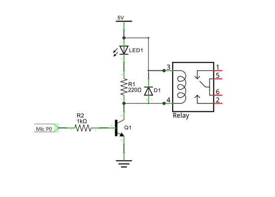

Circuit
========================

.. list-table:: 
   :width: 100%
   :align: center

   * -  Schematic diagram
   * -  |Chapter21_17|
   * -  Hardware connection
   * -  |Chapter21_18|

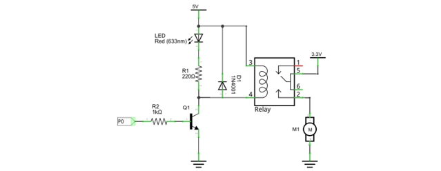
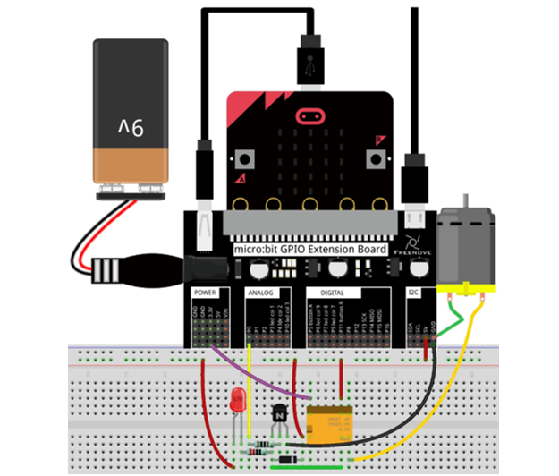

Block code 
========================

Open MakeCode first. Import the .hex file. The path is as below:

( :ref:`How to import project <import_project>` )

+-----------+----------------------------------+-----------+
| File type | Path                             | File name |
+-----------+----------------------------------+-----------+
| HEX file  | ../Projects/BlockCode/21.1_Relay | Relay.hex |
+-----------+----------------------------------+-----------+

After importing successfully, the code is shown as below:

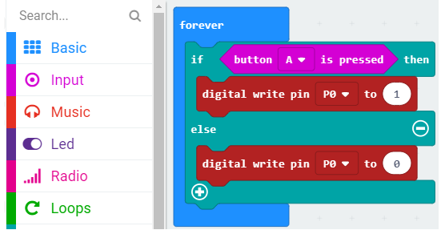

Check the connection of the circuit, verify it correct, and download the code into micro:bit. Press button A, then the motor starts to rotate. Release the button, then the motor stops.

It is to determine whether the button A is pressed. If pressed, P0 outputs a high level, the relay is turned on, and the motor is running; if it is not pressed, P0 outputs a low level, and the motor does not run.

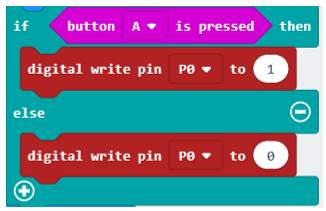

Python code
==============================

Open the .py file with Mu. Code, the path is as below:

+-------------+-----------------------------------+-----------+
| File type   | Path                              | File name |
+-------------+-----------------------------------+-----------+
| Python file | ../Projects/PythonCode/21.1_Relay | Relay.py  |
+-------------+-----------------------------------+-----------+

After loading successfully, the code is shown as below:

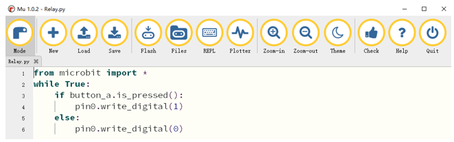

Check the connection of the circuit, verify it correct, and download the code into micro:bit. Press button A, then the motor starts to rotate. Release the button, then the motor stops.

The following is the program code:

.. literalinclude:: ../../../freenove_Kit/Projects/PythonCode/21.1_Relay/Relay.py
    :linenos: 
    :language: python
    :lines: 1-6
    :dedent:

If A is pressed, P0 outputs a high level, the relay is turned on, and the motor is running. If it is not pressed, P0 outputs a low level, and the motor does not run.

.. literalinclude:: ../../../freenove_Kit/Projects/PythonCode/21.1_Relay/Relay.py
    :linenos: 
    :language: python
    :lines: 3-6
    :dedent:

Project Potentiometer & Motor
*******************************************

In this project, a rotary potentiometer is used to control a motor.

Component list
=============================

+----------------------------+-----------------------------+
| Microbit x1                | Expansion board x1          |
|                            |                             |
| |Chapter03_00|             | |Chapter03_01|              |
+----------------------------+-----------------------------+
| Breakboard x1              | USB cable x1                |
|                            |                             |
| |Chapter03_02|             | |Chapter03_03|              |
+----------------------------+-----------------------------+
|F/M x9   M/M x3             | Motor x1                    |
|                            |                             |
| |Chapter21_22|             | |Chapter21_07|              |
+----------------------------+-----------------------------+
| Rotary potentionmeter x1   | L293D x1                    |
|                            |                             |
| |Chapter21_08|             | |Chapter21_23|              |
+----------------------------+-----------------------------+

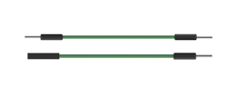
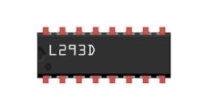

Component knowledge
=============================

L293D
---------------------------

L293D is an IC Chip (Integrated Circuit Chip) with a 4-channel motor drive. You can drive a Unidirectional DC Motor with 4 ports or a Bi-Directional DC Motor with 2 ports or a Stepper Motor (Stepper Motors are covered later in this Tutorial).

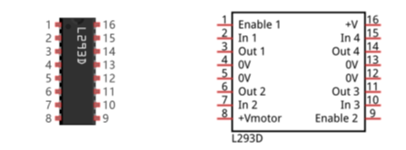

Port description of L293D module is as follows:

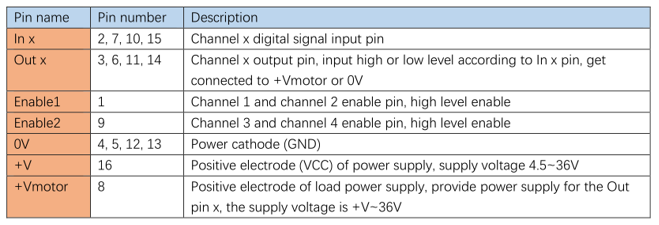

For more details, please see datasheet.

When using the L293D to drive a DC Motor, there are usually two connection options.

The following connection option uses one channel of the L239D, which can control motor speed through the PWM, However the motor then can only rotate in one direction.

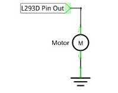

The following connection uses two channels of the L239D: one channel outputs the PWM wave, and the other channel connects to GND. Therefore, you can control the speed of the motor. When these two channel signals are exchanged, not only controls the speed of motor, but also can control the speed of the motor.

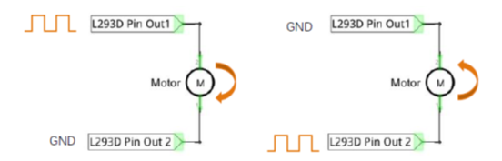

In practical use the motor is usually connected to channel 1 and by outputting different levels to in1 and in2 to control the rotational direction of the motor, and output to the PWM wave to Enable1 port to control the motor’s rotational speed. If the motor is connected to channel 3 and 4 by outputting different levels to in3 and in4 to control the motor's rotation direction, and output to the PWM wave to Enable2 pin to control the motor’s rotational speed.

Circuit
========================

.. list-table:: 
   :width: 100%
   :align: center

   * -  Schematic diagram
   * -  |Chapter21_28|
   * -  Hardware connection
   * -  |Chapter21_29|

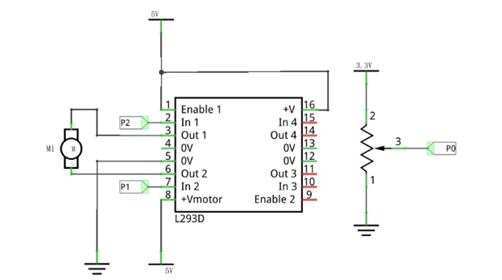
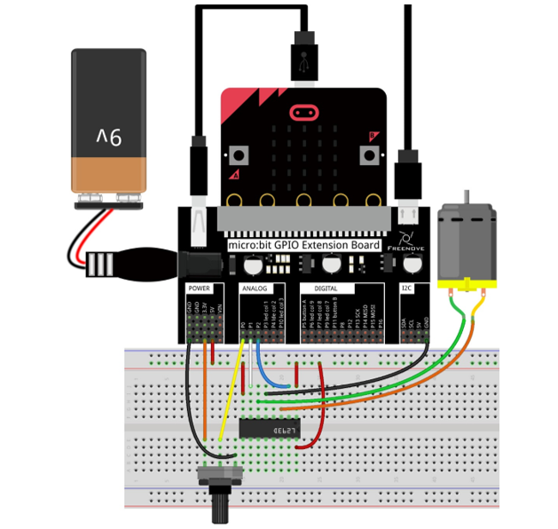

Block code 
=========================

Open MakeCode first. Import the .hex file. The path is as below:

( :ref:`How to import project <import_project>` )

+-----------+----------------------------------+-----------+
| File type | Path                             | File name |
+-----------+----------------------------------+-----------+
| HEX file  | ../Projects/BlockCode/21.2_Motor | Motor.hex |
+-----------+----------------------------------+-----------+

After importing successfully, the code is shown as below:

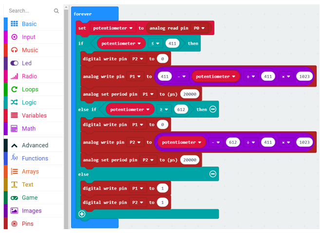

Check the connection of the circuit and verify it correct. Download the code into the micro:bit and rotate the potentiometer. When the potentiometer is in the middle position, the motor stops rotating. When the potentiometer gets away from middle position, the motor speed increases. The potentiometer moves to the limit and the motor speed reaches its maximum value. When the potentiometer is on a different side, the rotating direction of motor is different. 

Read the analog value of the P0 pin of the potentiometer. When the analog value is less than 411, the motor rotates forward. When the analog value is greater than 612, the motor reverses. When the analog value is between 411 and 612, the motor does not rotate.

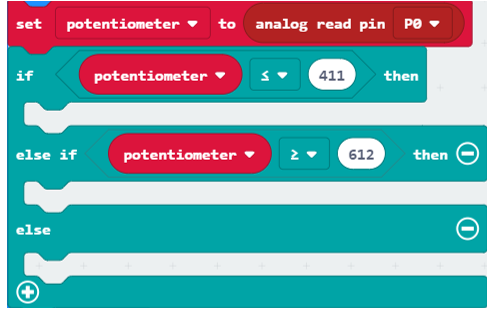

Set P2 to low level. P1 outputs PWM signal with an interval of 20ms and duty cycle changes with the change of potentiometer variable, then motor rotates forward.

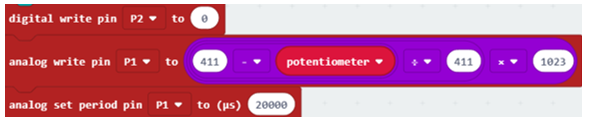

Set P1 to low level, P2 output PWM signal with an interval of 20ms, duty cycle changes with the change of potentiometer variable, then motor rotates in a reverse direction.

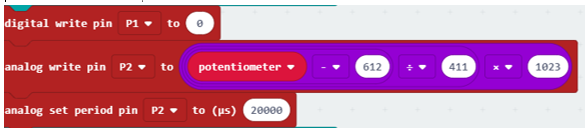

When P1, P2 pin output high level, motor does not rotate.

Reference
--------------------------

.. list-table:: 
   :width: 100%
   :align: center

   * -  Block
     -  Function 
   
   * -  |Chapter21_35|
     -  Write an analog signal (0 through 1023) to the pin you set.
  
   * -  |Chapter21_36|
     -  Configure the period of Pulse Width Modulation (PWM) 
        
        on the specified analog pin. 
      
        Before you call this function, 
        
        you should set the specified pin as analog.

Python code
-----------------------------

Open the .py file with Mu. Code, the path is as below:

+-------------+-----------------------------------+-----------+
| File type   | Path                              | File name |
+-------------+-----------------------------------+-----------+
| Python file | ../Projects/PythonCode/21.2_Motor | Motor.py  |
+-------------+-----------------------------------+-----------+

After loading successfully, the code is shown as below:

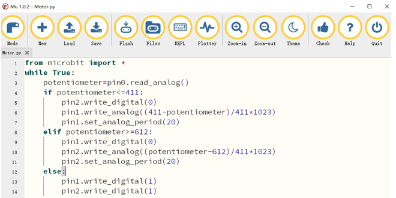

Check the connection of the circuit and verify it correct. Download the code into the micro:bit and rotate the potentiometer. When the potentiometer is in the middle position, the motor stops rotating. When the potentiometer gets away from middle position, the motor speed increases. The potentiometer moves to the limit and the motor speed reaches its maximum value. When the potentiometer is on a different side, the rotating direction of motor is different. 

The following is the program code:

.. literalinclude:: ../../../freenove_Kit/Projects/PythonCode/21.2_Motor/Motor.py
    :linenos: 
    :language: python
    :lines: 1-14
    :dedent:

Read the analog value of the P0 pin of the potentiometer. When the analog value is less than 411, the motor rotates forward. When the analog value is greater than 612, the motor reverses. When the analog value is between 411 and 612, the motor does not rotate.

.. code-block:: python

    potentiometer=pin0.read_analog()
    if potentiometer<=411:
        
    elif potentiometer>=612:
        
    else:

Set P2 to low level. P1 outputs PWM signal with an interval of 20ms, duty cycle changes with potentiometer variable, then motor rotates forward.

.. literalinclude:: ../../../freenove_Kit/Projects/PythonCode/21.2_Motor/Motor.py
    :linenos: 
    :language: python
    :lines: 5-7
    :dedent:

Set P1 to low level. P2 outputs PWM signal with an interval of 20ms, duty cycle changes with the change of potentiometer variable, then motor rotates in a reverse direction.

.. literalinclude:: ../../../freenove_Kit/Projects/PythonCode/21.2_Motor/Motor.py
    :linenos: 
    :language: python
    :lines: 9-11
    :dedent:

When P1, P2 pins output high level, motor does not rotate.

.. literalinclude:: ../../../freenove_Kit/Projects/PythonCode/21.2_Motor/Motor.py
    :linenos: 
    :language: python
    :lines: 13-14
    :dedent:

Reference
-------------------------

.. py:function:: pin.set_analog_period(int)	

    sets the interval; of the PWM output of the pin in milliseconds

    see https://en.wikipedia.org/wiki/Pulse-width_modulation

.. py:function:: pin.write_analog(value)	

    value is between 0 and 1023