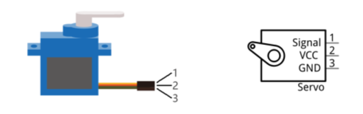
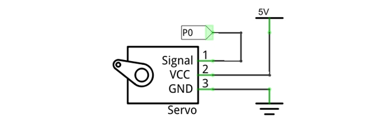
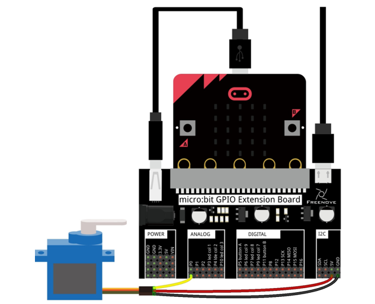
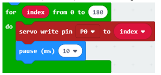
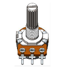
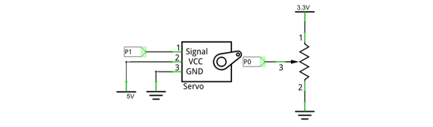
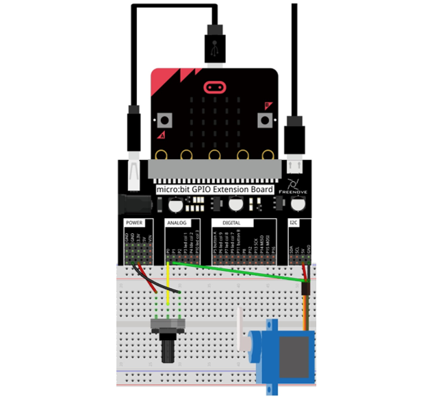
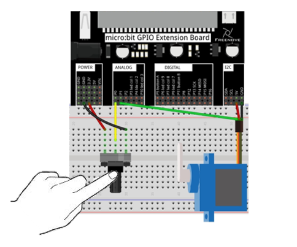
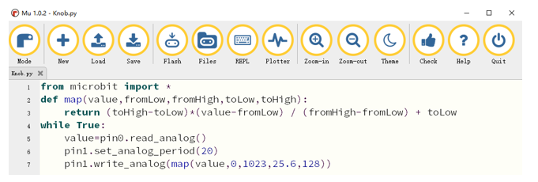

##############################################################################
Chapter Servo
##############################################################################

In this chapter, we will learn about Servos which are a rotary actuator type motor that can be controlled rotate to specific angles.

Project Sweep
************************************

In this project, we will use a servo.

Component list
=============================

+----------------+-------------------------------------+
| Microbit x1    | Expansion board x1                  |
|                |                                     |
| |Chapter03_00| | |Chapter03_01|                      |
+----------------+-------------------------------------+
| Jumper F/M x3  | USB cable x2                        |
|                |                                     |
| |Chapter22_01| | |Chapter03_03|                      |
+----------------+-------------------------------------+
| Servo x1                                             |
|                                                      |
|  |Chapter22_00|                                      |
+------------------------------------------------------+

.. |Chapter03_00| image:: ../_static/imgs/3_LED/Chapter03_00.png
.. |Chapter03_01| image:: ../_static/imgs/3_LED/Chapter03_01.png
.. |Chapter03_03| image:: ../_static/imgs/3_LED/Chapter03_03.png

Component knowledge
================================

Servo
----------------------------

Servo is a compact package which consists of a DC Motor, a set of reduction gears to provide torque, a sensor and control circuit board. Most Servos only have a 180-degree range of motion via their "horn". Servos can output higher torque than a simple DC Motor alone and they are widely used to control motion in model cars, model airplanes, robots, etc. Servos have three wire leads which usually terminate to a male or female 3-pin plug. Two leads are for electric power: Positive (2-VCC, Red wire), Negative (3-GND, Brown wire), and the signal line (1-Signal, Orange wire) as represented in the Servo provided in your Kit.

We will use a 50Hz PWM signal with a duty cycle in a certain range to drive the Servo. The lasting time 0.5ms-2.5ms of PWM single cycle high level corresponds to the Servo angle 0 degrees - 180 degree linearly. Part of the corresponding values are as follows:

+-----------------+-------------+
| High level time | Servo angle |
+-----------------+-------------+
| 0.5ms           | 0 degree    |
+-----------------+-------------+
| 1ms             | 45 degree   |
+-----------------+-------------+
| 1.5ms           | 90 degree   |
+-----------------+-------------+
| 2ms             | 135 degree  |
+-----------------+-------------+
| 2.5ms           | 180 degree  |
+-----------------+-------------+

As can be seen from the above table, the servo rotates from 0 to 180 degrees, and the corresponding pulse width is 0.5-2.5ms. Then the analog voltage value is written to the micro:bit pin ranging from 25.6 to 128.

Circuit
========================

This circuit Servo is powered by 5V, and the Micro:bit P0 pin controls the Servo rotation angle.

.. list-table:: 
   :width: 100%
   :align: center

   * -  Schematic diagram
   * -  |Chapter22_03|
   * -  Hardware connection
   * -  |Chapter22_04|

Block code 
=======================

Open MakeCode first. Import the .hex file. The path is as below:

(How to import project)

+-----------+----------------------------------+-----------+
| File type | Path                             | File name |
+-----------+----------------------------------+-----------+
| HEX file  | ../Projects/BlockCode/22.1_Sweep | Sweep.hex |
+-----------+----------------------------------+-----------+

After importing successfully, the code is shown as below:

Check the connection of the circuit, verify it correct, and download the code into micro:bit. The servo rotates from 0 degrees to 180 degrees, then from 180 degrees to 0 degrees, and repeats in an endless loop.

In the for loop of 0-180, let the servo change from 0 to 180 degrees.

In the for loop of 0-180, take the difference between 180 and index2, and let the servo rotate from 180 degrees to 0 degrees.

Reference
------------------------

.. list-table:: 
   :width: 100%
   :align: center

   * -  Block
     -  Function 
   
   * -  |Chapter22_08|
     -  Write a value to the servo on the specified pin and control the shaft.

python code 
=======================

Open the .py file with Mu. Code, the path is as below:

+-------------+-----------------------------------+-----------+
| File type   | Path                              | File name |
+-------------+-----------------------------------+-----------+
| Python file | ../Projects/PythonCode/22.1_Sweep | Sweep.py  |
+-------------+-----------------------------------+-----------+

After loading successfully, the code is shown as below:

The following is the program code:

.. literalinclude:: ../../../freenove_Kit/Projects/PythonCode/22.1_Sweep/Sweep.py
    :linenos: 
    :language: python
    :lines: 1-11
    :dedent:

Define map functions to convert values in one range to values in another range.

.. literalinclude:: ../../../freenove_Kit/Projects/PythonCode/22.1_Sweep/Sweep.py
    :linenos: 
    :language: python
    :lines: 2-3
    :dedent:

Set the interval of the PWM signal to 20ms. In a 0-180 for loop, convert the value in the range 0-180 to an analog voltage value in the range of 25.6~128, and then output the corresponding PWM signal to turn the servo from 0 degrees to 180 degrees. 

.. literalinclude:: ../../../freenove_Kit/Projects/PythonCode/22.1_Sweep/Sweep.py
    :linenos: 
    :language: python
    :lines: 5-8
    :dedent:

In a 180-0 for loop, convert the value in the range 0-180 to the analog voltage value in the range of 25.6~128, and then output the corresponding PWM signal to rotate the servo from 180 degrees to 0 degrees.

.. literalinclude:: ../../../freenove_Kit/Projects/PythonCode/22.1_Sweep/Sweep.py
    :linenos: 
    :language: python
    :lines: 9-11
    :dedent:

Project Knob
*********************************

In this project, we will use a potentiometer to control the rotation angle of the Servo.

Component list
===========================

+----------------+-------------------------------------+
| Microbit x1    | Expansion board x1                  |
|                |                                     |
| |Chapter03_00| | |Chapter03_01|                      |
+----------------+-------------------------------------+
| Jumper F/M x6  | USB cable x2                        |
|                |                                     |
| |Chapter22_01| | |Chapter03_03|                      |
+----------------+---------+---------------------------+
| Servo x1                 |  Rotary potentiometer x1  |
|                          |                           |
|  |Chapter22_00|          |   |Chapter22_09|          |
+--------------------------+---------------------------+

Circuit
================================

The P0 pin of this circuit microbit reads the voltage of the potentiometer, and the P1 pin drives the servo.

.. list-table:: 
   :width: 100%
   :align: center

   * -  Schematic diagram
   * -  |Chapter22_03|
   * -  Hardware connection
   * -  |Chapter22_04|

Block code 
============================

Open MakeCode first. Import the .hex file. The path is as below:

( :ref:`How to import project <import_project>` )

+-----------+---------------------------------+-----------+
| File type | Path                            | File name |
+-----------+---------------------------------+-----------+
| HEX file  | ../Projects/BlockCode/22.2_Knob | Knob.hex  |
+-----------+---------------------------------+-----------+

After importing successfully, the code is shown as below:

Check the connection of the circuit and verify it correct, download the code into the micro:bit, rotate the potentiometer, and the servo will follow the rotation.

Read the analog voltage value of the P0 pin, map the analog voltage value in the range of 0-1023 to the angle of the servo in the range of 0-180, and then drive the servo to rotate the corresponding angle through the P1 pin.

Python code
===========================

Open the .py file with Mu. Code, the path is as below:

+-------------+----------------------------------+-----------+
| File type   | Path                             | File name |
+-------------+----------------------------------+-----------+
| Python file | ../Projects/PythonCode/22.2_Knob | Knob.py   |
+-------------+----------------------------------+-----------+

After loading successfully, the code is shown as below:

Check the connection of the circuit and verify it correct, download the code into the micro:bit, rotate the potentiometer, and the servo will follow the rotation.

The following is the program code:

.. literalinclude:: ../../../freenove_Kit/Projects/PythonCode/22.2_Knob/Knob.py
    :linenos: 
    :language: python
    :lines: 1-7
    :dedent:

Define map functions to convert values in one range to values in another range.

.. literalinclude:: ../../../freenove_Kit/Projects/PythonCode/22.2_Knob/Knob.py
    :linenos: 
    :language: python
    :lines: 2-3
    :dedent:

Set the period of PWM signal to 20 ms. Read the analog voltage value of P0 foot, convert the analog voltage value in the range of 0-1023 to the analog voltage value in the range of 25.6-128, and then output the corresponding PWM signal to rotate the servo at the corresponding angle. 

.. literalinclude:: ../../../freenove_Kit/Projects/PythonCode/22.2_Knob/Knob.py
    :linenos: 
    :language: python
    :lines: 5-7
    :dedent: