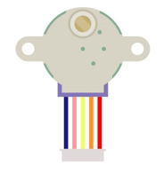
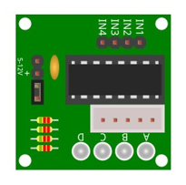
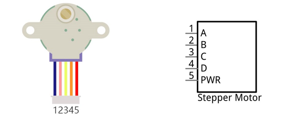
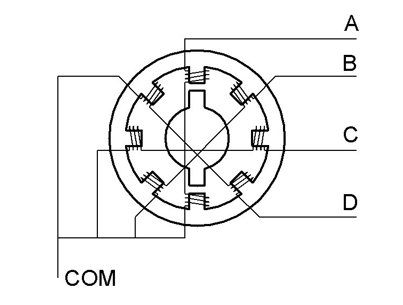
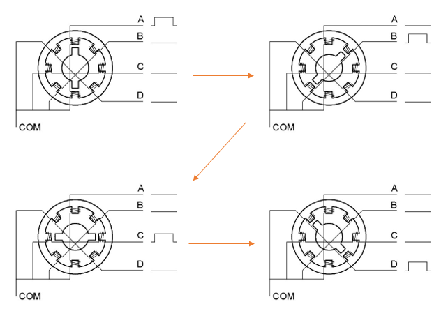
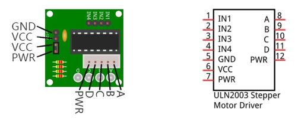
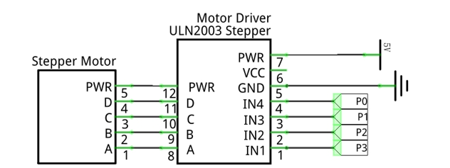
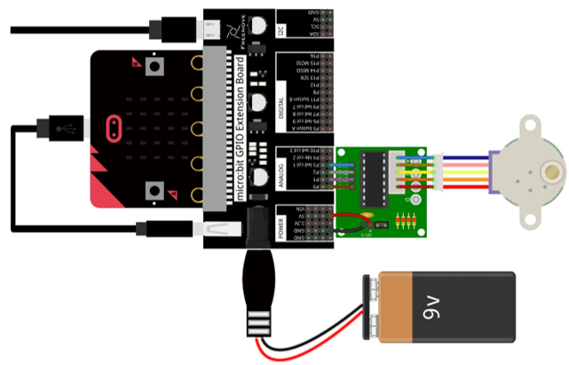
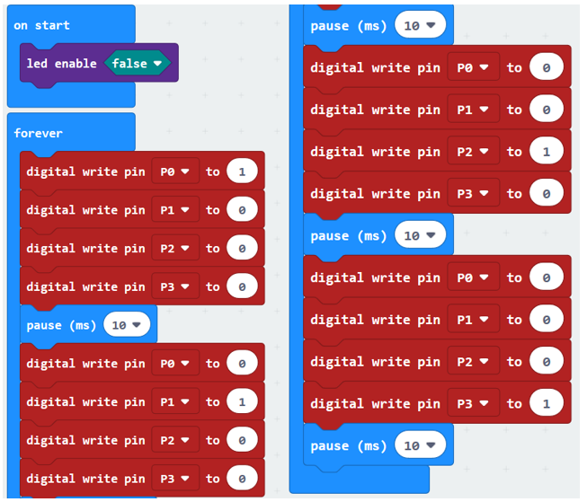
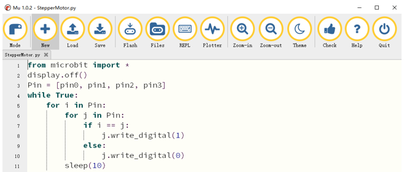

##############################################################################
Chapter Stepper Motor
##############################################################################

In this chapter, we will learn how to drive a Stepper Motor, and understand its working principle.

Project Stepper Motor 
****************************************

In this project, we will use micro:bit to control a stepper motor.

Component list
================================

+----------------------------+---------------------------------------------+
| Microbit x1                | Expansion board x1                          |
|                            |                                             |
| |Chapter03_00|             | |Chapter03_01|                              |
+----------------------------+---------------------------------------------+
| F/F x4                     | USB cable x2                                |
|                            |                                             |
| |Chapter20_01|             | |Chapter03_03|                              |
+----------------------------+---------------------------------------------+
| Stepper Motor x1           | ULN2003 Stepper Motor Driver x1             |
|                            |                                             |
|  |Chapter23_00|            |  |Chapter23_01|                             |
+----------------------------+---------------------------------------------+

.. |Chapter03_00| image:: ../_static/imgs/3_LED/Chapter03_00.png
.. |Chapter03_01| image:: ../_static/imgs/3_LED/Chapter03_01.png
.. |Chapter03_02| image:: ../_static/imgs/3_LED/Chapter03_02.png
.. |Chapter03_03| image:: ../_static/imgs/3_LED/Chapter03_03.png
.. |Chapter20_01| image:: ../_static/imgs/20_LCD1602/Chapter20_01.png

Component knowledge
=============================

Stepper Motor
------------------------------

Stepper Motors are an open-loop control device, which converts an electronic pulse signal into angular displacement or linear displacement. In a non-overload condition, the speed of the motor and the location of the stops depends only on the pulse signal frequency and number of pulses and is not affected by changes in load as with a DC Motor. 

A small Four-Phase Deceleration Stepper Motor is shown here:

The schematic diagram of a four-phase stepping motor is shown below:

The outside case or housing of the Stepper Motor is the Stator and inside the Stator is the Rotor. There are a specific number of individual coils, usually an integer multiple of the number of phases the motor has, when the Stator is powered ON, an electromagnetic field will be formed to attract a corresponding convex diagonal groove or indentation in the Rotor's surface. The Rotor is usually made of iron or a permanent magnet. Therefore, the Stepper Motor can be driven by powering the coils on the Stator in an ordered sequence (producing a series of "steps" or stepped movements).

A common driving process is as follows:

In the sequence above, the Stepper Motor rotates once at a certain angle, which is called a "step". By controlling the number of rotational steps, you can then control the Stepper Motor's rotation angle. By defining the time between two steps, you can control the Stepper Motor's rotation speed. When rotating clockwise, the order of coil powered on is: A -> B -> C -> D -> A ->... . And the rotor will rotate in accordance with this order, step by step, called four-steps, four-part. If the coils is powered ON in the reverse order, D -> C -> B -> A -> D ->… , the rotor will rotate in counter-clockwise direction.

There are other methods to control Stepper Motors, such as: connect A phase, then connect A B phase, the stator will be located in the center of A B, which is called a half-step. This method can improve the stability of the Stepper Motor and reduces noise. Tise sequence of powering the coils looks like this: A -> AB -> B -> BC -> C-> CD-> D -> DA ->A ->... , the rotor will rotate in accordance to this sequence ar, a half-step at a time, called four-steps, eight-part. Conversely, if the coils are powered ON in the reverse order the Stepper Motor will rotate in the opposite direction.

The stator in the Stepper Motor we have supplied has 32 magnetic poles. Therefore, to complete one full revolution requires 32 full steps. The rotor (or output shaft) of the Stepper Motor is connected to a speed reduction set of gears and the reduction ratio is 1:64. Therefore, the final output shaft (exiting the Stepper Motor's housing) requires 32 X 64 = 2048 steps to make one full revolution.

ULN2003 Stepping motor driver
-----------------------------------------

A ULN2003 Stepper Motor Driver is used to convert weak signals into more powerful control signals in order to drive the Stepper Motor. In the illustration below, the input signal IN1-IN4 corresponds to the output signal A-D, and 4 LEDs are integrated into the board to indicate the state of these signals. The PWR interface can be used as a power supply for the Stepper Motor. By default, PWR and VCC are connected.

Circuit
========================

.. list-table:: 
   :width: 100%
   :align: center

   * -  Schematic diagram
   * -  |Chapter23_06|
   * -  Hardware connection
   * -  |Chapter23_07|

Block code 
===========================

Open MakeCode first. Import the .hex file. The path is as below:

( :ref:`How to import project <import_project>` )

+-----------+-----------------------------------------+------------------+
| File type | Path                                    | File name        |
+-----------+-----------------------------------------+------------------+
| HEX file  | ../Projects/BlockCode/23.1_StepperMotor | StepperMotor.hex |
+-----------+-----------------------------------------+------------------+

After importing successfully, the code is shown as below:

After checking the connection of the circuit and verifying it correct, download the code into micro:bit, and then the stepper motor will rotate slowly.

In the code, the pins of P0, P1, P2 and P3 is set to high level in turn. When one pin is at a high level, set the other three pins to low level. So the coil is energized as follows: A_B_C_D_A... A_B_C_D_A_C_D... to make the stepper motor rotate. 

Python code
==========================

Open the .py file with Mu. Code, the path is as below:

+-------------+------------------------------------------+-----------------+
| File type   | Path                                     | File name       |
+-------------+------------------------------------------+-----------------+
| Python file | ../Projects/PythonCode/23.1_StepperMotor | StepperMotor.py |
+-------------+------------------------------------------+-----------------+

After loading successfully, the code is shown as below:

After checking the connection of the circuit and verifying it correct, download the code into micro:bit, and the stepper motor rotates slowly. 

The following is the program code:

.. literalinclude:: ../../../freenove_Kit/Projects/PythonCode/23.1_StepperMotor/StepperMotor.py
    :linenos: 
    :language: python
    :lines: 1-11
    :dedent:

Close the LED dot matrix screen to allow the GPIO pins associated with the LED dot matrix screen to be reused for other purposes. Define Pin list to store P0, P1, P2, P3 pin variables. 

.. literalinclude:: ../../../freenove_Kit/Projects/PythonCode/23.1_StepperMotor/StepperMotor.py
    :linenos: 
    :language: python
    :lines: 2-3
    :dedent:

In the for loop, the pin order with output high level is P0, P1, P3 P0.... When one pin outputs high level, make the other three pins output low levels. Make the coil electrified as follows: \A_B_C_D_A_... to make stepper motor rotate. 

.. literalinclude:: ../../../freenove_Kit/Projects/PythonCode/23.1_StepperMotor/StepperMotor.py
    :linenos: 
    :language: python
    :lines: 5-11
    :dedent: