##############################################################################
Chapter Hygrothermograph
##############################################################################

In this chapter, we will learn a commonly used sensor - Thermohygrometer DHT11.

Project Hygrothermograph
******************************************

In this project, we will use the micro:bit to read and print the temperature and humidity data of DHT11.

Component list
================================

+----------------------------+------------------------------------+
| Microbit x1                | Expansion board x1                 |
|                            |                                    |
| |Chapter03_00|             | |Chapter03_01|                     |
+----------------------------+------------------------------------+
| Breakboard x1              | USB cable x1                       |
|                            |                                    |
| |Chapter03_02|             | |Chapter03_03|                     |
+-----------------+----------+---------+--------------------------+
| DHT11 x1        | Resistor 10kΩ x1   | Jumper M/M x1  F/M x3    |
|                 |                    |                          |
| |Chapter24_00|  |  |Chapter24_01|    |  |Chapter24_02|          |
+-----------------+--------------------+--------------------------+

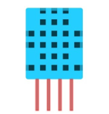
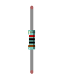
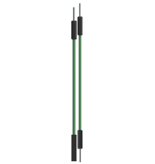
.. |Chapter03_00| image:: ../_static/imgs/3_LED/Chapter03_00.png
.. |Chapter03_01| image:: ../_static/imgs/3_LED/Chapter03_01.png
.. |Chapter03_02| image:: ../_static/imgs/3_LED/Chapter03_02.png
.. |Chapter03_03| image:: ../_static/imgs/3_LED/Chapter03_03.png

Component knowledge
==========================

The Temperature & Humidity Sensor DHT11 is a compound temperature & humidity sensor, and the output digital signal has been calibrated by its manufacturer.

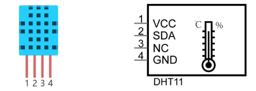

After being powered up, it will initialize in 1S's time. Its operating voltage is within the range of 3.3V-5.5V.

The SDA pin is a data pin, which is used to communicate with other devices. 

The NC pin (Not Connected Pin) are a type of pin found on various integrated circuit packages. Those pins have no functional purpose to the outside circuit (but may have an unknown functionality during manufacture and test). Those pins should not be connected to any of the circuit connections.

Circuit
==========================

.. list-table:: 
   :width: 100%
   :align: center

   * -  Schematic diagram
   * -  |Chapter24_04|
   * -  Hardware connection
   * -  |Chapter24_05|

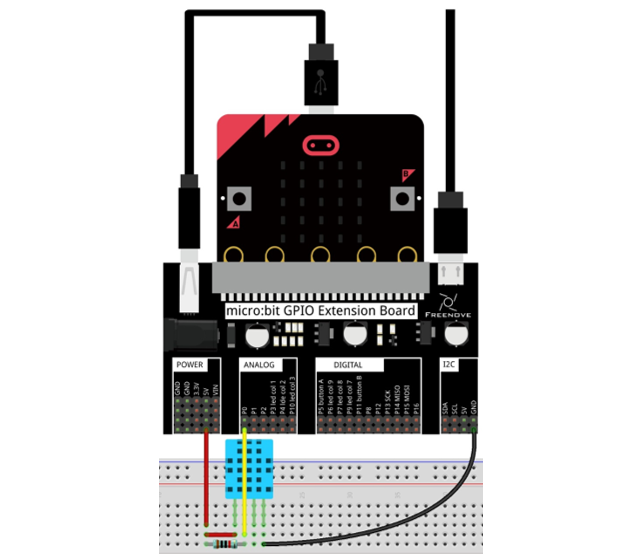

Block code 
========================

Open MakeCode first. Import the .hex file. The path is as below:

( :ref:`How to import project <import_project>` )

+-----------+----------------------------------+-----------+
| File type | Path                             | File name |
+-----------+----------------------------------+-----------+
| HEX file  | ../Projects/BlockCode/24.1_DHT11 | DHT11.hex |
+-----------+----------------------------------+-----------+

After importing successfully, the code is shown as below:

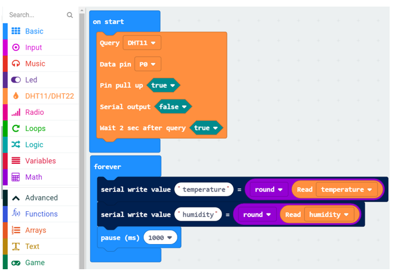

After checking the connection of the circuit and verifying it correct, download the code into micro:bit and open the serial port controller, you can see the temperature and humidity of the current environment, as shown in the following figure:

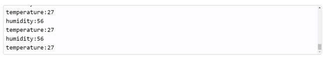

Set sensor type to DHT11, data pin to P0, initialize DHT11 module, wait for 2 seconds

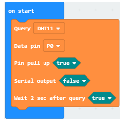

Every 1 s, the temperature and humidity data read will be printed out by serial port controller.

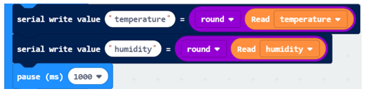

Reference
--------------------------

.. list-table:: 
   :width: 100%
   :align: center

   * -  Block
     -  Function 
   
   * -  |Chapter24_10|
     -  Set sensor type DHT11 or DHT22, select data pin and initialize DHT module.

   * -  |Chapter24_11|
     -  Read humidity level (%) or temperature (Celsius).

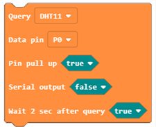

Extensions
-------------------------

If you want to import the DHT Sensor Extension Block into your new project, follow these steps to add it.

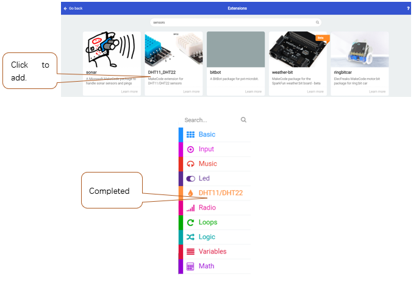

Python code
===========================

Import necessary Python file into micro:bit
------------------------------------------------

In the code of this tutorial, the LCD1602 module and DHT11 module are used, so it is necessary to import "I2C_LCD1602_Class.py" and "DHT11_RW.py" into the micro:bit. You can skip this section if you don’t use them. When you need, you can come back to import them.

The import method is as follows:

Search on the C drive and find the "mu_code" folder.

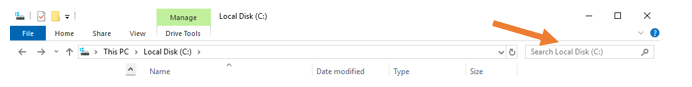

Double click on "mu_code" to enter the folder.

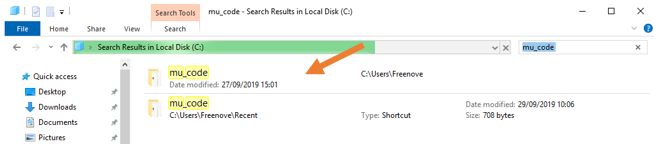

Copy "I2C_LCD1602_Class.py" and "DHT11_RW.py" from following path into "mu_code" directory.

+-------------+----------------------------+--------------------------------------+
| File type   | Path                       | File name                            |
+-------------+----------------------------+--------------------------------------+
| Python file | .. /Projects/PythonLibrary | I2C_LCD1602_Class.py     DHT11_RW.py |
+-------------+----------------------------+--------------------------------------+

After pasting successfully, you can see them as below:

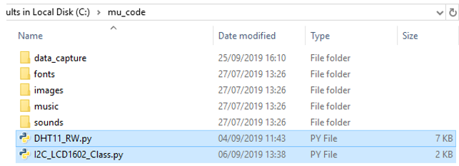

Open the Mu software, click "Files". Here we take "I2C_LCD1602_Class.py" as an example, drag "I2C_LCD1602_Class.py" into micro:bit.

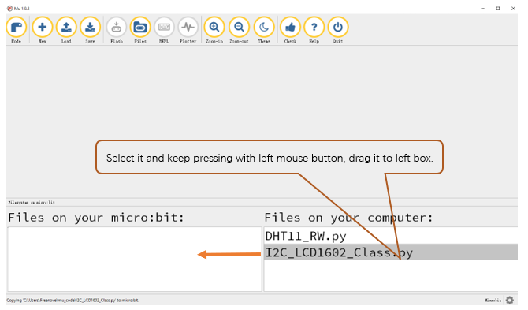

After importing successfully, you will see it on the left.

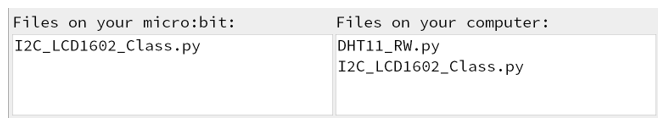

The import method of "DHT11_RW.py" is the same as described above. You just need to import the one you need to use.

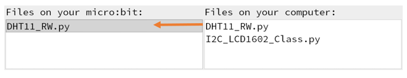

:red:`Note, after you upload other file into micro:bit, the original content will be covered. You need to import it next time you use it.`

Open the .py file with Mu. Code, the path is as below:

+-------------+-----------------------------------+-----------+
| File type   | Path                              | File name |
+-------------+-----------------------------------+-----------+
| Python file | ../Projects/PythonCode/24.1_DHT11 | DHT11.py  |
+-------------+-----------------------------------+-----------+

After loading the code, as shown below. Before downloading the code, import the "DHT11_RW.py" file into 

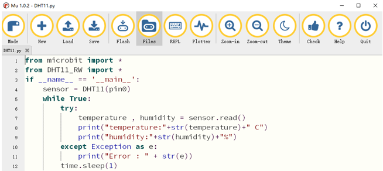

After importing the DHT11_RW.py file, check the connection of the circuit, verify it correct. And then download the code into micro:bit, click "REPL", press the micro:bit reset button, you can see the temperature and humidity of the current environment, as shown below:

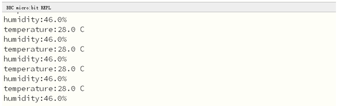

The following is the program code:

.. literalinclude:: ../../../freenove_Kit/Projects/PythonCode/24.1_DHT11/DHT11.py
    :linenos: 
    :language: python
    :lines: 1-12
    :dedent:

Export everything of DHT11_RW module, create object of DHT class, and set data pin to P0

.. code-block:: python

    from DHT11_RW import *
    sensor = DHT11(pin0)

Every 1 second, call the read() function in DHT11 class, get the temperature and humidity data, and print them out separately.

.. literalinclude:: ../../../freenove_Kit/Projects/PythonCode/24.1_DHT11/DHT11.py
    :linenos: 
    :language: python
    :lines: 5-12
    :dedent:

Reference
----------------------

.. py:function:: sensor.read()	

    The read() function is defined in DHT11 to obtain temperature and humidity data.