##############################################################################
Chapter Matrix Keypad
##############################################################################

Earlier we learned about a single Push Button Switch. In this chapter, we will learn about Matrix Keyboards, which integrates a number of Push Button Switches as Keys for the purposes of Input.

Project Matrix Keypad
*************************************

In this project, we will make LCD screen display number and character pressed on matrix keyboard.

Component list
================================

+----------------------------+------------------------------+
| Microbit x1                | Expansion board x1           |
|                            |                              |
| |Chapter03_00|             | |Chapter03_01|               |
+----------------------------+------------------------------+
| I2C LCD1602 Module x1      | USB cable x2                 |
|                            |                              |
| |Chapter25_00|             | |Chapter03_03|               |
+----------------------------+------------------------------+
| F/M x8    F/F x4           | 4x4 Matrix Keypad x1         |
|                            |                              |
|  |Chapter25_01|            |  |Chapter25_02|              |
+----------------------------+------------------------------+

.. |Chapter03_00| image:: ../_static/imgs/3_LED/Chapter03_00.png
.. |Chapter03_01| image:: ../_static/imgs/3_LED/Chapter03_01.png
.. |Chapter03_03| image:: ../_static/imgs/3_LED/Chapter03_03.png
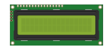
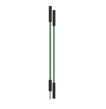
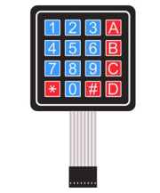

Component knowledge
==============================

4x4 Matrix Keypad
-----------------------------

A Keypad Matrix is a device that integrates a number of keys in one package. As is shown below, a 4x4 Keypad Matrix integrates 16 keys (think of this as 16 Push Button Switches in one module):

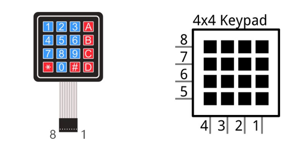

Similar to the integration of an LED Matrix, the 4x4 Keypad Matrix has each row of keys connected with one pin and this is the same for the columns. Such efficient connections reduce the number of processor ports required. The internal circuit of the Keypad Matrix is shown below.

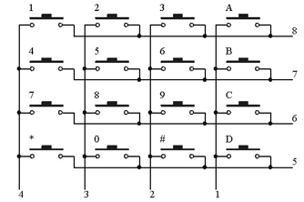

The method of usage is similar to the Matrix LED, by using a row or column scanning method to detect the state of each key’s position by column and row. Take column scanning method as an example, send low level to the first 1 column (Pin1), detect level state of row 5, 6, 7, 8 to judge whether the key A, B, C, D are pressed. Then send low level to column 2, 3, 4 in turn to detect whether other keys are pressed. Therefore, you can get the state of all of the keys.

Circuit
==========================

.. list-table:: 
   :width: 100%
   :align: center

   * -  Schematic diagram
   * -  |Chapter25_05|
   * -  Hardware connection
   * -  |Chapter25_06|

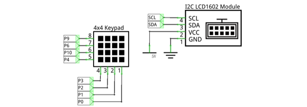
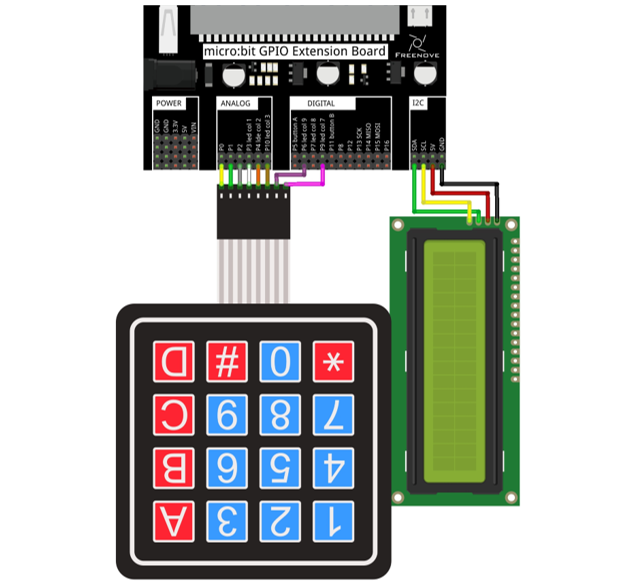

Block code
===========================

Open MakeCode first. Import the .hex file. The path is as below:

( :ref:`How to import project <import_project>` )

+-----------+-----------------------------------+------------+
| File type | Path                              | File name  |
+-----------+-----------------------------------+------------+
| HEX file  | ../Projects/BlockCode/25.1_Keypad | Keypad.hex |
+-----------+-----------------------------------+------------+

After importing successfully, the code is shown as below:

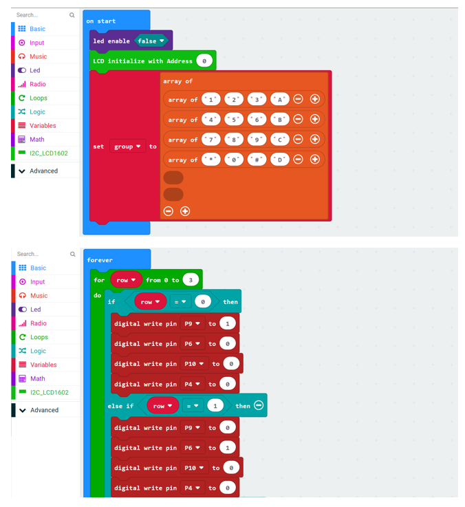

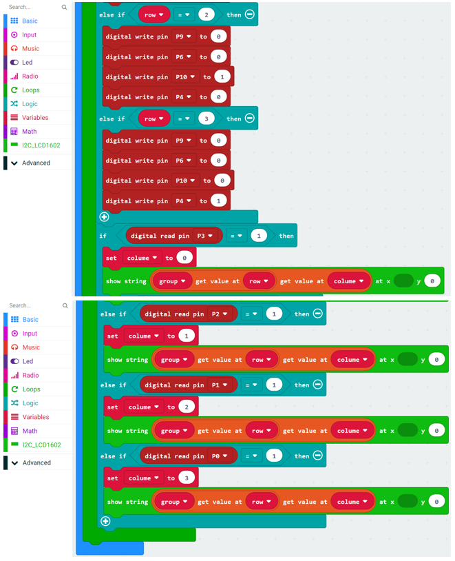

After checking the connection of the circuit and verifying it correct, the code is downloaded into micro:bit. When the key of the matrix keyboard is pressed, the LCD will display the corresponding numbers or characters.

Close the LED dot matrix screen, initialize the LCD, and store the values of the matrix keyboard 1, 2, 3, 4, 5, 6, 7, 8, 9, 0, A, B, C, D, #, \*, in the array group variable.

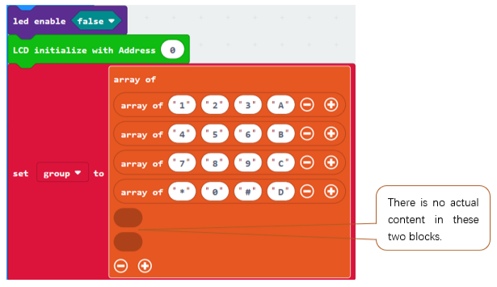

Row scanning. Pins P9, P6, P10, P4 corresponds to the first, second, third and fourth rows. Make the pins output high level in turn, the other pins output low level.

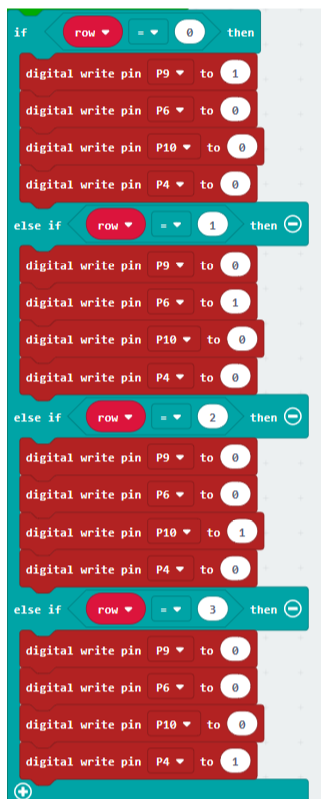

Column scanning. Pins P3, P2, P1, P0 corresponds to the first, second, third and fourth columns.  Reading high level means the key of current line and column is pressed. And the corresponding number or character in the group array will be displayed on the LCD. 

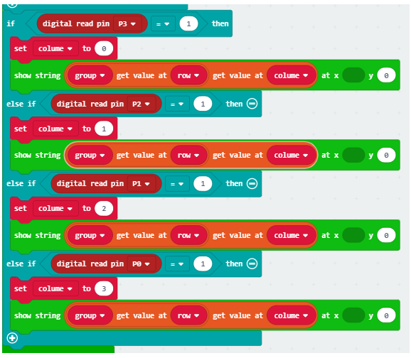

Python code
=============================

Open the .py file with Mu. Code, the path is as below:

+-------------+------------------------------------+-----------+
| File type   | Path                               | File name |
+-------------+------------------------------------+-----------+
| Python file | ../Projects/PythonCode/25.1_Keypad | Keypad.py |
+-------------+------------------------------------+-----------+

After the code is loaded, as shown below, import the "I2C_LCD1602_Class.py" file to micro:bit before downloading the code.

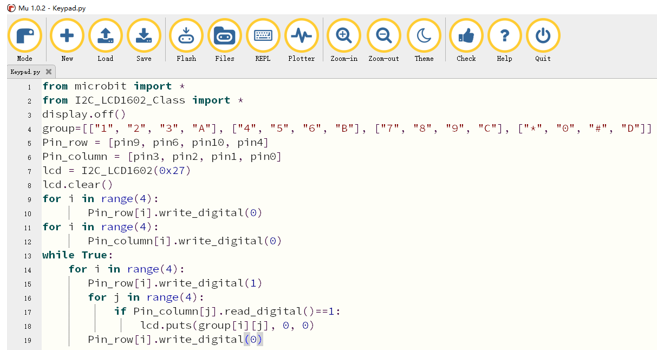

After importing the I2C_LCD1602_Class.py file, check the connection of the circuit and verify it correct, and then download the code into micro:bit, and press the key of the matrix keyboard, LCD will display the corresponding number or character.

The following is the program code:

.. literalinclude:: ../../../freenove_Kit/Projects/PythonCode/25.1_Keypad/Keypad.py
    :linenos: 
    :language: python
    :lines: 1-19
    :dedent:

Close the LED dot matrix screen, store the values of matrix keyboard 1, 2, 3, 4, 5, 6, 7, 8, 9, 0, A, B, C, D, \*, in the array group. Store the pin variables of the control keyboard row to Pin_row, and store the pin variables of the control keyboard column to Pin_column. Create the I2C_LCD1602 object lcd, enter the I2C address and clear the screen. Set the pins connecting the matrix keyboard to low level.

.. literalinclude:: ../../../freenove_Kit/Projects/PythonCode/25.1_Keypad/Keypad.py
    :linenos: 
    :language: python
    :lines: 3-12
    :dedent:

Scan rows and columns. If the key in certain row and column is pressed, the corresponding number or character in the group array will be displayed on the LCD.

.. literalinclude:: ../../../freenove_Kit/Projects/PythonCode/25.1_Keypad/Keypad.py
    :linenos: 
    :language: python
    :lines: 13-19
    :dedent:

Project Countdown Timer
***************************************

This project makes a countdown timer.

Component list

It is same as the previous project.

Circuit

It is same as the previous project.

Block code 

Open MakeCode first. Import the .hex file. The path is as below:

( :ref:`How to import project <import_project>` )

+-----------+-------------------------------------------+--------------------+
| File type | Path                                      | File name          |
+-----------+-------------------------------------------+--------------------+
| HEX file  | ../Projects/BlockCode/25.2_CountdownTimer | CountdownTimer.hex |
+-----------+-------------------------------------------+--------------------+

After importing successfully, the code is shown as below:

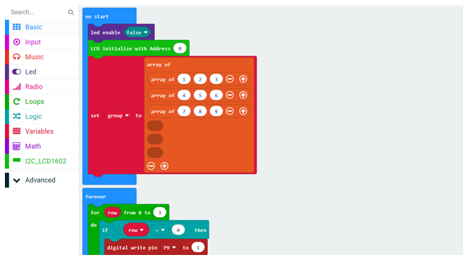

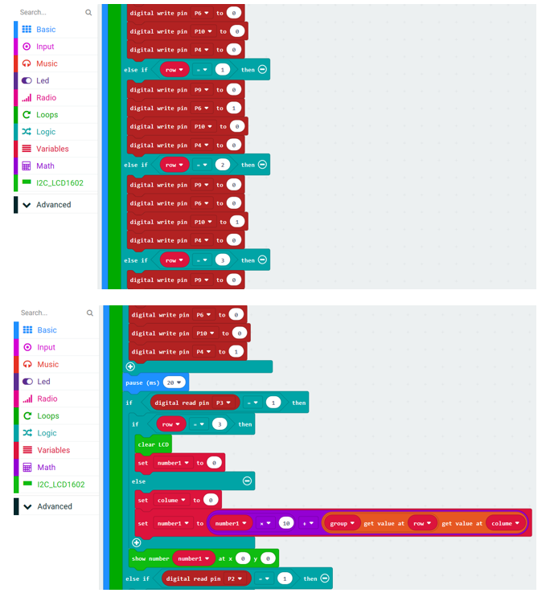

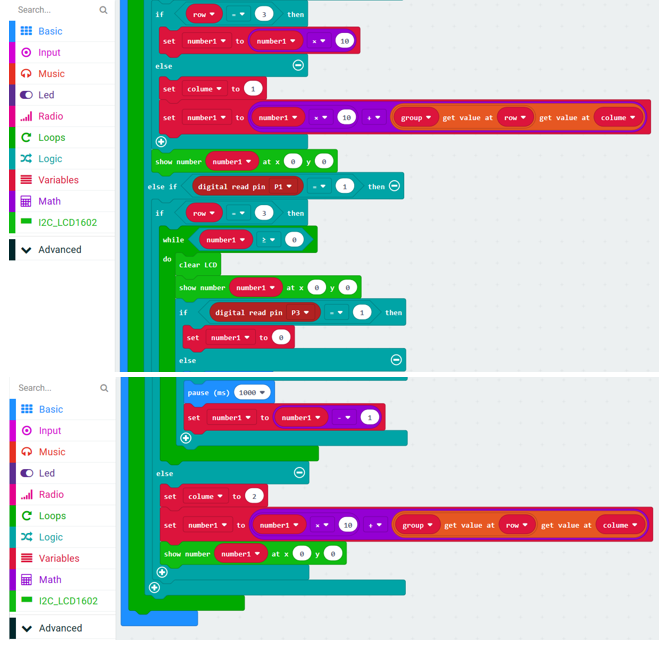

After checking the connection of the circuit and verifying it correct, download the code into micro:bit, type in the value, press the'#'key, start countdown, the key '*' is reset.

Close the LED dot matrix screen, initialize the LCD and store the values of matrix keyboard 1, 2, 3, 4, 5, 6, 7, 8, 9 in the array group.

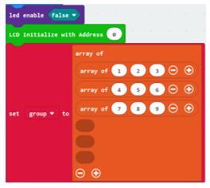

Row scanning. Pins P9, P6, P10, P4 corresponds to the first, second, third and fourth rows. Make the pins output high level in turn, the other pins output low level.

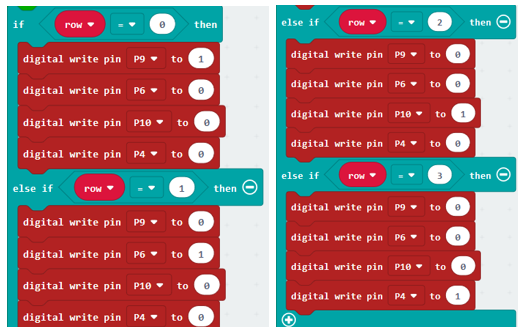

Column scanning. Pins P3, P2, P1 corresponds to the first, second and third columns. When reading high level, the corresponding reaction will be executed.

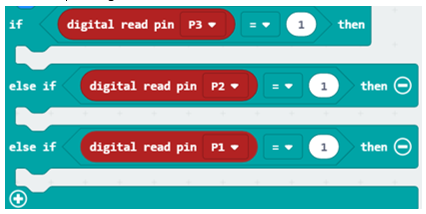

Determine whether the first column on the left is pressed, and then determine which row of the column is pressed. If the "*" key of the fourth row and first column is pressed, clear the LCD screen content, and the Number1 variable is assigned 0; if the other keys 1, 4 or 7 is pressed, the Number1 variable is multiplied by 10 and the corresponding key value is added, and then reassigned to Number1 to achieve carry effect. 

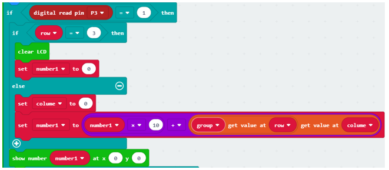

Determine whether the second column on the left is pressed, and then determine which row of the column is pressed. If the "0" key of the fourth row and second column is pressed, the value of Number1 is multiplied by 10, and then reassigned to Number1 variable. If the other keys 2, 5 or 8 is pressed, the value of Number1 is multiplied by 10 and the corresponding key value is added, and then reassigned to Number1 to achieve carry effect. 

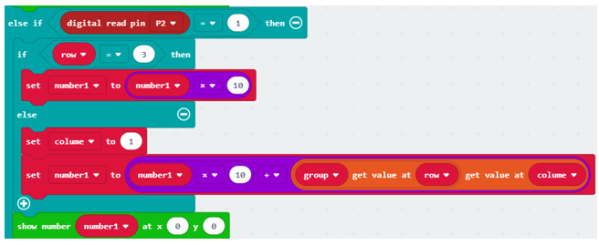

Determine whether the third column on the left is pressed, and then determine which row of the column is pressed. If the "#" key of the fourth row and the third column is pressed, the countdown is performed by the while loop. If the other keys 3, 6, 9 is pressed, the value of Number1 will be multiplied by 10 and the corresponding key value is reassigned to the Number1 variable to achieve carry effect. The Number1 variable will decrease by 1 every 1s. During the cycle, if the "*" key is pressed or the value of Number1 variable is less than or equal to 0, the loop will jumper out. 

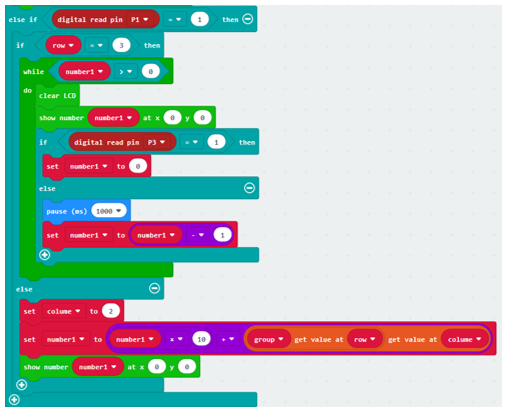

Python code
==============================

Open the .py file with Mu. Code, the path is as below:

+-------------+--------------------------------------------+-------------------+
| File type   | Path                                       | File name         |
+-------------+--------------------------------------------+-------------------+
| Python file | ../Projects/PythonCode/25.2_CountdownTimer | CountdownTimer.py |
+-------------+--------------------------------------------+-------------------+

After the code is loaded, as shown below, import the "I2C_LCD1602_Class.py" file to micro:bit before downloading the code.

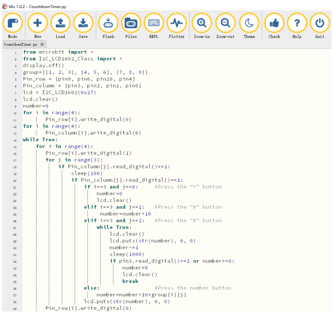

After importing the I2C_LCD1602_Class.py file, check the connection of the circuit and verify it correct, and download the code into micro:bit, type in the value, press the '#' key, start countdown, the key'*' is reset.

The following is the program code:

.. literalinclude:: ../../../freenove_Kit/Projects/PythonCode/25.2_CountdownTimer/CountdownTimer.py
    :linenos: 
    :language: python
    :lines: 1-39
    :dedent:

Close the LED dot matrix screen, store the values of matrix keyboard 1, 2, 3, 4, 5, 6, 7, 8, 9 in the array group, store the pin variables of the control keyboard row in Pin_row, and store the pin variables of the control keyboard column in Pin_column. Create the object lcd of class I2C_LCD1602, enter the I2C address and clear the screen, and set the pins connecting the matrix keyboard to low level.

.. literalinclude:: ../../../freenove_Kit/Projects/PythonCode/25.2_CountdownTimer/CountdownTimer.py
    :linenos: 
    :language: python
    :lines: 3-13
    :dedent:

Scan the rows and columns to check if the key is pressed.

If the "*" key is pressed, the number variable is assigned 0

If the "#" key is pressed, then the content of the while loop is executed. Number variable decreases by 1 every 1s to achieve the countdown effect. During the period, if the "*" key is pressed or the value of number variable is 0, the while loop jumper out and the number variable is assigned with 0.

If the number key is pressed, the number variable is multiplied by 10 and add the corresponding key value, then reassigned to the number variable.

.. literalinclude:: ../../../freenove_Kit/Projects/PythonCode/25.2_CountdownTimer/CountdownTimer.py
    :linenos: 
    :language: python
    :lines: 14-39
    :dedent: