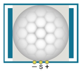
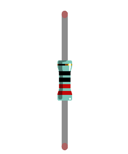
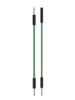
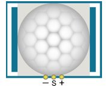
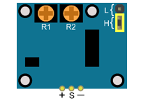
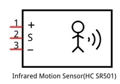
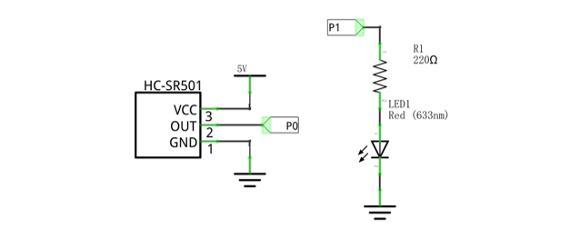
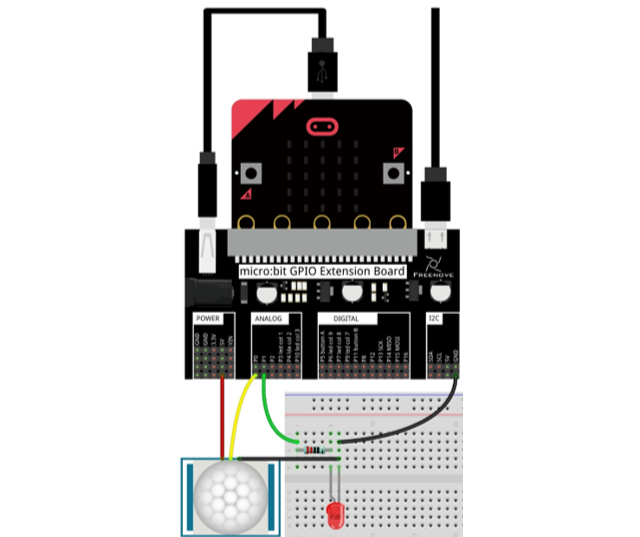
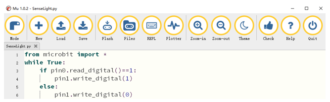

##############################################################################
Chapter Infrared Motion Sensor
##############################################################################

In this chapter, we will learn a widely used sensor, Infrared Motion Sensor.

Project Sense Light
***********************************

In this project, we will make a Motion Detector, with the human body infrared pyroelectric sensors.

When someone is in close proximity to the Motion Detector, it will automatically light up and when there is no one close by, it will be out.

This Infrared Motion Sensor can detect the infrared spectrum (heat signatures) emitted by living humans and animals.

Component list
===============================

+----------------------------+-----------------------------+
| Microbit x1                | Expansion board x1          |
|                            |                             |
| |Chapter03_00|             | |Chapter03_01|              |
+----------------------------+-----------------------------+
| Breakboard x1              | USB cable x1                |
|                            |                             |
| |Chapter03_02|             | |Chapter03_03|              |
+----------------------------+-----------------------------+
| HC-SR501 x1                | LED x1                      |
|                            |                             |
| |Chapter26_00|             | |Chapter26_01|              |
+----------------------------+-----------------------------+
| F/M x3  F/F x2             | Resistor 220Ω x1            |
|                            |                             |
| |Chapter26_03|             | |Chapter26_02|              |
+----------------------------+-----------------------------+

.. |Chapter03_00| image:: ../_static/imgs/3_LED/Chapter03_00.png
.. |Chapter03_01| image:: ../_static/imgs/3_LED/Chapter03_01.png
.. |Chapter03_02| image:: ../_static/imgs/3_LED/Chapter03_02.png
.. |Chapter03_03| image:: ../_static/imgs/3_LED/Chapter03_03.png

Component knowledge
============================

The following is the diagram of infrared Motion sensor(HC SR-501):

.. list-table:: 
   :width: 100%
   :align: center

   * -  Top
     -  Bottom
     -  Schematic
   
   * -  |Chapter26_04|
     -  |Chapter26_05|
     -  |Chapter26_06|

Description: 

1.	Working voltage: 5v-20v(DC) Static current: 65uA.

2.	Automatic Trigger. When a living body enters into the active area of sensor, the module will output high level (3.3V). When the body leaves the sensor’s active detection area, it will output high level lasting for time period T, then output low level(0V). Delay time T can be adjusted by the potentiometer R1.

3.	According to the position of Fresnel lenses dome, you can choose non-repeatable trigger modes or repeatable modes.

L: non-repeatable trigger mode. The module output high level after sensing a body, then when the delay time is over, the module will output low level. During high level time, the sensor no longer actively senses bodies.  

H: repeatable trigger mode. The distinction from the L mode is that it can sense a body until that body leaves during the period of high level output. After this, it starts to time and output low level after delaying T time.

4.	Induction block time: the induction will stay in block condition and does not induce external signal at lesser time intervals (less than delay time) after outputting high level or low level 

5.	Initialization time: the module needs about 1 minute to initialize after being powered ON. During this period, it will alternately output high or low level. 

6.	One characteristic of this sensor is when a body moves close to or moves away from the sensor’s dome edge, the sensor will work at high sensitively. When a body moves close to or moves away from the sensor’s dome in a vertical direction (perpendicular to the dome), the sensor cannot detect well (please take note of this deficiency). Actually this makes sense when you consider that this sensor is usually placed on a celling as part of a security product. Note: The Sensing Range (distance before a body is detected) is adjusted by the potentiometer.

We can regard this sensor as a simple inductive switch when in use.

Circuit
========================

.. list-table:: 
   :width: 100%
   :align: center

   * -  Schematic diagram
   * -  |Chapter26_07|
   * -  Hardware connection
   * -  |Chapter26_08|

Block code 
=============================

Open MakeCode first. Import the .hex file. The path is as below:

( :ref:`How to import project <import_project>` )

+-----------+---------------------------------------+----------------+
| File type | Path                                  | File name      |
+-----------+---------------------------------------+----------------+
| HEX file  | ../Projects/BlockCode/26.1_SenseLight | SenseLight.hex |
+-----------+---------------------------------------+----------------+

After import successfully, the code is shown as below:

 
After checking the connection of the circuit and verifying it correct, download the code into micro:bit, then HC-SR501 module is initialized for about one minute. After initialization, when someone is moving in its detection range, the LED will light up; otherwise it will not respond. Two potentiometers can adjust the detection distance and Induction block time. 

If human movement is detected, the module will output high level. If not, the module will always output low level. The level read from P0 pin is written to the P1 pin, so that the level of P0 and P1 pin will be consistent to control the LED. 

 
Python code
===========================

Open the .py file with Mu. Code, the path is as below:

+-------------+----------------------------------------+---------------+
| File type   | Path                                   | File name     |
+-------------+----------------------------------------+---------------+
| Python file | ../Projects/PythonCode/26.1_SenseLight | SenseLight.py |
+-------------+----------------------------------------+---------------+

After loading successfully, the code is shown as below:

After checking the connection of the circuit and verifying it correct, download the code into micro:bit, then HC-SR501 module is initialized for about one minute. After initialization, when someone is moving in its detection range, the LED will light up; Otherwise it will not respond. Two potentiometers can adjust the detection distance and Induction block time.

The following is the program code:

.. literalinclude:: ../../../freenove_Kit/Projects/PythonCode/26.1_SenseLight/SenseLight.py
    :linenos: 
    :language: python
    :lines: 1-6
    :dedent:

If human movement is detected, the module will output high level. If not, the module will always output low level. According to the read level of the P1 pin, the P0 pin also outputs the same level to control the LED. 

.. literalinclude:: ../../../freenove_Kit/Projects/PythonCode/26.1_SenseLight/SenseLight.py
    :linenos: 
    :language: python
    :lines: 3-6
    :dedent: