##############################################################################
Chapter Ultrasonic Ranging
##############################################################################

In this chapter, we learn a module which use ultrasonic to measure distance, HC SR04.

Project Ultrasonic Ranging
***************************************

In this project, we use HC-SR04 ultrasonic module to measure the distance between the module and the obstacle in front of it and display it on LCD screen. 

Component list
===============================

+----------------------------+-----------------------------+
| Microbit x1                | Expansion board x1          |
|                            |                             |
| |Chapter03_00|             | |Chapter03_01|              |
+----------------------------+-----------------------------+
| I2C LCD1602 Module x1      | USB cable x2                |
|                            |                             |
| |Chapter27_00|             | |Chapter03_03|              |
+----------------------------+-----------------------------+
| F/F x8                     | HC-SR04 x1                  |
|                            |                             |
| |Chapter27_01|             | |Chapter27_02|              |
+----------------------------+-----------------------------+

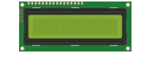
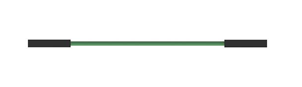
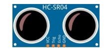
.. |Chapter03_00| image:: ../_static/imgs/3_LED/Chapter03_00.png
.. |Chapter03_01| image:: ../_static/imgs/3_LED/Chapter03_01.png
.. |Chapter03_03| image:: ../_static/imgs/3_LED/Chapter03_03.png

Component Knowledge
===============================

The Ultrasonic Ranging Module uses the principle that ultrasonic waves will reflect when they encounter any obstacles. This is possible by counting the time interval between when the ultrasonic wave is transmitted to when the ultrasonic wave reflects back after encountering an obstacle. Time interval counting will end after an ultrasonic wave is received, and the time difference (delta) is the total time of the ultrasonic wave’s journey from being transmitted to being received. Because the speed of sound in air is a constant, and is about v=340m/s, we can calculate the distance between the Ultrasonic Ranging Module and the obstacle: s=vt/2.

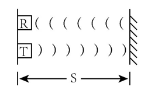
 
The HC-SR04 Ultrasonic Ranging Module integrates a both an ultrasonic transmitter and a receiver. The transmitter is used to convert electrical signals (electrical energy) into high frequency (beyond human hearing) sound waves (mechanical energy) and the function of the receiver is opposite of this. The picture and the diagram of the HC SR04 Ultrasonic Ranging Module are shown below:

.. list-table:: 
   :width: 100%
   :align: center

   * -  Schematic diagram
   * -  |Chapter27_04|
   * -  Hardware connection
   * -  |Chapter27_05|

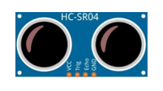
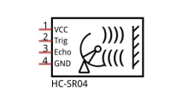

Pin description:

+------+-------------------+
| VCC  | power  supply pin |
+------+-------------------+
| Trig | trigger pin       |
+------+-------------------+
| Echo | Echo pin          |
+------+-------------------+
| GND  | GND               |
+------+-------------------+

Technical specs:

+--------------------------------+----------------------------------+
| Working voltage: 5V            | Working current: 12mA            |
+--------------------------------+----------------------------------+
| Minimum measured distance: 2cm | Maximum measured distance: 200cm |
+--------------------------------+----------------------------------+

Instructions for Use: output a high-level pulse in Trig pin lasting for least 10uS, the module begins to transmit ultrasonic waves. At the same time, the Echo pin is pulled up. When the module receives the returned ultrasonic waves from encountering an obstacle, the Echo pin will be pulled down. The duration of high level in the Echo pin is the total time of the ultrasonic wave from transmitting to receiving, s=vt/2. This is done constantly.

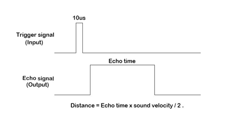

Circuit
============================

.. list-table:: 
   :width: 100%
   :align: center

   * -  Schematic diagram
   * -  |Chapter27_07|
   * -  Hardware connection
   * -  |Chapter27_08|

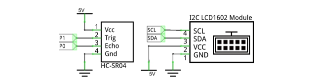
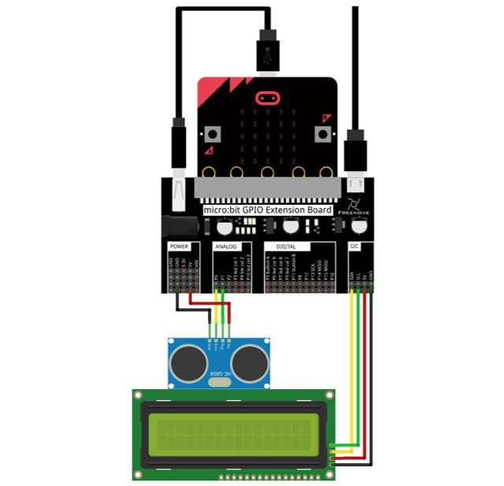

Block code 
===========================

Open MakeCode first. Import the .hex file. The path is as below:

( :ref:`How to import project <import_project>` )

+-----------+----------------------------------------------+-----------------------+
| File type | Path                                         | File name             |
+-----------+----------------------------------------------+-----------------------+
| HEX file  | ../Projects/BlockCode/27.1_UltrasonicRanging | UltrasonicRanging.hex |
+-----------+----------------------------------------------+-----------------------+

After importing successfully, the code is shown as below:

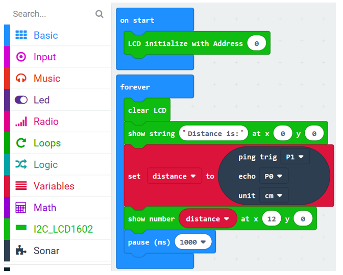

After checking the connection of the circuit and verifying it correct, download the code into micro:bit. The LCD screen will show the distance between the obstacle and the ultrasonic module in CM.

Initialize LCD.

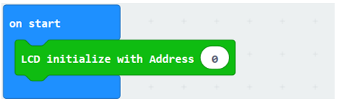

The distance of obstacles measured by the ultrasonic module will be assigned to the variable distance, and then displayed on LCD. LCD refreshes every 1 second.

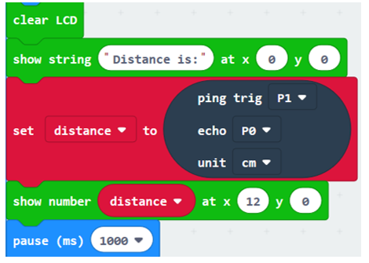

Reference
-------------------------

.. list-table:: 
   :width: 100%
   :align: center

   * -  Block
     -  Function 
   
   * -  |Chapter27_12|
     -  It can return the distance of obstacles detected by sensor.

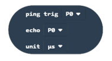

Extensions
------------------------

If you want to import the ultrasonic module expansion block into the new project, follow the steps below to add it.

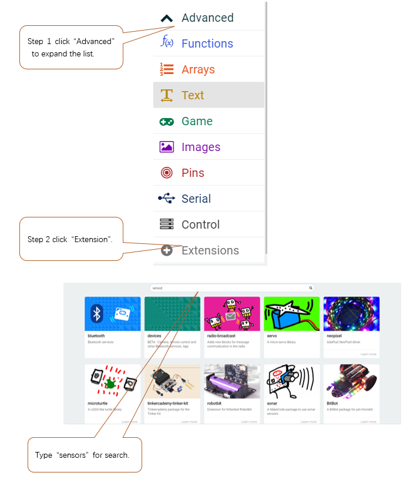

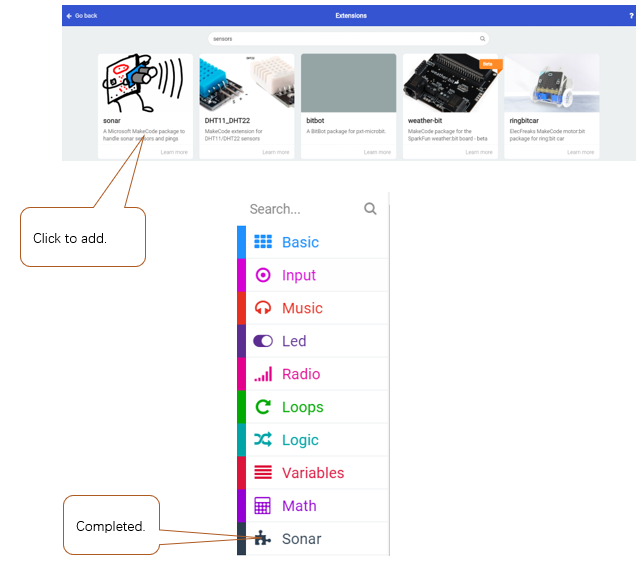

Python code
=======================

Open the .py file with Mu. Code, the path is as below:

+-------------+-----------------------------------------------+----------------------+
| File type   | Path                                          | File name            |
+-------------+-----------------------------------------------+----------------------+
| Python file | ../Projects/PythonCode/27.1_UltrasonicRanging | UltrasonicRanging.py |
+-------------+-----------------------------------------------+----------------------+

After the code is loaded, as shown below, import the "I2C_LCD1602_Class.py" file to micro:bit before downloading the code.

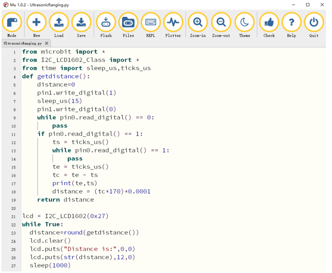

After importing the I2C_LCD1602_Class.py file, check the connection of the circuit and verify it correct. After downloading the code into micro:bit, you can see that the LCD screen will show the distance between the obstacle and the ultrasonic module. The unit is CM.

The following is the program code:

.. literalinclude:: ../../../freenove_Kit/Projects/PythonCode/27.1_UltrasonicRanging/UltrasonicRanging.py
    :linenos: 
    :language: python
    :lines: 1-27
    :dedent:

The custom getdistance() function is used to get the distance between the obstacle and the ultrasonic module. 

The unit of return value is CM.

.. literalinclude:: ../../../freenove_Kit/Projects/PythonCode/27.1_UltrasonicRanging/UltrasonicRanging.py
    :linenos: 
    :language: python
    :lines: 4-19
    :dedent:

Create the object lcd of I2C_LCD1602 class, input I2C address 0x27, call getdistance() function, get the distance of the obstacle to the ultrasonic module, assign it to the distance variable, and then display the value of the distance variable on the LCD.

.. literalinclude:: ../../../freenove_Kit/Projects/PythonCode/27.1_UltrasonicRanging/UltrasonicRanging.py
    :linenos: 
    :language: python
    :lines: 21-27
    :dedent:

Reference
--------------------------

.. py:function:: getdistance()	
    
    Get the distance from the ultrasonic module to the obstacle. The unit is CM.