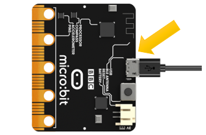
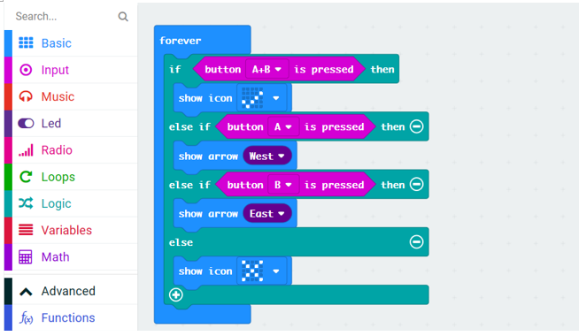
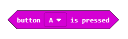
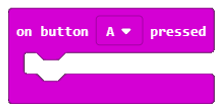
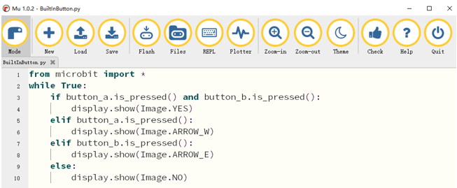

##############################################################################
Built-in Button
##############################################################################

Keyboards or buttons are important tools for human-computer interaction. We often use keyboards to enter text, type commands, control devices, etc. Two programmable buttons A and B are integrated on the micro:bit to easily control the micro:bit to make actions.

Project Button A and B
************************************

This project uses micro:bit integrated buttons A and B. When different buttons are pressed, micro:bit displays different patterns.

Circuit
================================

Connect micro:bit and PC via micro USB cable.

Hardware connection

Block code 
==============================

Open MakeCode first.

Import the .hex file. The path is as below:

( :ref:`How to import project <import_project>` )

+-----------+------------------------------------------+-------------------+
| File type | Path                                     | File name         |
+-----------+------------------------------------------+-------------------+
| HEX file  | ../Projects/BlockCode/02.1_BuiltInButton | BuiltInButton.hex |
+-----------+------------------------------------------+-------------------+

After loading successfully, the code is shown as below:

Download the code into micro:bit. When button A is pressed, the micro:bit LED matrix will display an arrow pointing to button A. When button B is pressed, the micro:bit LED matrix will display an arrow pointing to button B. When the buttons A and B are pressed at the same time, the micro:bit LED matrix will display a check mark. When no button is pressed, the micro:bit LED matrix displays a cross.

Reference
-----------------------------

.. list-table:: 
   :width: 100%
   :align: center

   * -  Block
     -  Function 
   
   * -  |Chapter02_02|
     -  Check whether a button is pressed at the moment. 
      
        The micro\:bit has two buttons: button A and button B.

   * -  |Chapter02_03|
     -  This handler works when button A or B is pressed, or A and B together.

Python code
============================

Open the .py file with Mu. Code, the path is as below:

+-------------+-------------------------------------------+---------------+
| File type   | Path                                      | File name     |
+-------------+-------------------------------------------+---------------+
| Python file | ../Projects/PythonCode/02.1_BuiltInButton | BuiltInButton |
+-------------+-------------------------------------------+---------------+

After loading successfully, the code is shown as below:

Download the code into micro:bit. When button A is pressed, the micro:bit LED matrix will display an arrow pointing to button A. When button B is pressed, the micro:bit LED matrix will display a an arrow pointing to button B.When the buttons A and B are pressed at the same time, the micro:bit LED matrix will display a check mark. When no button is pressed, the micro:bit LED matrix displays a cross.

The following is the program code:

.. literalinclude:: ../../../freenove_Kit/Projects/PythonCode/02.1_BuiltInButton/BuiltInButton.py
    :linenos: 
    :language: python
    :lines: 1-10
    :dedent:

Use the if-elif-else statement to determine when the button is pressed. First, when the buttons A and B are pressed at the same time, a check mark is displayed.

.. literalinclude:: ../../../freenove_Kit/Projects/PythonCode/02.1_BuiltInButton/BuiltInButton.py
    :linenos: 
    :language: python
    :lines: 3-4
    :dedent:

Then, determine in turn if the buttons A or B is pressed seperately, and the case where no button is pressed.

.. literalinclude:: ../../../freenove_Kit/Projects/PythonCode/02.1_BuiltInButton/BuiltInButton.py
    :linenos: 
    :language: python
    :lines: 5-10
    :dedent:

Note that it is necessary to first determine if buttons A and B are pressed at the same time. If-elif-else statement will make the micro:bit execute only one situation. If the state with two buttoon pressed is placed in last, the result of pressing A or B will appear first, then the statement will end, and then sentence met the state with two button pressed will never be executed.

Reference
------------------------

.. py:function:: is_pressed()	

Returns True if the specified button is currently being pressed, and False otherwise.

For more information, please refer to https://microbit-micropython.readthedocs.io/en/latest/button.html