##############################################################################
Chapter LED
##############################################################################

This section we will learn how to control external LEDs.

Project Blink
********************************

This project uses micro:bit to control LED blinking.

Component List
===========================

+----------------+-------------------------------------+
| Microbit x1    | Expansion board x1                  |
|                |                                     |
| |Chapter03_00| | |Chapter03_01|                      |
+----------------+-------------------------------------+
| Breakboard x1  | USB cable x1                        |
|                |                                     |
| |Chapter03_02| | |Chapter03_03|                      |
+----------------+--------------------+----------------+
| Jumper F/M x2  | Resistor 220Ω x1   | LED x1         |
|                |                    |                |
| |Chapter03_04| | |Chapter03_05|     | |Chapter03_06| |
+----------------+--------------------+----------------+

.. |Chapter03_00| image:: ../_static/imgs/3_LED/Chapter03_00.png
.. |Chapter03_01| image:: ../_static/imgs/3_LED/Chapter03_01.png
.. |Chapter03_02| image:: ../_static/imgs/3_LED/Chapter03_02.png
.. |Chapter03_03| image:: ../_static/imgs/3_LED/Chapter03_03.png
.. |Chapter03_04| image:: ../_static/imgs/3_LED/Chapter03_04.png
.. |Chapter03_05| image:: ../_static/imgs/3_LED/Chapter03_05.png

Circuit Knowledge
===============================

Current
-----------------------------

The unit of current (I) is ampere (A). 1A=1000mA, 1mA=1000μA.

Closed loop consisting of electronic components is necessary for current.

In the figure below: the left is a loop circuit, so current flows through the circuit. The right is not a loop circuit, so there is no current.

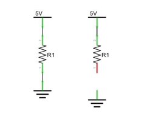

Resistor
-------------------------------

Resistors use Ohms (Ω) as the unit of measurement of their resistance (R). 1MΩ=1000kΩ, 1kΩ=1000Ω.

A resistor is a passive electrical component that limits or regulates the flow of current in an electronic circuit.

On the left, we see a physical representation of a resistor, and the right is the symbol used to represent the presence of a resistor in a circuit diagram or schematic.

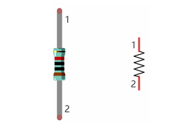

The bands of color on a resistor is a shorthand code used to identify its resistance value. For more details of resistor color codes, please refer to the card in the kit package.

With a fixed voltage, there will be less current output with greater resistance added to the circuit. The relationship between Current, Voltage and Resistance can be expressed by this formula: I=V/R known as Ohm’s Law where I = Current, V = Voltage and R = Resistance. Knowing the values of any two of these allows you to solve the value of the third.

In the following diagram, the current through R1 is: I=U/R=5V/10kΩ=0.0005A=0.5mA.

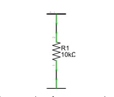

WARNING: Never connect the two poles of a power supply with anything of low resistance value (i.e. a metal object or bare wire) this is a Short and results in high current that may damage the power supply and electronic components.

.. note::
    
    Unlike LEDs and Diodes, Resistors have no poles and re non-polar (it does not matter which direction you insert them into a circuit, it will work the same)

Analog signal and Digital signal
-----------------------------------------

An Analog Signal is a continuous signal in both time and value. On the contrary, a Digital Signal or discrete-time signal is a time series consisting of a sequence of quantities. Most signals in life are analog signals. A familiar example of an Analog Signal would be how the temperature throughout the day is continuously changing and could not suddenly change instantaneously from 0℃ to 10℃. However, Digital Signals can instantaneously change in value. This change is expressed in numbers as 1 and 0 (the basis of binary code). 

Their differences can more easily be seen when compared when graphed as below.

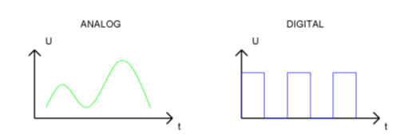

Note that the Analog signals are curved waves and the Digital signals are "Square Waves". 

In practical applications, we often use binary as the digital signal, that is a series of 0's and 1’s. Since a binary signal only has two values (0 or 1) it has great stability and reliability. Lastly, both analog and digital signals can be converted into the other.

Low level and high level
--------------------------------

In circuit, the form of binary (0 and 1) is presented as low level and high level.

Low level is generally equal to ground voltage (0V). High level is generally equal to the operating voltage of components.

The low level of Micro:bit is 0V and high level is 3.3V, as shown below. When IO port on Micro:bit outputs high level, low-power components can be directly driven, like LED.

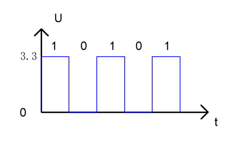

Component knowledge

Let us learn about the basic features of components to use them better.

Jumper
----------------------

Jumper is a kind of wire, which is designed to connect the components together by inserting its two terminals.

Jumpers have male end (pin) and female end (slot), so jumpers can be divided into the following 3 types.

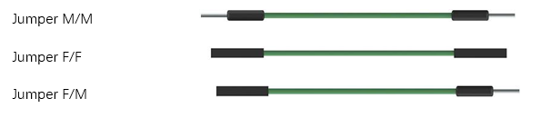

Breadboard
-----------------------

There are many small holes on breadboard to connect Jumper.

Some small holes are connected inside breadboard. Here we have a small breadboard as an example of how the rows of holes (sockets) are electrically attached. The left picture shows the ways the pins have shared electrical connection and the right picture shows the actual internal metal, which connect these rows electrically.

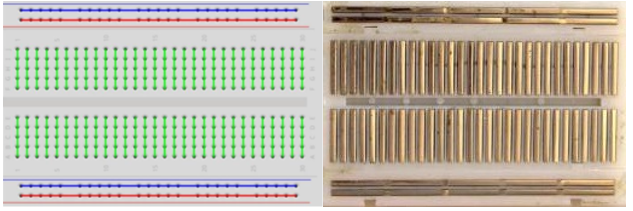

LED
-----------------------

An LED is a type of diode. All diodes only work if current is flowing in the correct direction and have two Poles. An LED will only work (light up) if the longer pin (+) of LED is connected to the positive output from a power source and the shorter pin is connected to the negative (-) negative output also referred to as Ground (GND). This type of component is known as "Polar" (think One-Way Street).

All common 2 lead diodes are the same in this respect. Diodes work only if the voltage of its positive electrode is higher than its negative electrode and there is a narrow range of operating voltage for most all common diodes of 1.9 and 3.4V. If you use much more than 3.3V the LED will be damaged and burn out.

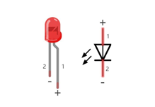

Note: LEDs cannot be directly connected to a power supply, which usually ends in a damaged component. A resistor with a specified resistance value must be connected in series to the LED you plan to use.

Circuit
==========================

When wiring, it is recommended to disconnect all the power supplies in the circuit, and then build the circuit according to the circuit (micro:bit board cannot be inserted reverse), 

**LED's positive pole (long pin) should be connected to resistor while its negative pole (short pin) should be connected to GND. After the circuit is built and verified correct, use the USB cable to connect the PC to the micro:bit to power the circuit.**

**CAUTION: Avoid any possible short circuits (especially connecting 5V or GND, 3.3V and GND)!**

**WARNING: A short circuit can cause high current in your circuit, create excessive component heat and cause permanent damage to your micro:bit!**

.. list-table:: 
   :width: 100%
   :align: center

   * -  Schematic diagram
   * -  |Chapter03_15|
   * -  Hardware connection
   * -  |Chapter03_16|

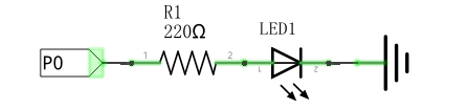
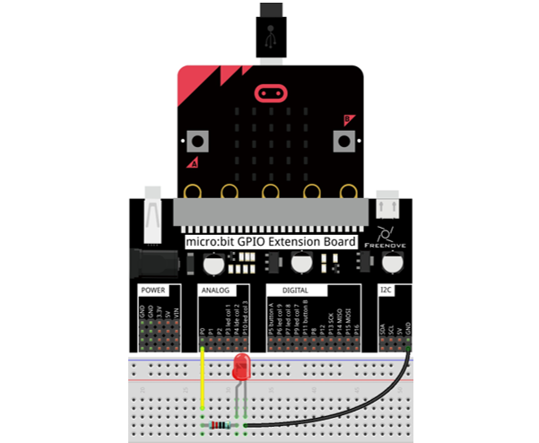

Block code 
============================

Open MakeCode first. Import the .hex file. The path is as below:

( :ref:`How to import project <import_project>` )

+-----------+----------------------------------+-----------+
| File type | Path                             | File name |
+-----------+----------------------------------+-----------+
| HEX file  | ../Projects/BlockCode/03.1_Blink | Blink.hex |
+-----------+----------------------------------+-----------+

After import successfully, the code is shown as below:

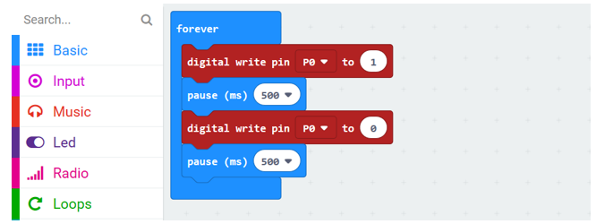

Download the code into the micro:bit and the LED on the breadboard will begin to blink.

In the code, write 1 to the P0 port to turn ON the LED. After waiting for 500ms, write 0 to the P0 port to turn OFF the LED. After waiting for 500ms, the LED will be turned ON again. Repeat the loop, then LED will start blinking.

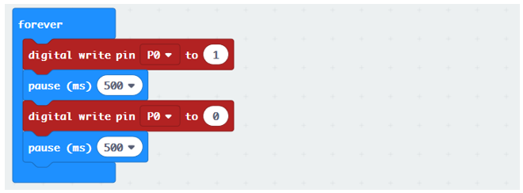

Reference
----------------------------

.. list-table:: 
   :width: 100%
   :align: center

   * -  Block
     -  Function 
   
   * -  |Chapter03_19|
     -  Pause the program for the number of milliseconds you set. 
        
        You can use this function to slow your program down.

   * -  |Chapter03_20|
     -  Write a digital (0 or 1) signal to a pin on the micro:bit board.

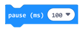

Python code
==========================

Open the .py file with Mu. Code, the path is as below:

+-------------+-----------------------------------+-----------+
| File type   | Path                              | File name |
+-------------+-----------------------------------+-----------+
| Python file | ../Projects/PythonCode/03.1_Blink | Blink.py  |
+-------------+-----------------------------------+-----------+

After loading successfully, the code is shown as below:

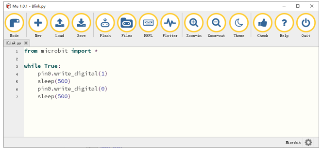

Download the code into micro:bit and the LED on the breadboard will start to blink.

( :ref:`How to download? <download>` )

The following is the program code:

.. literalinclude:: ../../../freenove_Kit/Projects/PythonCode/03.1_Blink/Blink.py
    :linenos: 
    :language: python
    :lines: 1-7
    :dedent:

In the code, write 1 to the P0 port to turn ON the LED. After waiting for 500ms, write 0 to the P0 port to turn OFF the LED. After waiting for 500ms, the LED will be turned ON again. Repeat the loop, then LED will start blinking. 

Write a high level to pin P0.

.. literalinclude:: ../../../freenove_Kit/Projects/PythonCode/03.1_Blink/Blink.py
    :linenos: 
    :language: python
    :lines: 4-4
    :dedent:

Delay 500ms

.. literalinclude:: ../../../freenove_Kit/Projects/PythonCode/03.1_Blink/Blink.py
    :linenos: 
    :language: python
    :lines: 5-5
    :dedent:

Then write low level, and then delay 500ms. Repeat actions above.

Reference
------------------------

.. py:function:: pin.write_digital(value)

Set the pin to high if value is 1, or to low, if it is 0.

For more information, please refer to:https://microbit-micropython.readthedocs.io/en/latest/pin.html