##############################################################################
Chapter Button and LED
##############################################################################

Usually, there are three essential parts in a complete automatic control device: INPUT, OUTPUT, and CONTROL. In last section, the LED module was the output part and micro:bit was the control part. In practical applications, we not only make the LEDs flash, but also make a device sense the surrounding environment, receive instructions and then take the appropriate action such as turn on LEDs, make a buzzer beep and so on.

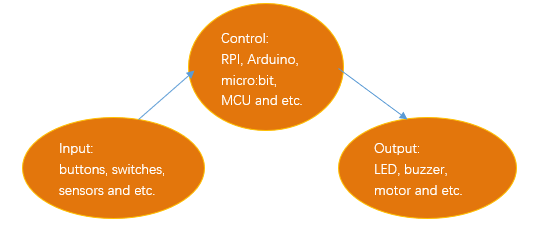

Next, we will build a simple control system to control an LED through a push button switch.

Project Control LED by Button
*****************************************

In the project, we will control the LED state through a Push Button Switch. When the button is pressed, our LED will turn ON, and when it is released, the LED will turn OFF. This describes a Momentary Switch.

Component List
===========================

+----------------+-----------------------------------------+
| Microbit x1    | Expansion board x1                      |
|                |                                         |
| |Chapter03_00| | |Chapter03_01|                          |
+----------------+-----------------------------------------+
| Breakboard x1  | USB cable x1                            |
|                |                                         |
| |Chapter03_02| | |Chapter03_03|                          |
+----------------+------------------------+----------------+
| FM x4  MM x1   | Push Button Switch x1  | LED x1         |
|                |                        |                |
| |Chapter04_01| | |Chapter04_03|         | |Chapter04_02| |
+----------------+-----------+------------+----------------+
| Resistor 220Ω x1           | Resistor 1kΩ x2             |
|                            |                             |
| |Chapter04_04|             | |Chapter04_05|              |
+----------------------------+-----------------------------+

.. |Chapter03_00| image:: ../_static/imgs/3_LED/Chapter03_00.png
.. |Chapter03_01| image:: ../_static/imgs/3_LED/Chapter03_01.png
.. |Chapter03_02| image:: ../_static/imgs/3_LED/Chapter03_02.png
.. |Chapter03_03| image:: ../_static/imgs/3_LED/Chapter03_03.png
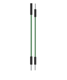
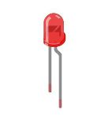
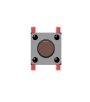

.. |Chapter04_05| image:: ../_static/imgs/4_Button_and_LED/Chapter04_05.png

Circuit knowledge
==============================

Connection of Push Button Switch
------------------------------------------

We connect a push button switch directly to the circuit to turn ON or OFF the LED. In digital circuits, we need to use the push button switch as an input signal. The recommended connection is as follows:

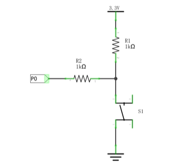

In the above circuit diagram, when the button is not pressed, 3.3V (high level) will be detected by I/O port;
and when the button is pressed, it will be 0V (low level). Resistor R2 here is used to prevent the port from being set to output high level by accident. Without R2, the port maybe connected directly to the cathode and cause a short circuit when the button is pressed.

The following diagram shows another connection, in which the level detected by I/O port is opposite to above diagram, when the button is pressed or not.

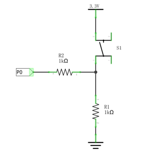

Circuit
===========================

The P0 pin detects the button and the P1 pin controls the LED.

.. list-table:: 
   :width: 100%
   :align: center

   * -  Schematic diagram
   * -  |Chapter04_08|
   * -  Hardware connection
   * -  |Chapter04_09|

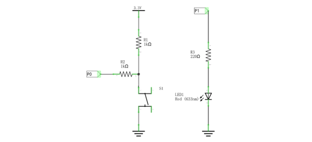
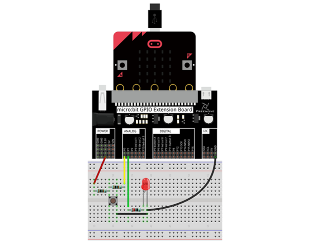

Block code 
=============================

Open MakeCode first. Import the .hex file. The path is as below:

( :ref:`How to import project <import_project>` )

+-----------+-----------------------------------------+------------------+
| File type | Path                                    | File name        |
+-----------+-----------------------------------------+------------------+
| HEX file  | ../Projects/BlockCode/04.1_ButtonAndLED | ButtonAndLED.hex |
+-----------+-----------------------------------------+------------------+

After import successfully, the code is shown as below:

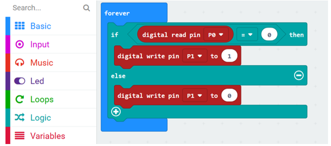

Download the code into micro:bit. When the button is pressed, the LED will be turned on. When the button is released, the LED will be turned off.

In the program, read the level of the P0 pin to determine if the button is pressed.

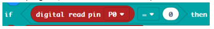

If P0 pin is low level, it indicates that the button is pressed, and make P1 pin output 1, then LED will be turned ON.

Otherwise, P1 pin outputs 0, and the LED will be turned OFF.

Reference
--------------------------

.. list-table:: 
   :width: 100%
   :align: center

   * -  Block
   * -  Function 
   
   * -  |Chapter04_14|
   * -  Read a digital (0 or 1) signal from a pin on the micro:bit board.

Python code
==========================

Open the .py file with Mu. Code, the path is as below:

+-------------+------------------------------------------+-----------------+
| File type   | Path                                     | File name       |
+-------------+------------------------------------------+-----------------+
| Python file | ../Projects/PythonCode/04.1_ButtonAndLED | ButtonAndLED.py |
+-------------+------------------------------------------+-----------------+

After loading successfully, the code is shown as below:

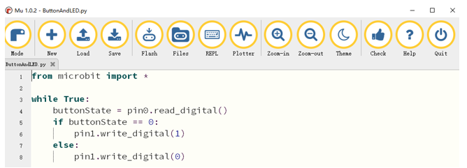

Download the code into micro:bit. When the button is pressed, the led will be turned ON. When the button is released, the led will be turned OFF.

( :ref:`How to download? <download>` )

The following is the program code:

.. literalinclude:: ../../../freenove_Kit/Projects/PythonCode/04.1_ButtonAndLED/ButtonAndLED.py
    :linenos: 
    :language: python
    :lines: 1-8
    :dedent:

In the program, read the level of the P0 pin, save the read level value in the variable buttonState, and then determine whether the button is pressed.

.. literalinclude:: ../../../freenove_Kit/Projects/PythonCode/04.1_ButtonAndLED/ButtonAndLED.py
    :linenos: 
    :language: python
    :lines: 4-4
    :dedent:

If the read P0 pin is low, it indicates that the button is pressed, and then make P1 pin output 1, so LED will be turned ON. Otherwise, the P1 pin outputs 0, and the LED will be turned OFF.

.. literalinclude:: ../../../freenove_Kit/Projects/PythonCode/04.1_ButtonAndLED/ButtonAndLED.py
    :linenos: 
    :language: python
    :lines: 5-8
    :dedent:

Reference
----------------------------

.. py:function:: pin.read_digital()	

    Return 1 if the pin is high level, and 0 if it's low.

    For more information, please refer to:https://microbit-micropython.readthedocs.io/en/latest/pin.html

Project Table Lamp
************************************

In this project, we will make a table lamp. The components and circuits used are exactly the same as the previous one, but this will function differently: Press the button, the LED will turn ON, and pressing the button again, the LED turns OFF. The ON switch action is no longer momentary (like a door bell) but remains ON without needing to continually press on the Button Switch.

Component list
==========================

It is same as the previous project.

Circuit knowledge
===========================

Debounce for Push Button
----------------------------

When a Momentary Push Button Switch is pressed, it will not change from one state to another state immediately. Due to tiny mechanical vibrations, there will be a short period of continuous buffeting before it stabilizes in a new state too fast for Humans to detect but not for computer microcontrollers. The same is true when the push button switch is released. This unwanted phenomenon is known as "bounce".

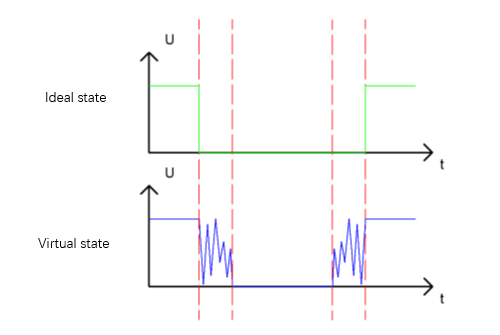

Therefore, if we can directly detect the state of the Push Button Switch, there are multiple pressing and releasing actions in one pressing cycle. This buffeting will mislead the high-speed operation of the microcontroller to cause many false decisions. Therefore, we need to eliminate the impact of buffeting. Our solution: to judge the state of the button multiple times. Only when the button state is stable (consistent) over a period of time, can it indicate that the button is actually in the ON state (being pressed).

This project needs the same components and circuits as we used in the previous section.

Circuit
============================

It is same as the previous section.

Block code

Open MakeCode first. Import the .hex file. The path is as below:

( :ref:`How to import project <import_project>` )

+-----------+--------------------------------------+---------------+
| File type | Path                                 | File name     |
+-----------+--------------------------------------+---------------+
| HEX file  | ../Projects/BlockCode/04.2_TableLamp | TableLamp.hex |
+-----------+--------------------------------------+---------------+

After importing successfully, the code is shown as below:

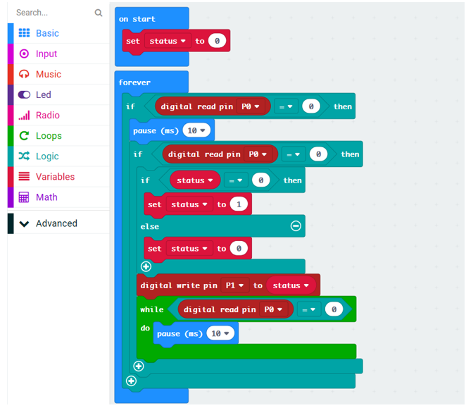

Download the code to micro:bit, press the button once, the LED turns ON, press the button again, the LED turns OFF.

In the program, when it is detected for the first time that the button is pressed, wait for 10ms to detect whether the button is pressed again, to skip the bounce when the button is pressed. And if the button is still detected as pressed for the second time, the button is considered to have been pressed and in a steady state. Otherwise, it is considered to be a bounce and the program will stop detecting.

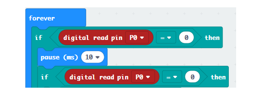

When it is determined that the key is pressed, change the status value. Status is used to save the state of LED.

And then write the new value of status to the P1 port to control the LED.

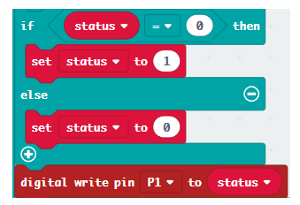

After the above operations done, the program will detect whether the button is released. And similarly, it will first eliminate the bounce of the button.

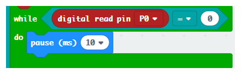

Reference
-------------------------

.. list-table::
   :width: 100%
   :align: center

   * -  Block
   * -  Function 
   
   * -  |Chapter04_21|
   * -  Use an equal sign to make a variable store the number or string you set.

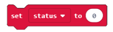

Python code
======================

Open the .py file with Mu. Code, the path is as below:

+-------------+---------------------------------------+--------------+
| File type   | Path                                  | File name    |
+-------------+---------------------------------------+--------------+
| Python file | ../Projects/PythonCode/04.2_TableLamp | TableLamp.py |
+-------------+---------------------------------------+--------------+

After loading successfully, the code is shown as below:

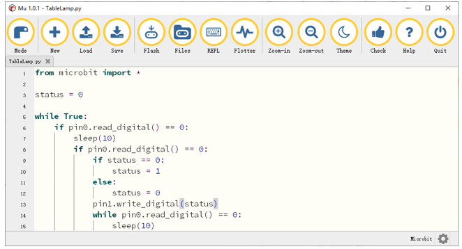

Download the code to micro:bit, press the button once, the LED turns ON; press the button again, the LED turns OFF.

The following is the program code:

.. literalinclude:: ../../../freenove_Kit/Projects/PythonCode/04.2_TableLamp/TableLamp.py
    :linenos: 
    :language: python
    :lines: 1-15
    :dedent:

In the program, when it is detected for the first time that the button is pressed, wait for 10ms to detect whether the button is pressed again, to eliminate the impact of bounce when the button is pressed. And if the button is still pressed for the second time, the button is considered to have been pressed and in a steady state. Otherwise, it is considered to be a bounce and exit this judgment.

.. literalinclude:: ../../../freenove_Kit/Projects/PythonCode/04.2_TableLamp/TableLamp.py
    :linenos: 
    :language: python
    :lines: 6-8
    :dedent:

When it is determined that the key is pressed, change the status value. Status is used to save the state of LED.

And then write the new value of status to the P1 port to control the LED.

.. literalinclude:: ../../../freenove_Kit/Projects/PythonCode/04.2_TableLamp/TableLamp.py
    :linenos: 
    :language: python
    :lines: 9-13
    :dedent:

After the above operations done, the program will detect whether the button is released. And similarly, it will first eliminate the bounce of the button.

.. literalinclude:: ../../../freenove_Kit/Projects/PythonCode/04.2_TableLamp/TableLamp.py
    :linenos: 
    :language: python
    :lines: 14-15
    :dedent: