##############################################################################
Chapter LED Bar Graph
##############################################################################

We have learned how to control LED blink. Next step, we will learn a new component LED bar graph.

Project Flowing Light
**********************************

In this project, we use LED Bar Graph to make a flowing water light.

Component List
===========================

+-------------------+-------------------------------------------+
| Microbit x1       | Expansion board x1                        |
|                   |                                           |
| |Chapter03_00|    | |Chapter03_01|                            |
+-------------------+-------------------------------------------+
| Breakboard x1     | USB cable x1                              |
|                   |                                           |
| |Chapter03_02|    | |Chapter03_03|                            |
+-------------------+--------------------+----------------------+
| LED bar graph x1  | Jumper F/M x11     | Resistor 220Ω x10    |
|                   |                    |                      |
| |Chapter05_00|    | |Chapter05_02|     | |Chapter05_01|       |
+-------------------+--------------------+----------------------+

.. |Chapter03_00| image:: ../_static/imgs/3_LED/Chapter03_00.png
.. |Chapter03_01| image:: ../_static/imgs/3_LED/Chapter03_01.png
.. |Chapter03_02| image:: ../_static/imgs/3_LED/Chapter03_02.png
.. |Chapter03_03| image:: ../_static/imgs/3_LED/Chapter03_03.png
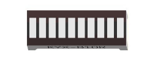
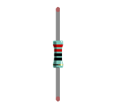
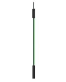

Component knowledge
=============================

Let us learn about the basic features of components to use and understand them better.

LED Bar Graph
--------------------------------

A Bar Graph LED has 10 LEDs integrated into one compact component. The two rows of pins at its bottom are paired to identify each LED like the single LED used earlier. 

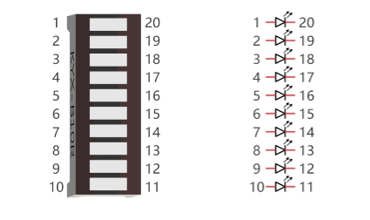

Circuit
=========================

The P0 pin detects the button and the P1 pin controls the LED.

.. list-table:: 
   :width: 100%
   :align: center

   * -  Schematic diagram
   * -  |Chapter05_04|
   * -  Hardware connection
        
        :red:`If your project doesn't work, please rotate LED bar 180°.`

   * -  |Chapter05_05|

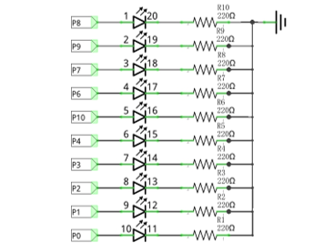
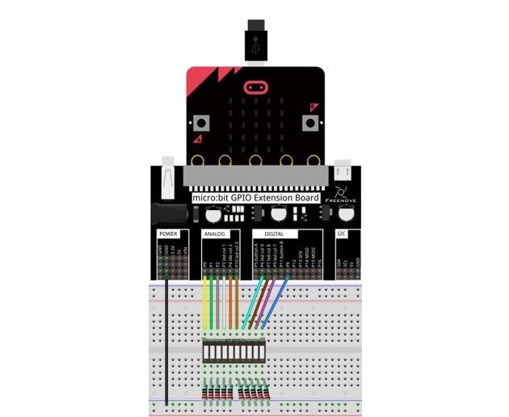

Block code 
========================

Open MakeCode first. Import the .hex file. The path is as below:

( :ref:`How to import project <import_project>` )

+-----------+-------------------------------------------+--------------------+
| File type | Path                                      | File name          |
+-----------+-------------------------------------------+--------------------+
| HEX file  | ../Projects/BlockCode/05.1_FlowingLight01 | FlowingLight01.hex |
+-----------+-------------------------------------------+--------------------+

After importing successfully, the code is shown as below:

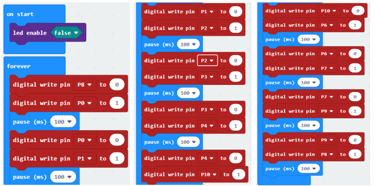

Check the connection of the circuit, verify that the circuit is connected correctly, download the code into micro:bit, after the program is executed, you will see the LED turns ON from left to right, which repeats This process is repeated to achieve the "movements" of flowing water. 

:red:`In the code, we need turn OFF the LED screen (which allows the GPIO pin associated with the LED screen to be reused for other purposes).`

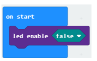

Set one pin to high and the rest of 9 pins to low level at a time; Until all the 10 pins are set to high and low level in turn.

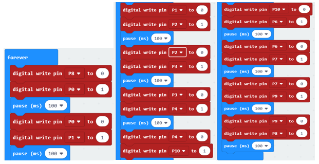

Reference
---------------------------

.. list-table:: 
   :width: 100%
   :align: center

   * -  Block
     -  Function 
   
   * -  |Chapter05_09|
     -  Turns the LED screen on and off 
        
        (thus allowing you to re-use the GPIO pins associated with the display
        
        for other purposes).

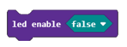

Python code
===========================

Open the .py file with Mu. Code, the path is as below:

+-------------+--------------------------------------------+-------------------+
| File type   | Path                                       | File name         |
+-------------+--------------------------------------------+-------------------+
| Python file | ../Projects/PythonCode/05.1_FlowingLight01 | FlowingLight01.py |
+-------------+--------------------------------------------+-------------------+

After loading successfully, the code is shown as below:

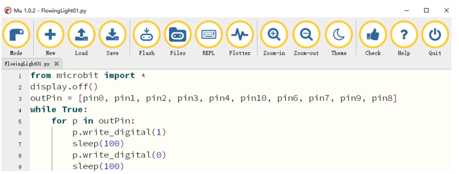

Check the connection of the circuit, verify that the circuit is connected correctly, download the code into micro:bit, after the program is executed, you will see the LED turns ON from left to right, which repeats to achieve the "movements" of flowing water.

The following is the program code:

.. literalinclude:: ../../../freenove_Kit/Projects/PythonCode/05.1_FlowingLight01/FlowingLight01.py
    :linenos: 
    :language: python
    :lines: 1-9
    :dedent:

In the code, we need to turn OFF the LED screen (which allows the GPIO pin associated with the LED screen to be reused for other purposes).

.. literalinclude:: ../../../freenove_Kit/Projects/PythonCode/05.1_FlowingLight01/FlowingLight01.py
    :linenos: 
    :language: python
    :lines: 2-2
    :dedent:

Define an array to save the pin variable.

.. literalinclude:: ../../../freenove_Kit/Projects/PythonCode/05.1_FlowingLight01/FlowingLight01.py
    :linenos: 
    :language: python
    :lines: 3-3
    :dedent:

Change the level of the currently selected pin every 100ms to implement the effect of flowing water light.

.. literalinclude:: ../../../freenove_Kit/Projects/PythonCode/05.1_FlowingLight01/FlowingLight01.py
    :linenos: 
    :language: python
    :lines: 5-9
    :dedent:

Reference
---------------------

.. py:function:: display.off()	

    Use off() to turn OFF the display (thus allowing you to re-use the GPIO pins associated with the display for other purposes)