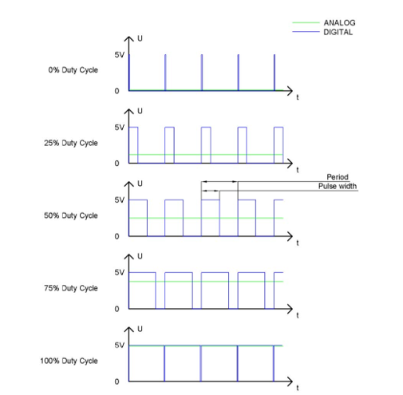
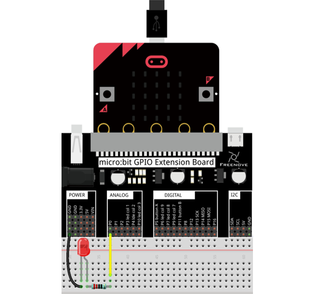
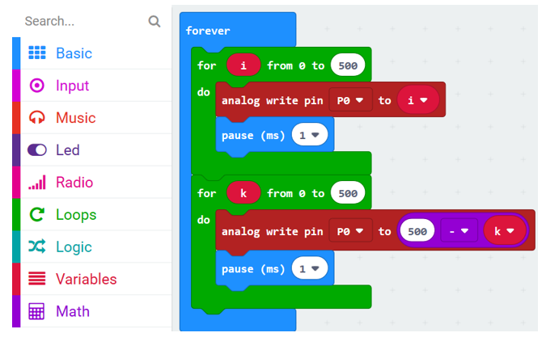
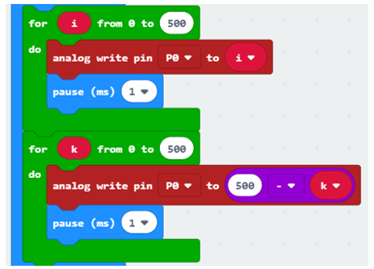
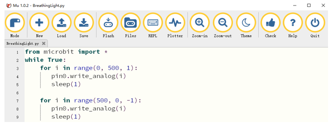

##############################################################################
Chapter PWM
##############################################################################

In this chapter, we will learn how to make a breathing LED.

Project Breathing Light
***************************************

Component list
=============================

+----------------+-------------------------------------+
| Microbit x1    | Expansion board x1                  |
|                |                                     |
| |Chapter03_00| | |Chapter03_01|                      |
+----------------+-------------------------------------+
| Breakboard x1  | USB cable x1                        |
|                |                                     |
| |Chapter03_02| | |Chapter03_03|                      |
+----------------+--------------------+----------------+
| Jumper F/M x2  | Resistor 220Ω x1   | LED x1         |
|                |                    |                |
| |Chapter03_04| | |Chapter03_05|     | |Chapter03_06| |
+----------------+--------------------+----------------+

.. |Chapter03_00| image:: ../_static/imgs/3_LED/Chapter03_00.png
.. |Chapter03_01| image:: ../_static/imgs/3_LED/Chapter03_01.png
.. |Chapter03_02| image:: ../_static/imgs/3_LED/Chapter03_02.png
.. |Chapter03_03| image:: ../_static/imgs/3_LED/Chapter03_03.png
.. |Chapter03_04| image:: ../_static/imgs/3_LED/Chapter03_04.png
.. |Chapter03_05| image:: ../_static/imgs/3_LED/Chapter03_05.png
.. |Chapter03_06| image:: ../_static/imgs/3_LED/Chapter03_06.png

Circuit knowledge
========================

At first, let us learn the knowledge how to use the circuit to make LED emit different brightness of light,

PWM
-------------------

PWM, Pulse-Width Modulation, is a very effective method for using digital signals to control analog circuits. Digital processors cannot directly output analog signals. PWM technology makes it very convenient to achieve this conversion (translation of digital to analog signals).

PWM technology uses digital pins to send certain frequencies of square waves, that is, the output of high levels and low levels, which alternately last for a while. The total time for each set of high levels and low levels is generally fixed, which is called the period (Note: the reciprocal of the period is frequency). The time of high level outputs are generally called "pulse width", and the duty cycle is the percentage of the ratio of pulse duration, or pulse width (PW) to the total period (T) of the waveform. 

The longer the output of high levels last, the longer the duty cycle and the higher the corresponding voltage in the analog signal will be. The following figures show how the analog signal voltages vary between 0V-5V (high level is 5V) corresponding to the pulse width 0%-100%:

The longer the PWM duty cycle is, the higher the output power will be. Now that we understand this relationship, we can use PWM to control the brightness of an LED or the speed of DC motor and so on.

Circuit
=========================

The P0 pin detects the button and the P1 pin controls the LED.

.. list-table:: 
   :width: 100%
   :align: center

   * -  Schematic diagram
   * -  |Chapter06_01|
   * -  Hardware connection
        
        :red:`The pin for the circuit is P0. The long pin (positive) of LED is connected to the resistor,`
        
        :red:`and the short pin (negative) to ground.`

   * -  |Chapter06_02|

Block code 
============================

Open MakeCode first. Import the .hex file. The path is as below:

( :ref:`How to import project <import_project>` )

+-----------+-------------------------------------------+--------------------+
| File type | Path                                      | File name          |
+-----------+-------------------------------------------+--------------------+
| HEX file  | ../Projects/BlockCode/06.1_BreathingLight | BreathingLight.hex |
+-----------+-------------------------------------------+--------------------+

After import successfully, the code is shown as below:

Check the connection of the circuit, confirm that the circuit is connected correctly, download the code into micro:bit. The LED will becomes brighter gradually, and then dimmer and dimmer. This process will be repeated to achieve the effect of breathing.

P0 outputs PWM signal, from 0 to 500, then from 500 to 0.

Reference
--------------------------

.. list-table:: 
   :width: 100%
   :align: center

   * -  Block
     -  Function 
   
   * -  |Chapter06_05|
     -  Write an analog signal (0 through 1023) to the pin you set.

Python code
=========================

Open the .py file with Mu. Code, the path is as below:

+-------------+--------------------------------------------+-------------------+
| File type   | Path                                       | File name         |
+-------------+--------------------------------------------+-------------------+
| Python file | ../Projects/PythonCode/06.1_BreathingLight | BreathingLight.py |
+-------------+--------------------------------------------+-------------------+

After loading successfully, the code is shown as below:

Check the connection of the circuit, verify it correct and download the code into micro:bit, the LED will becomes brighter gradually, and then dimmer and dimmer. This process will be repeated to achieve the effect of breathing. ( :ref:`How to download? <download>` )

The following is the program code:

.. literalinclude:: ../../../freenove_Kit/Projects/PythonCode/06.1_BreathingLight/BreathingLight.py
    :linenos: 
    :language: python
    :lines: 1-8
    :dedent:

P0 outputs PWM signal, from 0 to 500

.. literalinclude:: ../../../freenove_Kit/Projects/PythonCode/06.1_BreathingLight/BreathingLight.py
    :linenos: 
    :language: python
    :lines: 3-5
    :dedent:

Then from 500 to 0.

.. literalinclude:: ../../../freenove_Kit/Projects/PythonCode/06.1_BreathingLight/BreathingLight.py
    :linenos: 
    :language: python
    :lines: 6-8
    :dedent:

Reference
----------------------------------

.. py:function:: pin.write_analog(value)
    
    Output a PWM signal on the pin, with the duty cycle proportional to the provided value. The value may be either an integer or a floating point number between 0 (0% duty cycle) and 1023 (100% duty)..
    
    For more information, please refer to:
    
    https://microbit-micropython.readthedocs.io/en/latest/pin.html