##############################################################################
Chapter RGBLED
##############################################################################

In this chapter, we will learn a new component, RGBLED.

Project Breathing Light
***************************************

Component list
=============================

+----------------+-------------------------------------+
| Microbit x1    | Expansion board x1                  |
|                |                                     |
| |Chapter03_00| | |Chapter03_01|                      |
+----------------+-------------------------------------+
| Breakboard x1  | USB cable x1                        |
|                |                                     |
| |Chapter03_02| | |Chapter03_03|                      |
+----------------+--------------------+----------------+
| RGB_LED x1     | Resistor 220Ω x3   | Jumper F/M x4  |
|                |                    |                |
| |Chapter07_00| | |Chapter03_05|     | |Chapter03_04| |
+----------------+--------------------+----------------+

.. |Chapter03_00| image:: ../_static/imgs/3_LED/Chapter03_00.png
.. |Chapter03_01| image:: ../_static/imgs/3_LED/Chapter03_01.png
.. |Chapter03_02| image:: ../_static/imgs/3_LED/Chapter03_02.png
.. |Chapter03_03| image:: ../_static/imgs/3_LED/Chapter03_03.png
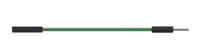
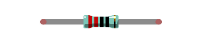

Component knowledge
=============================

RGB LED
-----------------------------

A RGB LED has 3 LEDs integrated into one LED component. It can respectively emit Red, Green and Blue light. In order to do this, it requires 4 pins (this is also how you identify it). The long pin (1) is the common which is the Anode (+) or positive lead, the other 3 are the Cathodes (-) or negative leads. A rendering of a RGB LED and its electronic symbol are shown below. We can make RGB LED emit various colors of light and brightness by controlling the 3 Anodes (2, 3 & 4) of the RGB LED

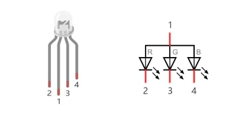

Red, Green, and Blue light are called 3 Primary Colors when discussing light (Note: for pigments such as paints, the 3 Primary Colors are Red, Blue and Yellow). When you combine these three Primary Colors of light with varied brightness, they can produce almost any color of visible light. Computer screens, single pixels of cell phone screens, neon lamps, etc. can all produce millions of colors due to phenomenon

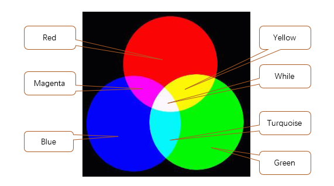

If we use a three 8 bit PWM to control the RGB LED, in theory, we can create 28*28*28=16777216 (16 million) colors through different combinations of RGB light brightness.

Circuit
============================

This circuit uses pins P2, P1, and P0 to connect the negative electrodes of the RGBLED.

.. list-table:: 
   :width: 100%
   :align: center

   * -  Schematic diagram
   * -  |Chapter07_03|
   * -  Hardware connection
        
        :red:`The pin for the circuit is P0. The long pin (positive) of LED is connected to the resistor,`
        
        :red:`and the short pin (negative) to ground.`

   * -  |Chapter07_04|

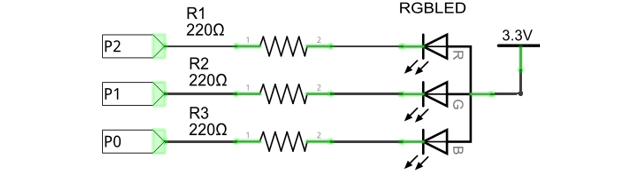
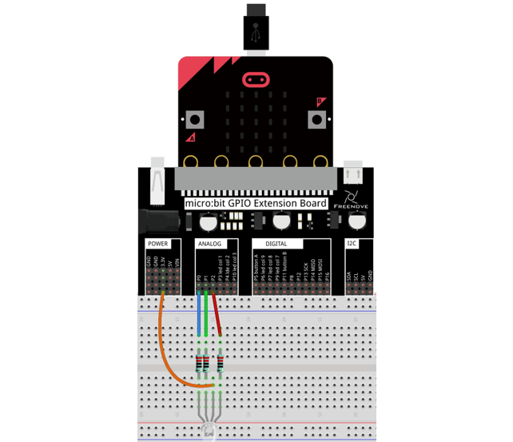

Block code
===========================

Open MakeCode first. Import the .hex file. The path is as below: (how to import project)

+-----------+-----------------------------------+------------+
| File type | Path                              | File name  |
+-----------+-----------------------------------+------------+
| HEX file  | ../Projects/BlockCode/07.1_RGBLED | RGBLED.hex |
+-----------+-----------------------------------+------------+

After importing successfully, the code is shown as below:

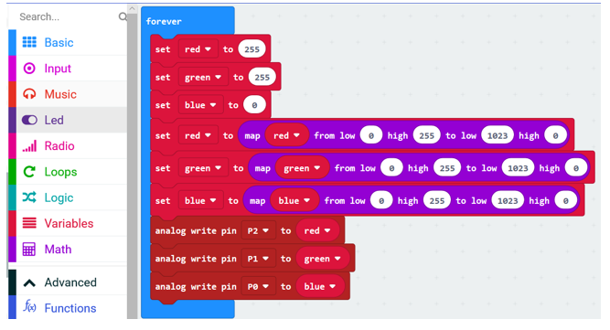

Check the connection of the circuit, confirm that the circuit is connected correctly, download the code into micro:bit, and RGBLED will emit yellow color. RGB value of yellow is (255,255,0).

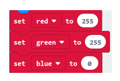

In this kit, three LEDs of RGB LED share a common anode(+) and their negative pins need to be set to LOW level to have the RGB LED work. And the value of variables 'red', 'green', and 'blue' need to be converted from the value ranging from 0-255 to analog signal values ranging from1023-0.

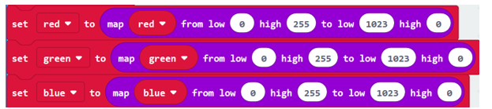

Write the 'red','green','blue' to corresponding pins P2, P1, P0.

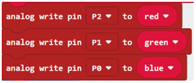

Reference
------------------------

.. list-table:: 
   :width: 100%
   :align: center

   * -  Block
     -  Function 
   
   * -  |Chapter07_09|
     -  Convert a value in one number range to a value in another number range.

Python code
------------------------

Open the .py file with Mu. Code, the path is as below:

+-------------+------------------------------------+-----------+
| File type   | Path                               | File name |
+-------------+------------------------------------+-----------+
| Python file | ../Projects/PythonCode/07.1_RGBLED | RGBLED.py |
+-------------+------------------------------------+-----------+

After loading successfully, the code is shown as below:

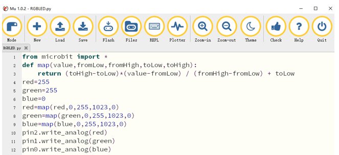

Check the connection of the circuit, confirm that the circuit is connected correctly, download the code into micro:bit, and RGBLED will emit yellow color. ( :ref:`How to download? <download>` )

The following is the program code:

.. literalinclude:: ../../../freenove_Kit/Projects/PythonCode/07.1_RGBLED/RGBLED.py
    :linenos: 
    :language: python
    :lines: 1-12
    :dedent:

A custom map() function is used to convert a value in one range to another range.

.. literalinclude:: ../../../freenove_Kit/Projects/PythonCode/07.1_RGBLED/RGBLED.py
    :linenos: 
    :language: python
    :lines: 2-3
    :dedent:

RGB value of yellow is (255,255,0).

.. literalinclude:: ../../../freenove_Kit/Projects/PythonCode/07.1_RGBLED/RGBLED.py
    :linenos: 
    :language: python
    :lines: 4-6
    :dedent:

In this kit, three LEDs of RGB LED share a common anode(+) and their negative pins need to be set to LOW level to have the RGB LED work. And the value of variables 'red', 'green', and 'blue' need to be converted from the value ranging from 0-255 to analog signal values ranging from1023-0.

.. literalinclude:: ../../../freenove_Kit/Projects/PythonCode/07.1_RGBLED/RGBLED.py
    :linenos: 
    :language: python
    :lines: 7-9
    :dedent:

Write the 'red', 'green', 'blue' to corresponding pins P2, P1, P0.

.. literalinclude:: ../../../freenove_Kit/Projects/PythonCode/07.1_RGBLED/RGBLED.py
    :linenos: 
    :language: python
    :lines: 10-12
    :dedent:

Reference
-------------------------

.. py:function:: map(value,fromLow,fromHigh,toLow,toHigh)	

    A custom function that converts a value in a range of numbers to a value in another range of numbers. For example, map(8,0,10,0,100) returns a value of 80; map(8,0,10,100,0)=20.

    map(8,0,10,0,100)=80.

Project 7.2 Multicolored Light
***************************************

In this project, we will use an RGB LED to emit different colors.

Component list
===============================

It is same with the previous project.

HSL color
================================

The HSL color mode is another color standard in the industry. It obtains a variety of colors by changing the three color channels of hue (H), saturation (S), and lightness (L) and superimposing them with each other. This color mode covers almost all colors that human vision can perceive. It is one of the most widely used color systems to date.

As shown in the hue circle below, the 0 degree of the hue is R (red) color, 120 degrees is G (green) color, and 240 degrees is B (blue) color. Each angle represents a color. The default saturation (S) takes the maximum value 100, the brightness (L) takes 50. If the hue angle is changed, the color will be changed. And the HSL color system can be converted to the RGB color system, to change the color of the LED.

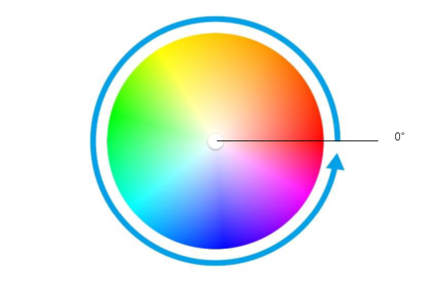

Circuit
=========================

It is same with last project.

Block code
=========================

Open MakeCode first. Import the .hex file. The path is as below:

( :ref:`How to import project <import_project>` )

+-----------+------------------------------------------+-------------------+
| File type | Path                                     | File name         |
+-----------+------------------------------------------+-------------------+
| HEX file  | ../Projects/BlockCode/07.2_ColorfulLight | ColorfulLight.hex |
+-----------+------------------------------------------+-------------------+

After importing successfully, the code is shown as below:

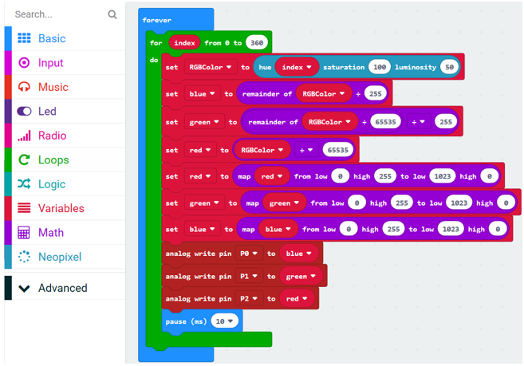

Check the connection of the circuit, confirm that the circuit is connected correctly, download the code into the microbit, and RGBLED will emit different colors.

From the knowledge of HSL color, we can know that different hue angles correspond different colors. The variable index represents hue angle, ranging from 0 to 360.

This block is to convert the HSL color system to the RGB color system, return the RGB value corresponding to the current hue angle, and store the value in the variable RGBColor. For example: hexadecimal RGB value 0xFF0000 means red, FF is the value of the red channel in RGB, and 00 and 00 are the values of the green and blue channels, respectively.

Assign the value of the lower eight-bit to blue channel, the value of the middle eight-bit to green channel, and the value of the upper eight-bit to red channel.

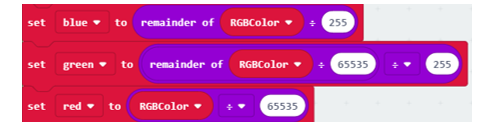

In this kit, three LEDs of RGB LED share a common anode (+) and their negative pins need to be set to LOW level to have the RGB LED work. And the variables 'red', 'green', and 'blue' need to be converted from the value ranging from 0-255 to analog signal values ranging from1023-0.

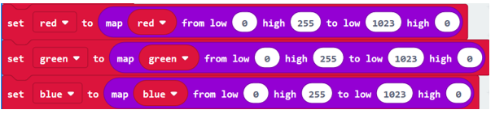

Every 10ms, write the 'red', 'green', 'blue' to corresponding pins P2, P1, P0.

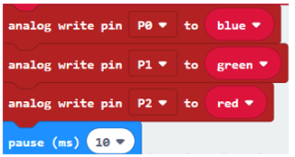

Reference
-------------------------------

.. list-table:: 
   :width: 100%
   :align: center

   * -  Block
     -  Function 
   
   * -  |Chapter07_18|
     -  This is an extra operator for division. You can find out how much is left over 
      
        if one number doesn't divide into the other number evenly.

   * -  |Chapter07_19|
     -  Convert HSL color system to RGB color system, and return the RGB value corresponding 
      
        to the current hue angle. It belongs to Neopixel expansion block.

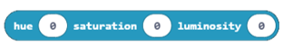

Extensions
---------------------

You can import Neopixel expansion block into new project as below:

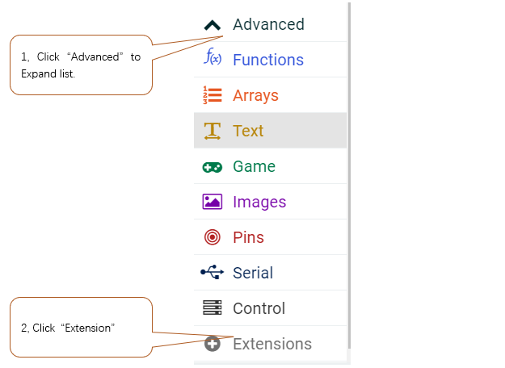

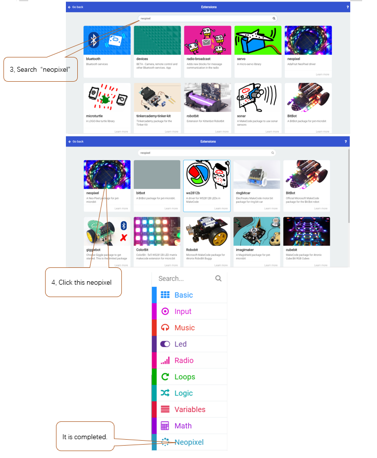

Python code
============================

Open the .py file with Mu. Code, the path is as below:

+-------------+-------------------------------------------+------------------+
| File type   | Path                                      | File name        |
+-------------+-------------------------------------------+------------------+
| Python file | ../Projects/PythonCode/07.2_ColorfulLight | ColorfulLight.py |
+-------------+-------------------------------------------+------------------+

After loading successfully, the code is shown as below:

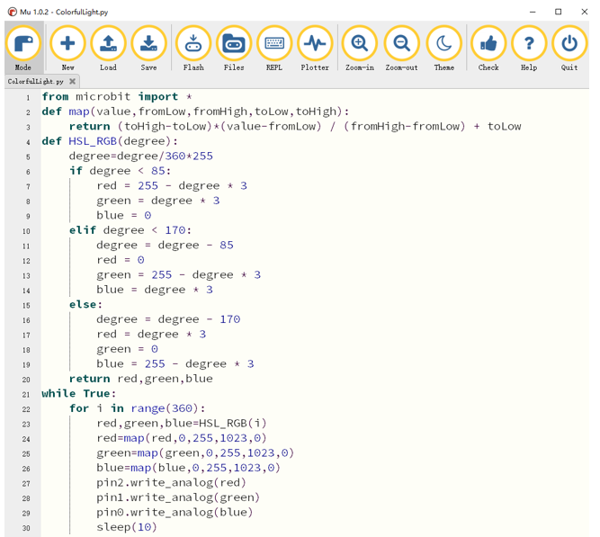

Check the connection of the circuit, confirm that the circuit is connected correctly, download the code into the microbit, and RGBLED will emit different colors. ( :ref:`How to download? <download>` )

The following is the program code:

.. literalinclude:: ../../../freenove_Kit/Projects/PythonCode/07.2_ColorfulLight/ColorfulLight.py
    :linenos: 
    :language: python
    :lines: 1-30
    :dedent:

The map() function is used to convert a value in one range to another range.

.. literalinclude:: ../../../freenove_Kit/Projects/PythonCode/07.2_ColorfulLight/ColorfulLight.py
    :linenos: 
    :language: python
    :lines: 2-3
    :dedent:

The HSL_RGB() function is used to convert the HSL color system to RGB color, and return the RGB value corresponding to the current hue angle.

.. literalinclude:: ../../../freenove_Kit/Projects/PythonCode/07.2_ColorfulLight/ColorfulLight.py
    :linenos: 
    :language: python
    :lines: 4-20
    :dedent:

Repeat 360 times, display the hue angle color corresponding to 0 to 360 degrees, and replace it every 10ms.

.. literalinclude:: ../../../freenove_Kit/Projects/PythonCode/07.2_ColorfulLight/ColorfulLight.py
    :linenos: 
    :language: python
    :lines: 21-30
    :dedent:

Reference
------------------------

.. py:function:: HSL_RGB(degree)	

    Custom function, used to convert HSL color system to RGB color system, return the RGB value corresponding to the current hue angle, for example: HSL_RGB(0), return red RGB value: red=255, green=0, blue=0.