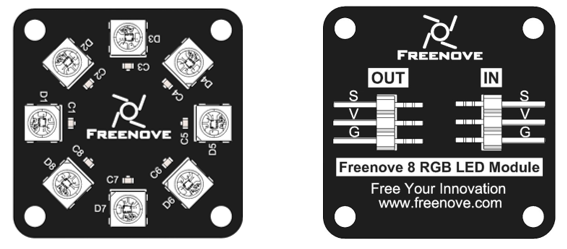
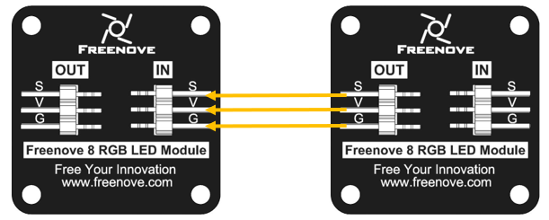
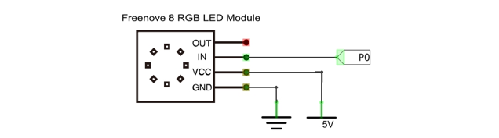
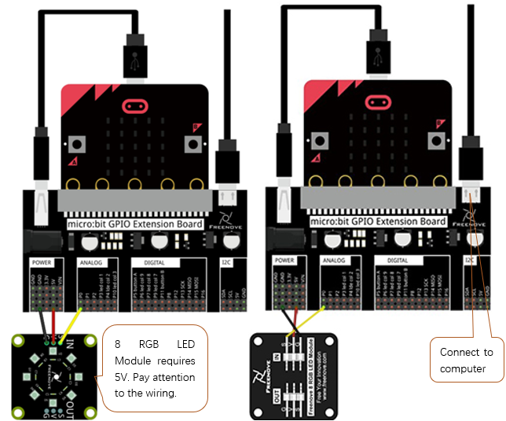
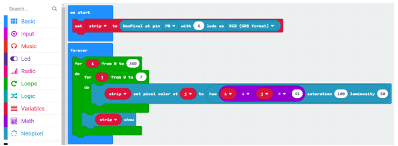
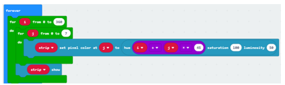
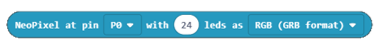
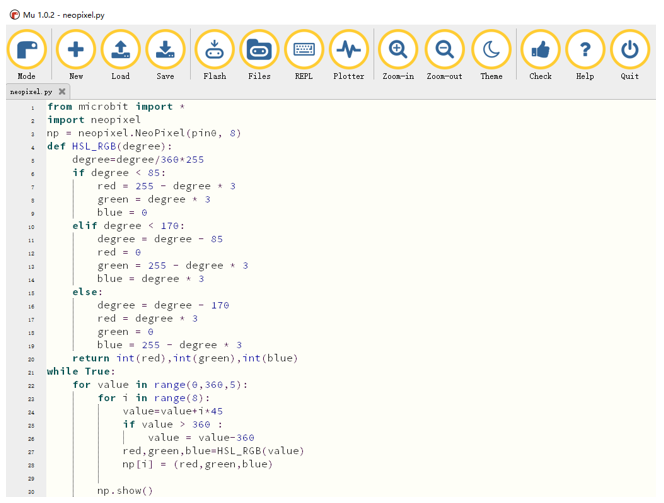

##############################################################################
Chapter Neopixel
##############################################################################

In this chapter, we will learn Freenove 8 RGB LED Module

Project Rainbow Water Light
*******************************************

This project will achieve rainbow water light.

Component list
=============================

+----------------+-------------------------------------+
| Microbit x1    | Expansion board x1                  |
|                |                                     |
| |Chapter03_00| | |Chapter03_01|                      |
+----------------+-------------------------------------+
| Jumper F/F x3  | USB cable x2                        |
|                |                                     |
| |Chapter08_00| | |Chapter03_03|                      |
+----------------+-------------------------------------+
| Freenove 8 RGB LED Module x1                         |
|                                                      |
|  |Chapter08_01|                                      |
+------------------------------------------------------+

.. |Chapter08_00| image:: ../_static/imgs/8_Neopixel/Chapter08_00.png
.. |Chapter08_01| image:: ../_static/imgs/8_Neopixel/Chapter08_01.png
.. |Chapter03_00| image:: ../_static/imgs/3_LED/Chapter03_00.png
.. |Chapter03_01| image:: ../_static/imgs/3_LED/Chapter03_01.png
.. |Chapter03_03| image:: ../_static/imgs/3_LED/Chapter03_03.png

Component knowledge
================================

Freenove 8 RGB LED Module
--------------------------------

The Freenove 8 RGB LED Module is as below. You can use only one data pin to control the eight LEDs on the module. As shown below:

And you can also control many modules at the same time. Just connect OUT pin of one module to IN pin of another module. In such way, you can use one data pin to control 8, 16, 32 … LEDs.

:orange:`Pin description:`

+---------------------------------------+---------------------------------------+
| (IN)                                  |          (OUT)                        |
+--------+------------------------------+--------+------------------------------+
| symbol | Function                     | symbol | Function                     |
+--------+------------------------------+--------+------------------------------+
| S      | Input control signal         | S      | Output control signal        |
+--------+------------------------------+--------+------------------------------+
| V      | Power supply pin, +3.5V~5.5V | V      | Power supply pin, +3.5V~5.5V |
+--------+------------------------------+--------+------------------------------+
| G      | GND                          | G      | GND                          |
+--------+------------------------------+--------+------------------------------+

Circuit
===========================

.. list-table:: 
   :width: 100%
   :align: center

   * -  Schematic diagram
   * -  |Chapter08_04|
   * -  Hardware connection
   * -  |Chapter08_05|

Block code 
============================

Open MakeCode first. Import the .hex file. The path is as below:

( :ref:`How to import project <import_project>` )

+-----------+-------------------------------------+--------------+
| File type | Path                                | File name    |
+-----------+-------------------------------------+--------------+
| HEX file  | ../Projects/BlockCode/08.1_Neopixel | Neopixel.hex |
+-----------+-------------------------------------+--------------+

After import successfully, the code is shown as below:

Check the connection of the circuit and verify it correct, download the code into the micro:bit, and then you can see the rainbow water light.

Set the number of data pins and LEDs at "on start", as well as the type of LED.

In the 0-360 for loop, the hue difference between each two LEDs is 45. When the hue changes, each LED succeeds the hue of the previous LED. And then the program converts the HSL color system to the RGB color system, returns the RGB value corresponding to the current hue angle and write the value to LED to achieve the effect of the rainbow water light.

Reference
------------------------

.. list-table:: 
   :width: 100%
   :align: center

   * -  Block
     -  Function 
   
   * -  |Chapter08_09|
     -  Set the number of data pins and LEDs, as well as the type of LED.

   * -  |Chapter08_10|
     -  Set LED color

   * -  |Chapter08_11|
     -  Turn on LED

Python code
==========================

Open the .py file with Mu. Code, the path is as below:

+-------------+--------------------------------------+-------------+
| File type   | Path                                 | File name   |
+-------------+--------------------------------------+-------------+
| Python file | ../Projects/PythonCode/08.1_Neopixel | Neopixel.py |
+-------------+--------------------------------------+-------------+

After loading successfully, the code is shown as below:

Check the connection of the circuit, confirm that the connection of the circuit is correct, download the code into the micro:bit, and then you can see the rainbow water light. ( :ref:`How to download? <download>` )

The following is the code:

.. literalinclude:: ../../../freenove_Kit/Projects/PythonCode/08.1_Neopixel/Neopixel.py
    :linenos: 
    :language: python
    :lines: 1-29
    :dedent:

Set the number of data pins and LEDs.

.. literalinclude:: ../../../freenove_Kit/Projects/PythonCode/08.1_Neopixel/Neopixel.py
    :linenos: 
    :language: python
    :lines: 3-3
    :dedent:

Custom HSL_RGB() function is used to convert HSL color to RGB color, returning the RGB value corresponding to the current hue angle.

.. literalinclude:: ../../../freenove_Kit/Projects/PythonCode/08.1_Neopixel/Neopixel.py
    :linenos: 
    :language: python
    :lines: 4-20
    :dedent:

In the 0-360 for loop, the hue difference between each two LEDs is 45. When the hue changes, each LED succeeds the hue of the previous LED. And then the program converts the HSL color system to the RGB color system, returns the RGB value corresponding to the current hue angle, and writes the value to LED to achieve the effect of the rainbow water light.

.. literalinclude:: ../../../freenove_Kit/Projects/PythonCode/08.1_Neopixel/Neopixel.py
    :linenos: 
    :language: python
    :lines: 21-29
    :dedent:

Reference
-----------------------------

.. py:function:: neopixel.NeoPixel(pin, n)	

    Initialize a new strip of n number of neopixel LEDs controlled via pin pin.

.. py:function:: show()	

    Show the pixels. Must be called for any updates to become visible.

.. py:function:: np[i]	

    Set pixels by indexing them (like with a Python list).