##############################################################################
Chapter Buzzer 
##############################################################################

In this chapter, we will learn about buzzers and the sounds they make. There are two kinds of buzzer: active buzzer and passive buzzer. 

Component knowledge
******************************************

Transistor
======================

A transistor is required in this project due to the buzzer's current being so great that GPIO of RPi's output capability cannot meet the power requirement necessary for operation. A NPN transistor is needed here to amplify the current. 

Transistors, full name: semiconductor transistor, is a semiconductor device that controls current (think of a transistor as an electronic "amplifying or switching device". Transistors can be used to amplify weak signals, or to work as a switch. Transistors have three electrodes (PINs): base (b), collector (c) and emitter (e). When there is current passing between "be" then "ce" will have a several-fold current increase (transistor magnification), in this configuration the transistor acts as an amplifier. When current produced by "be" exceeds a certain value, "ce" will limit the current output. at this point the transistor is working in its saturation region and acts like a switch. Transistors are available as two types as shown below: PNP and NPN,

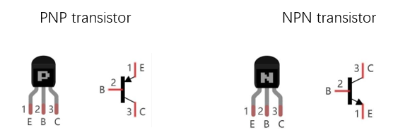

:red:`In our kit, the PNP transistor is marked with 8550, and the NPN transistor is marked with 8050.`

Thanks to the transistor's characteristics, they are often used as switches in digital circuits. As micro-controllers output current capacity is very weak, we will use a transistor to amplify its current in order to drive components requiring higher current.

Buzzer
======================

A buzzer is an audio component. They are widely used in electronic devices such as calculators, electronic alarm clocks, automobile fault indicators, etc. There are both active and passive types of buzzers. Active buzzers have oscillator inside, these will sound as long as power is supplied. Passive buzzers require an external oscillator signal (generally using PWM with different frequencies) to make a sound.

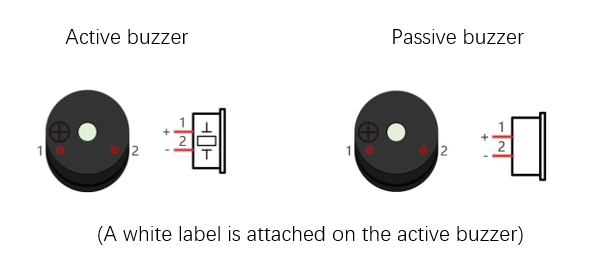

Active buzzers are easier to use. Generally, they only make a specific sound frequency. Passive buzzers require an external circuit to make sounds, but passive buzzers can be controlled to make sounds of various frequencies. The resonant frequency of the passive buzzer in this Kit is 2kHz, which means the passive buzzer is the loudest when its resonant frequency is 2kHz.

Buzzer requires large current when it works. But generally, microcontroller port cannot provide enough current for that. In order to control buzzer through micro:bit, a transistor can be used to drive a buzzer indirectly.

When we use a NPN transistor to drive a buzzer, we often use the following method. If GPIO outputs high level, current will flow through R1 (Resistor 1), the transistor conducts current and the buzzer will make sounds. If GPIO outputs low level, no current will flow through R1, the transistor will not conduct current and buzzer will remain silent (no sounds).

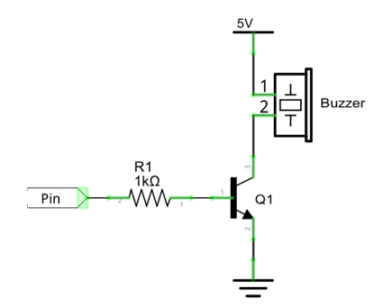

When we use a PNP transistor to drive a buzzer, we often use the following method. If GPIO outputs low level, current will flow through R1. The transistor conducts current and the buzzer will make sounds. If GPIO outputs high level, no current flows through R1, the transistor will not conduct current and buzzer will remain silent (no sounds). Below are the circuit schematics for both a NPN and PNP transistor to power a buzzer.

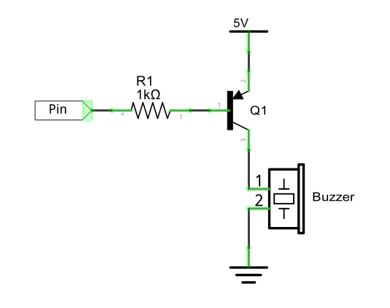

How to identify active and passive buzzer?

1.	As a rule, there is a label on an active buzzer covering the hole where sound is emitted, but there are exceptions to this rule.

2.	Active buzzers are more complex than passive buzzers in their manufacture. There are many circuits and crystal oscillator elements inside active buzzers; all of this is usually protected with a waterproof coating (and a housing) exposing only its pins from the underside. On the other hand, passive buzzers do not have protective coatings on their underside. From the pin holes, view of a passive buzzer, you can see the circuit board, coils, and a permanent magnet (all or any combination of these components depending on the model.

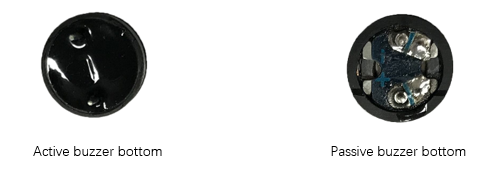

Project Active Buzzer
**************************************

In this project, we will use an active buzzer to play a fixed melody.

Component list
================================

+----------------------------+-----------------------------+
| Microbit x1                | Expansion board x1          |
|                            |                             |
| |Chapter03_00|             | |Chapter03_01|              |
+----------------------------+-----------------------------+
| Breakboard x1              | USB cable x2                |
|                            |                             |
| |Chapter03_02|             | |Chapter03_03|              |
+----------------------------+-----------------------------+
| F/M x 3  M/M x1            | Resistor 1kΩ x1             |
|                            |                             |
| |Chapter09_05|             | |Chapter04_05|              |
+----------------------------+-----------------------------+
| NPN(8050) transistor x1    | Active buzzer x1            |
|                            |                             |
| |Chapter09_06|             | |Chapter09_07|              |
+----------------------------+-----------------------------+

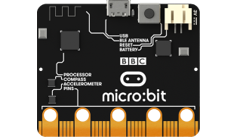
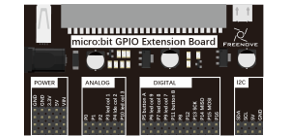
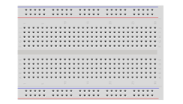

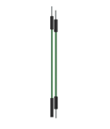
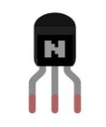
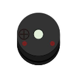

Circuit
================================

.. list-table:: 
   :width: 100%
   :align: center

   * -  Schematic diagram
   * -  |Chapter09_08|
   * -  Hardware connection
   * -  |Chapter09_09|

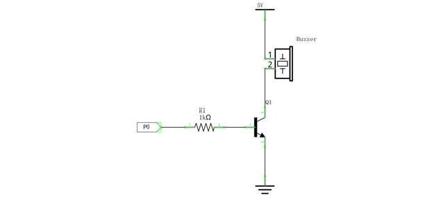
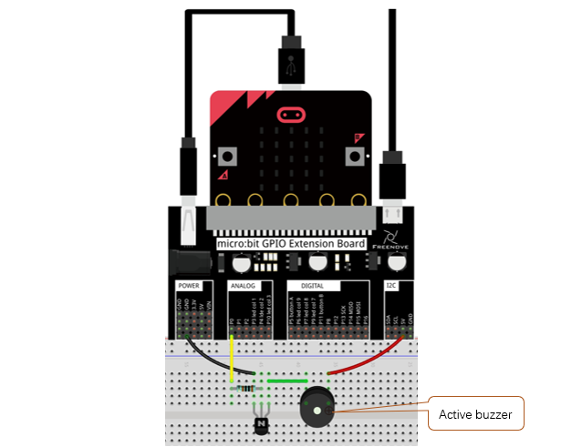

Block code 
==============================

Open MakeCode first. Import the .hex file. The path is as below:

( :ref:`How to import project <import_project>` )

+-----------+-----------------------------------------+------------------+
| File type | Path                                    | File name        |
+-----------+-----------------------------------------+------------------+
| HEX file  | ../Projects/BlockCode/09.1_ActiveBuzzer | ActiveBuzzer.hex |
+-----------+-----------------------------------------+------------------+

After importing successfully, the code is shown as below:

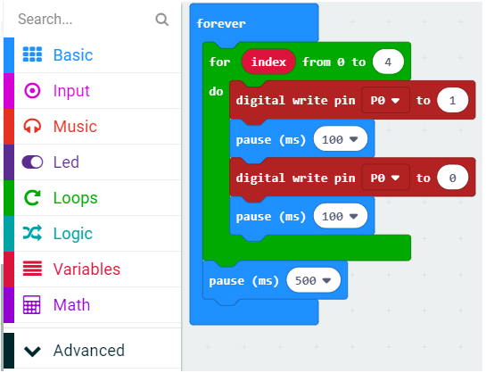

Check the connection of the circuit, download the code into the micro:bit, and the buzzer on the breadboard will make sounds.

In the for loop, P0 outputs a high level to make the buzzer sounds, then delay 100ms. And then P0 outputs a low level to stop the buzzer. Then delay 100ms. After the loop ends, delay 500ms.

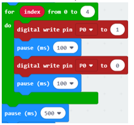

Python code
================================

Open the .py file with Mu. Code, the path is as below:

+-------------+------------------------------------------+-----------------+
| File type   | Path                                     | File name       |
+-------------+------------------------------------------+-----------------+
| Python file | ../Projects/PythonCode/09.1_ActiveBuzzer | ActiveBuzzer.py |
+-------------+------------------------------------------+-----------------+

After load successfully, the code is shown as below:

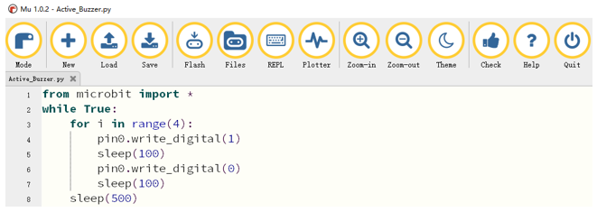

Check the connection of the circuit, download the code into the micro:bit, and the buzzer on the breadboard will sound.

The following is the program code:

.. literalinclude:: ../../../freenove_Kit/Projects/PythonCode/09.1_ActiveBuzzer/ActiveBuzzer.py
    :linenos: 
    :language: python
    :lines: 1-8
    :dedent:

In the for loop, P0 outputs a high level to make the buzzer sound, then delay 100ms. And then P0 outputs a low level to stop the buzzer. Then delay 100ms. After the loop ends, delay 500ms.

.. literalinclude:: ../../../freenove_Kit/Projects/PythonCode/09.1_ActiveBuzzer/ActiveBuzzer.py
    :linenos: 
    :language: python
    :lines: 2-8
    :dedent:

Project Happy Birthday Melody
**********************************************

In this project, we will make a passive buzzer to play a happy birthday melody.

Component list
=============================

+----------------------------+-----------------------------+
| Microbit x1                | Expansion board x1          |
|                            |                             |
| |Chapter03_00|             | |Chapter03_01|              |
+----------------------------+-----------------------------+
| Breakboard x1              | USB cable x2                |
|                            |                             |
| |Chapter03_02|             | |Chapter03_03|              |
+----------------------------+-----------------------------+
| F/M x 3  M/M x1            | Resistor 1kΩ x1             |
|                            |                             |
| |Chapter09_05|             | |Chapter04_05|              |
+----------------------------+-----------------------------+
| NPN(8050) transistor x1    | Active buzzer x1            |
|                            |                             |
| |Chapter09_06|             | |Chapter09_07|              |
+----------------------------+-----------------------------+

Circuit
================================

.. list-table:: 
   :width: 100%
   :align: center

   * -  Schematic diagram
   * -  |Chapter09_08|
   * -  Hardware connection
   * -  |Chapter09_09|

Block code 
==========================

Open MakeCode first. Import the .hex file. The path is as below:

(How to import project)

+-----------+------------------------------------------+-------------------+
| File type | Path                                     | File name         |
+-----------+------------------------------------------+-------------------+
| HEX file  | ../Projects/BlockCode/09.2_Play-a-melody | Play-a-melody.hex |
+-----------+------------------------------------------+-------------------+

After importing successfully, the code is shown as below:

Check the connection of the circuit, confirm that the circuit is connected correctly, download the code into the micro:bit, and the buzzer on the breadboard will play a song "happy birthday".

You can click on the small triangle next to "birthday" to expand the list, select other melody, and select the number of times to play by clicking on the small triangle next to "once".

Reference
------------------------

.. list-table:: 
   :width: 100%
   :align: center

   * -  Block
     -  Function 
   
   * -  |Chapter09_14|
     -  Begin playing a musical melody through pin P0 of the micro:bit. 
       
        There are built-in melodies that you can choose from the start 
        
        melody block. These are already composed for you and are easy 
        
        to use by just selecting the one you want.

Python code
============================

Open the .py file with Mu. Code, the path is as below:

+-------------+-------------------------------------------+------------------+
| File type   | Path                                      | File name        |
+-------------+-------------------------------------------+------------------+
| Python file | ../Projects/PythonCode/09.2_Play-a-melody | Play-a-melody.py |
+-------------+-------------------------------------------+------------------+

After loading successfully, the code is shown as below:

Check the connection of the circuit, confirm that the circuit is connected correctly, and download the code into the micro:bit, and the buzzer on the breadboard will play a song "happy birthday". ( :ref:`How to download? <download>` )

The following is the program code:

.. literalinclude:: ../../../freenove_Kit/Projects/PythonCode/09.2_Play-a-melody/Play-a-melody.py
    :linenos: 
    :language: python
    :lines: 1-3
    :dedent:

Reference
--------------------------

.. py:function:: music.play()	

    It is used to play music. MicroPython has quite a lot of built-in melodies. 

    For more information, please refer to:

    https://microbit-micropython.readthedocs.io/en/latest/tutorials/music.html

Project Custom Melody
*************************************

In this project, we will make the passive buzzer play a custom melody.

Component list
===================================

+----------------------------+-----------------------------+
| Microbit x1                | Expansion board x1          |
|                            |                             |
| |Chapter03_00|             | |Chapter03_01|              |
+----------------------------+-----------------------------+
| Breakboard x1              | USB cable x2                |
|                            |                             |
| |Chapter03_02|             | |Chapter03_03|              |
+----------------------------+-----------------------------+
| F/M x 3  M/M x1            | Resistor 1kΩ x1             |
|                            |                             |
| |Chapter09_05|             | |Chapter04_05|              |
+----------------------------+-----------------------------+
| NPN(8050) transistor x1    | Active buzzer x1            |
|                            |                             |
| |Chapter09_06|             | |Chapter09_07|              |
+----------------------------+-----------------------------+

Circuit
================================

.. list-table:: 
   :width: 100%
   :align: center

   * -  Schematic diagram
   * -  |Chapter09_08|
   * -  Hardware connection
   * -  |Chapter09_09|

Block code 
===============================

Open MakeCode first. Import the .hex file. The path is as below:

( :ref:`How to import project <import_project>` )

+-----------+-------------------------------------------------+--------------------------+
| File type | Path                                            | File name                |
+-----------+-------------------------------------------------+--------------------------+
| HEX file  | ../Projects/BlockCode/09.3_Play-a-custom-melody | Play-a-custom-melody.hex |
+-----------+-------------------------------------------------+--------------------------+

After importing successfully, the code is shown as below:

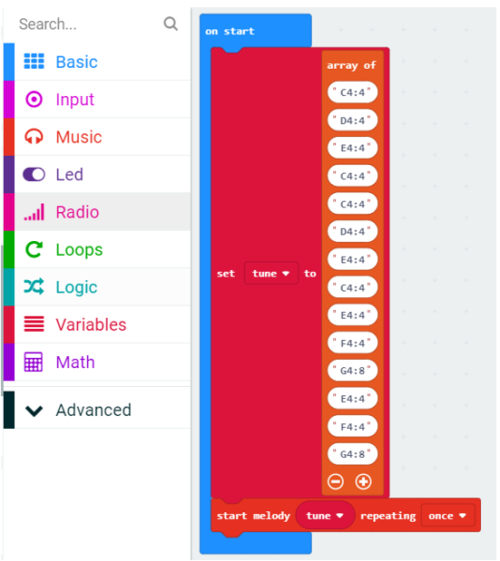

Check the connection of the circuit, confirm that the circuit is connected correctly, download the code into the micro:bit, and the buzzer on the breadboard will play a custom melody.

The tune array holds a custom melody, and each element in the array contains notes and beats. For example, "A1:4" refers to the note named A in octave number 1 to be played for a duration of 4.

Python code
===========================

Open the .py file with Mu. Code, the path is as below:

+-------------+--------------------------------------------------+-------------------------+
| File type   | Path                                             | File name               |
+-------------+--------------------------------------------------+-------------------------+
| Python file | ../Projects/PythonCode/09.3_Play-a-custom-melody | Play-a-custom-melody.py |
+-------------+--------------------------------------------------+-------------------------+

After loading successfully, the code is shown as below:

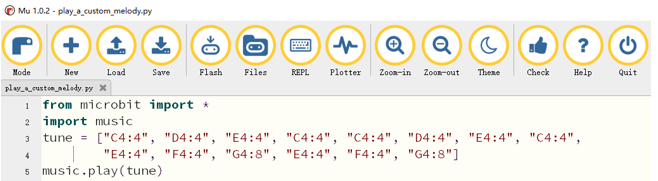

Check the connection of the circuit, confirm that the circuit is connected correctly, download the code into the micro:bit, and the buzzer on the breadboard will play a custom song.

The tune array holds a custom melody, and each element in the array contains notes and beats. For example, "A1:4" refers to the note named A in octave number 1 to be played for a duration of 4.

The following is the program code:

.. literalinclude:: ../../../freenove_Kit/Projects/PythonCode/09.3_Play-a-custom-melody/Play-a-custom-melody.py
    :linenos: 
    :language: python
    :lines: 1-5
    :dedent: