##############################################################################
Code & Programming
##############################################################################

Quick Start
*******************************

This section describes how to write programs for micro:bit and how to download them to micro:bit. There are very detailed tutorials on the official website. You can refer to: Https://microbit.org/guide/quick/.

Step 1: Connecting Micro:bit
==================================

Connect the micro:bit to your computer via a micro USB cable. Macs, PCs, Chromebooks and Linux systems (including Raspberry Pi) are all supported. 

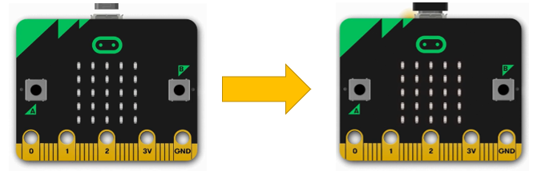

Step 2: Write Program
=================================

Visit https://makecode.microbit.org/. Then click "New Project" and start programming.

If your computer has Windows 10 operating system, you can also use Windows 10 App for programming, which is exactly the same as programming on browsers. Get windows 10 App(Click). 

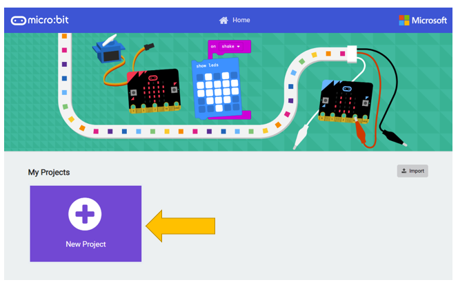

Write your first micro:bit code. For example, drag and drop some blocks and try your program on the

Simulator in the MakeCode Editor, like in the image below that shows how to program a Flashing Heart.

Here is a demo video: https://microbit.org/images/quickstart/makecode-heart.mp4 

MakeCode will be further introduced in next section.

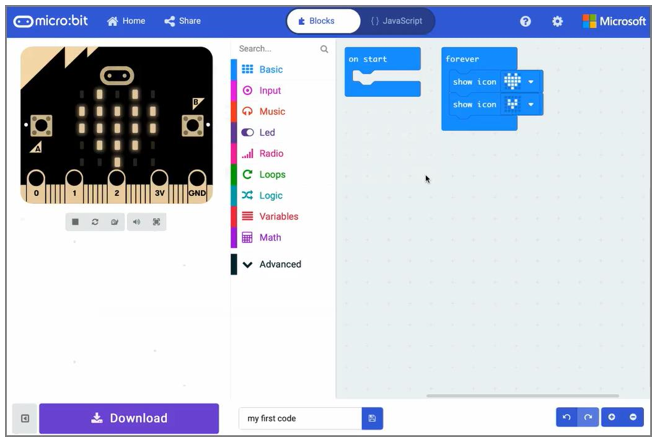

.. _download:

Step 3: Flashing Code to your Micro:bit
==============================================

The process of transferring the .HEX file to the BBC micro:bit is called flashing.

If you write program using Windows 10 App, you just need to click the "Download" button, then the program will be downloaded directly to micro:bit without any other actions.

If you write program using browser, please follow steps below: 

Click the Download button in the editor. This will download a 'hex' file, which is a compact format of your program that your micro:bit can read. Once the hex file has been downloaded, copy it to your micro:bit just like copying a file to a USB drive. On Windows you can right click and choose "Send to→MICROBIT."

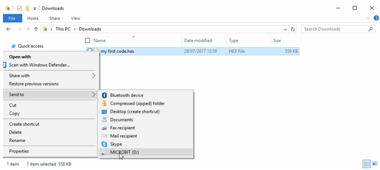

Step 4: Run the Program
==================================

The micro:bit will pause and the yellow LED on the back of the micro:bit will blink while your code is flashed. Once that's finished the code will run automatically! The micro:bit can only run one program at a time - every time you drag-and-drop a hex file onto the device over USB it will erase the current program and replace it with the new one.

Warning
=============================

:red:`The MICROBIT drive will automatically eject and reconnect each time you program it, but your hex file will be gone. The micro:bit can only receive hex files and won't store anything else!`

MakeCode
*******************************

Open web version of `MakeCode <https://makecode.microbit.org/>`_ or **windows 10 app version of MakeCode** , which can be downloaded on **Microsoft store** . 

https://makecode.microbit.org/

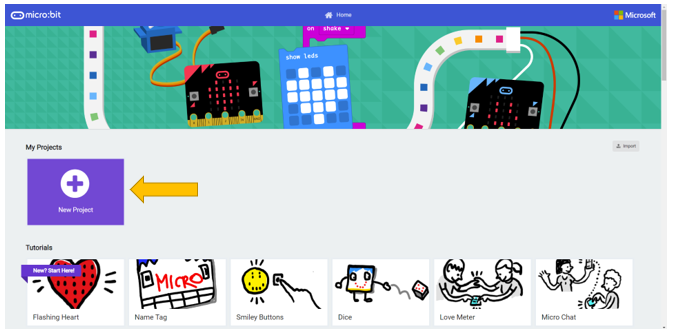

Click "New Project", MakeCode editor is as below:

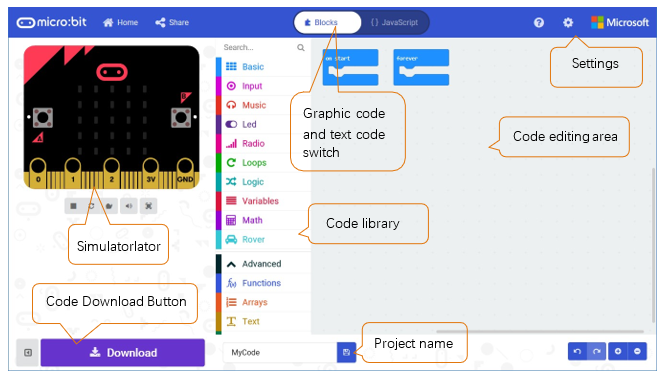

In the code area, there are two fixed blocks "on start" and "forever".

The code in the "on start" block will be executed only once after power-on or reset. And the code in "forever" block will be executed circularly.

.. _quick_download:

Quick Download
*********************************

As mentioned earlier, if you use Windows 10 App of MakeCode (recommended), you can quickly download the code to micro:bit by clicking the download button. Using browser version of MakeCode may require more steps. 

If you use browser version of MakeCode on Google Chrome 65+ for platform Android, Chrome OS, Linux, macOS and Windows 10, you can also download file quickly.

Here we use webUSB feature of Chrome, which allows web pages to access your USB hardware devices. We will complete the connection and pairing of the micro:bit device with the webpage in the following steps.

Pair device 
================================

Connect your computer and Micro:bit with a USB cable.

Click the gear menu in the top right corner and then click on "Pair device".

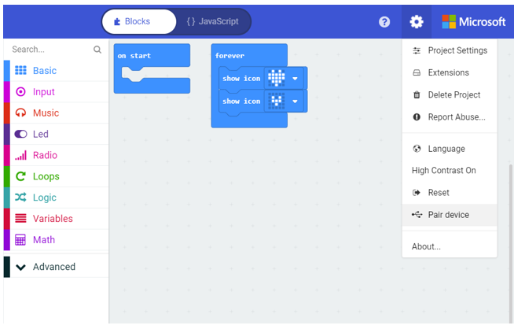

Then continue to click "Pair device" button.

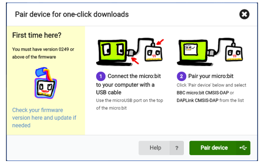

Select device on the pop-up window and click "Connect" button. If there are no devices shown on the pop-up window, please refer to following content: 

https://makecode.microbit.org/device/usb/webusb/troubleshoot 

We have save the page as a file " **Troubleshooting downloads with WebUSB - Microsoft MakeCode.pdf** ". You can read it directly in the folder of this tutorial. 

And the file " **Firmware microbit.pdf** " introduces how to update firmware of micro:bit. Its content come from:

https://microbit.org/guide/firmware/ 

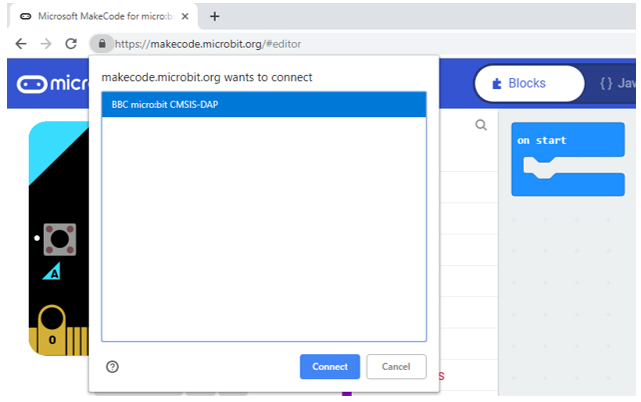

After the connection succeeds, click the Download button and the program will be downloaded directly to Micro: bit.

.. _import_project:

Import Code
*************************************

We provide hex file (project files) for each project, which contains all the contents of the project and can be imported directly. You can also complete the code of project manually. If you choose to complete the code by dragging code block, you may need to add necessary extensions. 

:green:`As for simple projects, it is recommended to complete the project by dragging code block.`

:green:`As for complicated projects, it is recommended to complete the project by importing Hex code file.`

Next, we will take "Heartbeat" project as an example to introduce how to load code. 

Open web version of makecode or windows 10 app version of MakeCode.

Click "Import" button on the right of HOME page.

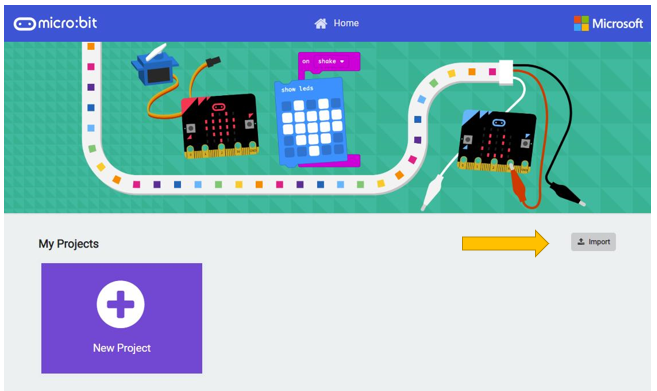

In the pop-up dialog box, click "Import File".

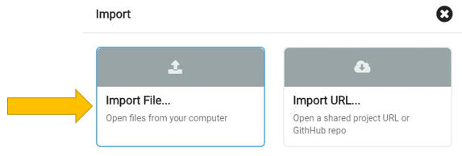

Select file".. Projects/BlockCode/01.1_Heartbeat/Heartbeat.hex". Then click "Go ahead!"

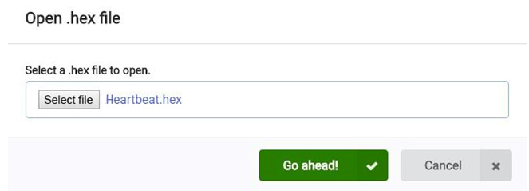

A few seconds later, the project is loaded successfully.

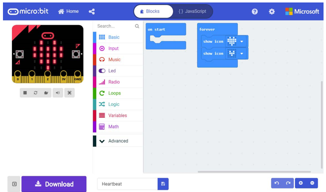

Python
**************************************

If you are not interested in python, you can skip this section.

Micro:bit can be programmed in Python. Since micro:bit is a microcontroller, the hardware difference makes it not support pure Python. Here we use MicroPython, which is specially designed for micro:bit.

MicroPython is a lean and efficient implementation of the Python 3 programming language that includes a small subset of the Python standard library and is optimized to run on microcontrollers and in constrained environments.

We designed block code and Python code with similar function for each project.

There are two kinds of python editors for micro:bit, web version and software.  

:green:`It is highly recommended to use software Mu as a Python educator.`

Mu. (https://codewith.mu/en/download)

Next, we will introduce Mu.

Mu
=================================

Mu is a Python code editor for beginner programmers based on extensive feedback given by teachers and learners. 

Official website: https://codewith.mu/

You can download it here: https://codewith.mu/en/download

Download and install it. 

And you will see the following interface when opening it.

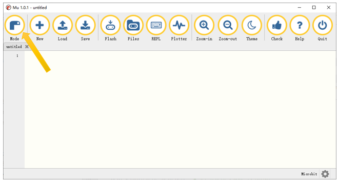

Click the Mode button in the menu bar and select "BBC micro:bit" in the pop-up dialog box. Click "OK".

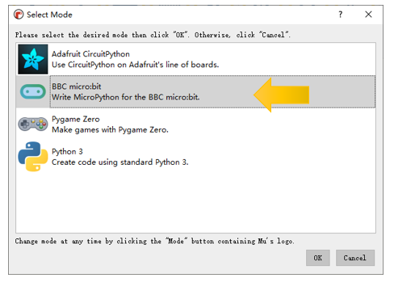

Import the .hex file. The path is as below: 

+-------------+--------------------------+--------------+
| File type   | Path                     | File name    |
+-------------+--------------------------+--------------+
| Python file | ../project/1.1.Heartbeat | Heartbeat.py |
+-------------+--------------------------+--------------+

Successful loading is shown below.

You can also type the code by yourself.

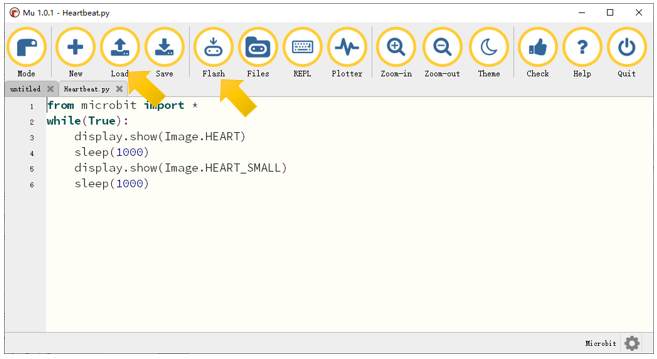

Use the micro USB cable to connect micro:bit and PC, and click the Flash button to download the program into micro:bit.

If there are errors in your code, you may be able to successfully download it to micro:bit, but it will not work properly. 

For example, the function sleep() was written as sleeps() in the following illustration. Click the button and the code can be uploaded to Micro:bit successfully. However, after the downloading completes, LED matrix prompts some error information and the number of the wrong line.

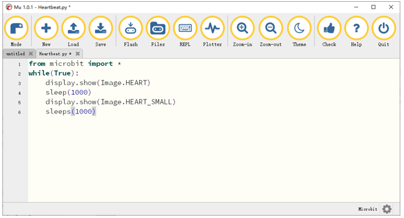

Click the "REPL" button and press the reset button (the button on the back, not A, B) on micro:bit. The error message will be displayed in the REPL box, as shown below:

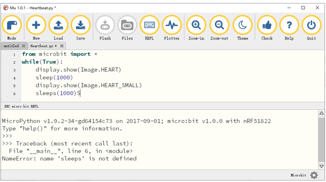

**Click REPL again** , you will close REPL mode. And then you can flash new code.

To ensure the code is correct, after completing the code, click the "Check" button to check the code for errors. As shown below, click the "Check" button. Then Mu will indicate the error of the code.

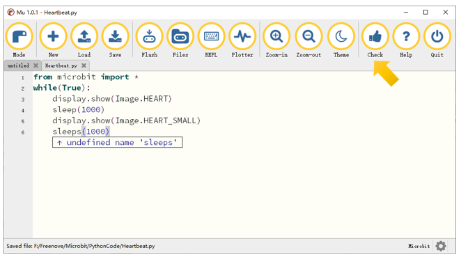

Correct the code according to the error prompt. Then click the "Check" button again, Mu displays no error on the bar below.

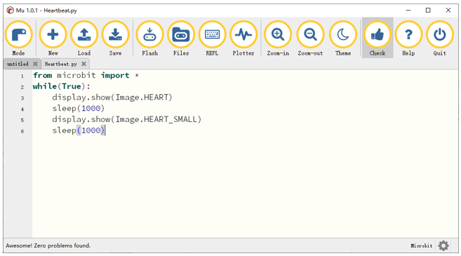

Import necessary Python file into micro:bit
==============================================

In the code of this tutorial, the LCD1602 module and DHT11 module are used, so it is necessary to import "I2C_LCD1602_Class.py" and "DHT11_RW.py" into the micro:bit. You can skip this section if you don't use them. When you need, you can come back to import them.

The import method is as follows:

Search on the C drive and find the "mu_code" folder.

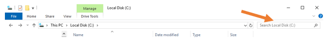

Double click on "mu_code" to enter the folder.

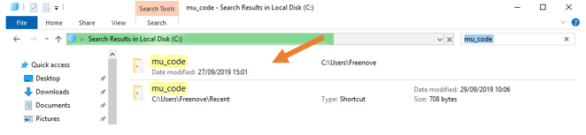

Copy "I2C_LCD1602_Class.py" and "DHT11_RW.py" from following path into "mu_code" directory.

+-------------+--------------------------------------------------+-------------+
| File type   | Path                                             | File name   |
+-------------+--------------------------------------------------+-------------+
| Python file | .. /Projects/PythonLibrary	I2C_LCD1602_Class.py | DHT11_RW.py |
+-------------+--------------------------------------------------+-------------+

After pasting successfully, you can see them as below:

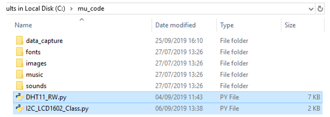

Open the Mu software, click "Files". Here we take "I2C_LCD1602_Class.py" as an example, drag "I2C_LCD1602_Class.py" into micro:bit.

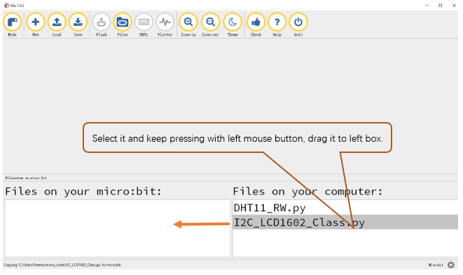

After importing successfully, you will see it on the left.

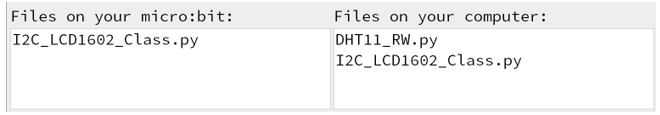

The import method of "DHT11_RW.py" is the same as described above. You just need to import the one you need to use.

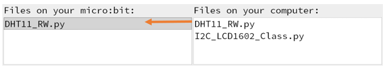

:red:`Note, after you upload other file into micro:bit, the original content will be covered. You need to import it next time you use it.`