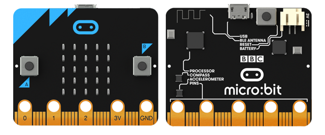
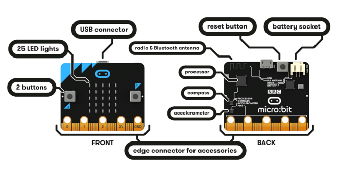
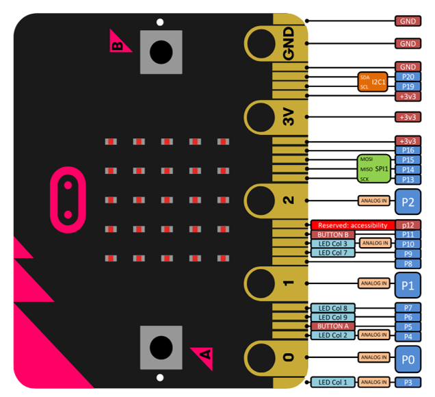

##############################################################################
Micro:bit
##############################################################################

This chapter is the Start Point in the journey to build and explore Micro:bit and Micro:Rover electronic projects.

Meet micro:bit
******************************

The BBC micro:bit is a pocket-size, programmable micro-computer that can be used for all sorts of cool creations, from robots to musical instruments – the possibilities are infinite.

For more contents, please refer to:

https://microbit.org/guide/ 

Features
***************************

Your micro:bit has the following physical features:

- 25 individual programmable LEDs

- 2 programmable buttons

- Physical connection pins

- Light and temperature sensors

- Motion sensors (accelerometer and compass)

- Wireless Communication, via Radio and Bluetooth

- USB interface

For more details, please refer to:

https://microbit.org/guide/features/ 

Hardware
**************************

It is not required for beginners to master this section, but a brief understanding is necessary. However, if you want to be a developer, hardware information will be very helpful. Detailed hardware information about micro:bit can be found here: https://tech.microbit.org/hardware/.

First, get to know the micro:bit GPIO.

GPIO
============================

GPIO, namely General Purpose Input/output Pins, is an important part of micro:bit for connecting external devices. All sensors and devices on Rover communicate with each other through micro:bit GPIO. The following is the GPIO serial number and function diagram of micro:bit:

