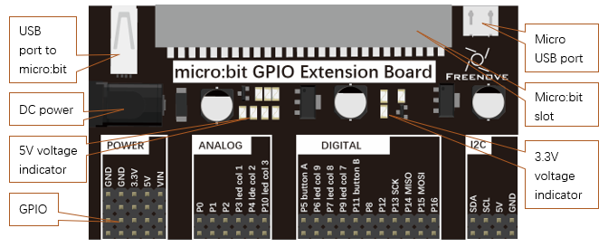
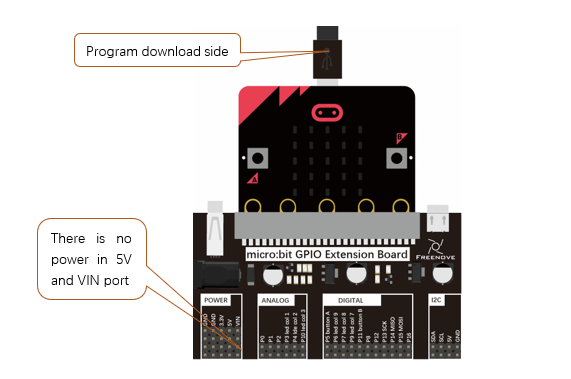
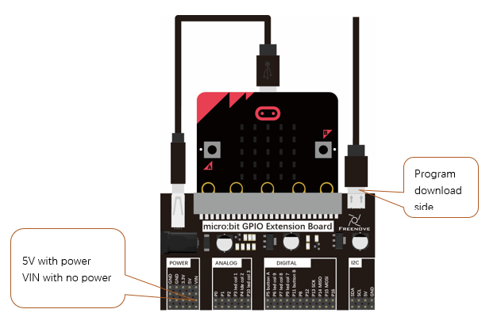
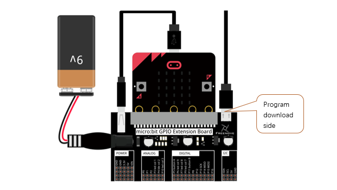

##############################################################################
Micro:bit GPIO Extension Board
##############################################################################

Hardware and Feature
*****************************

Micro:bit GPIO Extension Board is shown as below:

Micro:bit GPIO Extension Board is connected to micro:bit board via a slot with its GPIO connected to micro:bit’s GPIO. In addition, there are also 5V and VIN(9V) IO port on the extension board to meet requirement of more devices. 

How to use?
*****************************

If external device doesn't require voltage of 5V and 9V, you can use the following wiring.

If external device uses 5v voltage, but power needed is not large, you can use the following wiring.

If external device uses 5v voltage, but power needed is large, you can use the following wiring.

